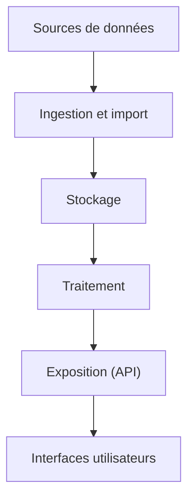
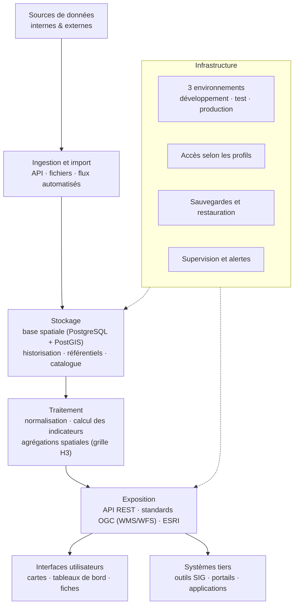
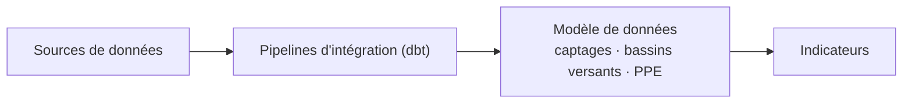
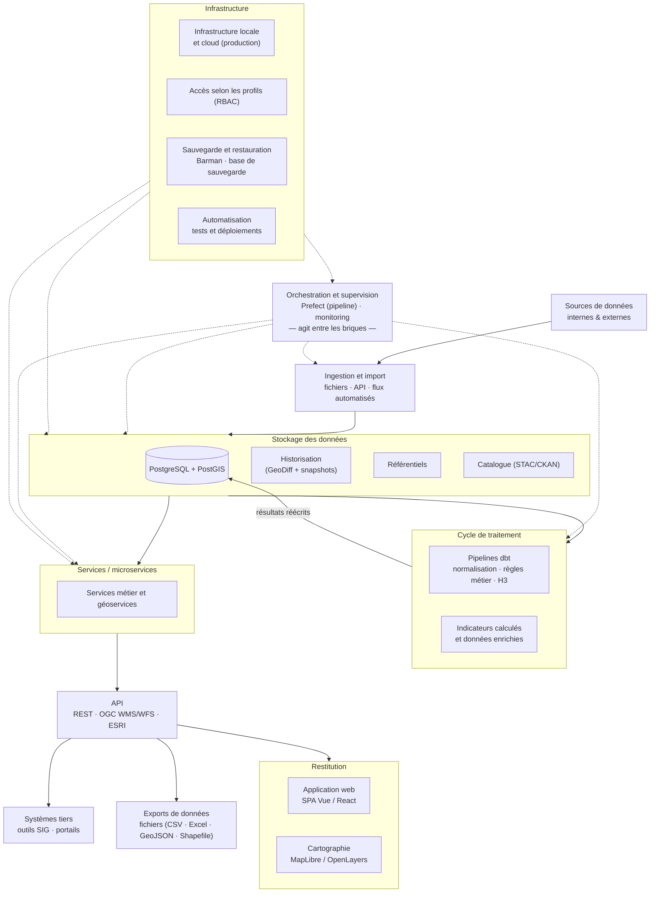

---
author:
- Hugo Roussaffa
authors:
- affiliation:
    address: BP 38, 98836 Dumbéa Mairie, Nouvelle-Calédonie
    name: Yapuka SARL
    Ridet: 1 568 070.001
  email: hugoroussaffa@gmail.com
  name: Hugo Roussaffa
  Position: Expert Géomatique -- Architecte data - Consultant
  Tel: +687 97.83.24
copyright:
  tag: "!expr"
  value: paste("Copyright Yapuka SARL - 2026. Tous droits réservés.",
    version)
date: 5 août 2026
date-format: long
engines:
- path: /opt/quarto/share/extension-subtrees/julia-engine/\_extensions/julia-engine/julia-engine.js
execute:
  echo: false
image_font_1: ../ressources/MJunckerOEIL.jpg
image_font_2: ../ressources/eau-monitoring.png
lang: fr
logo: ../ressources/OEIL_logo.png
logo_partenaire: ../ressources/logo_yapuka.png
resume: Succédant au tableau de bord PressionPPE (2021), dont il
  capitalise les acquis techniques et le retour d'expérience, le projet
  Hydroscope vise la mise en place de services numériques destinées au
  suivi de la ressource en eau potable sur l'ensemble du territoire de
  la Nouvelle-Calédonie. Le projet Hydroscope se fixe pour objectif de
  caractériser les Bassin Versant d'Approvisionnement en Eau Potable
  (BVAEP), incluant les Perimetre de Protection de l'Eau (PPE) et les
  points de captages via leurs facteurs biogéographiques (relief,
  géologie, végétation, pluviométrie), les pressions subies
  (urbanisation, incendies, érosion...) et les réponses qui ont pu être
  apportées sur ces milieux. Le projet doit aussi permettre le partage
  de ces connaissances à différentes échelles (pays, province, commune)
  via des interfaces numériques adaptés à différents publics.
subtitle: Note de cadrage stratégique
title: Projet HydroScope
toc-title: Table des matières
version: version 1
---



::: {}
> **Note de version**
>
> Historique des versions du document :
>
>   --------------------------------------------------------------------------------
>   Version   Date         Auteur(s)    Description des modifications
>   --------- ------------ ------------ --------------------------------------------
>   1                      Hugo         Rédaction initiale du cahier des charges
>                          Roussaffa    
>
>   2         05/08/2026   Hugo         Finalisation du backlog et des profils
>                          Roussaffa    utilisateurs, ajout du cadre de chiffrage,
>                                       compléments des exigences --- version
>                                       soumise à la relecture de la MOA
>   --------------------------------------------------------------------------------
>
> Points en attente (5)
>
> [high (link)](#link-mettre-lien-section) : mettre lien section
>
> [high (lien)](#lien-faire-le-lien-avec-la-section-monitoring-pour-le-suivi-des-traitements-en-arri-re-plan)
> : faire le lien avec la section monitoring pour le suivi des traitements en arrière plan
>
> [high (processing)](#processing-indiquer-la-volumetrie-plus-pr-cisement-sur-les-traitements-)
> : indiquer la volumetrie plus précisement sur les traitements.
>
> [high (API)](#api-pr-ciser-les-usage-des-api-externe-pr-vues-)
> : préciser les usage des API externe prévues.
>
> [high (lien)](#lien-faire-le-lien-avec-sla) : faire le lien avec SLA
:::

**Introduction**

Le projet Hydroscope s'inscrit dans la continuité d'un premier outil
développé en 2021 pour la DAVAR (PressionPPE). Suite au retour
d'expérience de ce premier projet, l'OEIL a déposé un dossier au fonds
PEP en 2023, validé avec un co-financement de l'OFB (65 %) et du fonds
PEP (35 %). L'objectif est de faire évoluer cet outil pour répondre aux
besoins accrus de connaissance et de gestion de la ressource en eau.

Le projet **Hydroscope** a pour ambition de doter le territoire d'une
architecture logicielle et d'une structure de données robuste, capables
de transformer les données brutes en informations stratégiques, tout en
garantissant l'historisation des indicateurs et l'automatisation de la
veille sur les pressions environnementales telles que les incendies,
l'érosion, la pollution, le développement des espèces envahissantes ou
l'artificialisation des sols.

L'OEIL assure la continuité intellectuelle du projet initial
(PressionPPE en 2021) et s'assurera à ce que les futurs outils --- qu'il
s'agisse de tableaux de bord experts, d'interfaces simplifiées pour les
partenaires ou de fiches pédagogiques --- deviennent des leviers d'aide
à la décision pour la protection durable des bassins versants
producteurs d'eau potable (BVAEP).

------------------------------------------------------------------------



## Contexte et objectifs {#contexte-et-objectifs number="0.1"}

La protection des ressources en eau potable constitue un enjeu majeur
pour la Nouvelle-Calédonie. Les captages destinés à l'alimentation en
eau potable sont exposés à de nombreuses pressions environnementales et
anthropiques susceptibles d'altérer durablement la qualité et la
disponibilité de la ressource. Les incendies, l'érosion des sols, les
activités minières, l'urbanisation ou encore les effets du changement
climatique nécessitent une connaissance fine des territoires afin
d'orienter les actions de prévention et de protection.

Une grande partie des captages est alimentée par des eaux
superficielles, ce qui les rend particulièrement sensibles aux
modifications des bassins versants d'alimentation en eau potable. La
préservation de ces bassins versants constitue ainsi un levier essentiel
pour garantir une ressource en eau de qualité sur le long terme.

### Contexte institutionnel {#contexte-institutionnel number="0.1.1"}

La gestion de l'eau potable en Nouvelle-Calédonie repose sur une
organisation institutionnelle impliquant plusieurs acteurs
complémentaires.

Depuis la loi du pays du **15 juillet 2025** relative au domaine public
de l'eau, le **Gouvernement de la Nouvelle-Calédonie** est compétent
pour instaurer les **Périmètres de Protection des Eaux (PPE)** par
arrêté. Le service de l'eau de la **DAVAR** assure l'instruction
technique et administrative des dossiers de protection.

Les **Provinces** interviennent principalement dans leurs compétences
environnementales et participent à l'instruction des dossiers en
formulant un avis obligatoire. Elles assurent également un rôle de
conseil et d'accompagnement auprès des collectivités.

Les **Communes** conservent la responsabilité du service public de
production et de distribution d'eau potable ainsi que de
l'assainissement. Elles sont les principales gestionnaires des captages
destinés à l'alimentation des populations.

Sur les **terres coutumières**, la création d'un périmètre de protection
est soumise à l'accord des autorités coutumières concernées.

La réglementation impose désormais la régularisation des captages
existants ne disposant pas encore de périmètre de protection, renforçant
ainsi les besoins en outils d'observation, de suivi et d'aide à la
décision.

### Positionnement du projet HydroScope {#positionnement-du-projet-hydroscope number="0.1.2"}

Le projet **HydroScope** est une initiative portée par l'OEIL, en
partenariat avec les services techniques concernés, avec le soutien
financier de l'Office Français de la Biodiversité (OFB) et du fonds de
la Politique de l'Eau Partagée (PEP).

Il s'inscrit dans la continuité du tableau de bord **PressionPPE**,
développé en 2021 avec le Service de l'eau de la DAVAR pour centraliser
des informations relatives aux pressions exercées sur les ressources en
eau potable. Les retours d'expérience sur cet outil ont mis en évidence
plusieurs pistes d'amélioration, notamment concernant l'historisation
des données, l'automatisation des traitements, l'adaptation des
interfaces aux différents profils d'utilisateurs ainsi que l'ouverture
vers des technologies open source.

HydroScope vise ainsi à faire évoluer cet outil en proposant une
plateforme permettant de consolider les données disponibles, de produire
des indicateurs homogènes, de faciliter leur consultation par les
différents acteurs impliqués dans la gestion de la ressource et de
simplifier le processus de production et de diffusion des données.

Le projet est actuellement engagé dans une phase de réalisation destinée
à développer des services numériques en réponse aux besoins métiers
identifiés lors de la phase d'analyse. Cette phase se concentre sur la
définition des indicateurs, la structuration des données et la
conception des interfaces utilisateurs adaptées aux différents profils
d'acteurs.

### Éléments de cadrage issus du dossier de candidature {#éléments-de-cadrage-issus-du-dossier-de-candidature number="0.1.3"}

Le projet HydroScope a fait l'objet d'un dossier de candidature au fonds
de soutien à la Politique de l'Eau Partagée (PEP 2023), co-financé par
l'Office Français de la Biodiversité (OFB) et le fonds PEP. Les éléments
suivants, issus de ce dossier, constituent le socle de cadrage du
présent cahier des charges :

- **64 % des captages** destinés à la production d'eau potable sont
  implantés sur des cours d'eau et soumis à des pressions multiples
  (incendies, activité minière, espèces envahissantes herbivores,
  artificialisation des sols) ;
- **plus de 220 périmètres de protection des eaux** sont réglementés, et
  d'autres sont en cours de réglementation, ce qui accroît la charge de
  suivi des gestionnaires ;
- en 2019, **17 % des feux de brousse ont touché des périmètres de
  protection des eaux**, soit près de **7 000 hectares** ;
- une étude estimait en 2016 que la **couverture végétale de 90 % des
  périmètres de protection** des eaux de Nouvelle-Calédonie était
  dégradée (Andreoli R. et al., 2016) ;
- le changement climatique pourrait induire une **baisse moyenne de 20 %
  des précipitations d'ici 2100**, avec de fortes disparités
  territoriales (Menkes C. et al., 2019).

Ces constats justifient la mise en place d'un outil d'observation
partagé permettant aux gestionnaires de disposer d'un même niveau
d'information sur la ressource en eau potable.

### Objectifs du projet {#objectifs-du-projet number="0.1.4"}

L'objectif d'HydroScope est de mettre à disposition un système
d'information permettant de mieux suivre l'état des bassins versants
d'alimentation en eau potable (BVAEP), les unités de gestion
(captage/forage) et des périmètres de protection des eaux, afin de
faciliter leur analyse et leur suivi dans le temps.

Plus précisément, le projet poursuit 4 objectifs :

- **Connaissance:** Mieux caractériser le territoire (relief, géologie,
  pluviométrie) et les enjeux (population desservie) en centralisant et
  structurant les données utiles à la caractérisation des bassins
  versants et des points de captages

- **Diagnostic:** Appréhender le niveau d'intégrité de la ressource via
  l'analyse d'une multitude d'indicateurs :

  - en produisant des indicateurs homogènes décrivant les enjeux, les
    pressions environnementales et les caractéristiques des territoires.
  - en assurant l'historisation des données afin de suivre leur
    évolution dans le temps.

- **Veille:** Détecter automatiquement les changements environnementaux
  significatifs et faciliter l'identification de ces évolutions
  significatives grâce à des mécanismes de veille et de mise à jour
  automatisée.

- **Partage:** Diffuser un diagnostic commun entre les parties prenantes
  pour orienter les investissements publics en mettant à disposition des
  indicateurs dans un tableau de bord adaptés aux différents profils
  d'utilisateurs et en facilitant le partage d'une information cohérente
  entre les différents partenaires.

HydroScope n'a pas vocation à remplacer les outils métiers existants ni
à se substituer aux décisions des gestionnaires. Il constitue un outil
d'observation, d'analyse et de restitution destiné à fournir une vision
consolidée des informations disponibles afin d'appuyer les travaux de
suivi et de protection de la ressource en eau potable.

### Objectifs fonctionnels {#objectifs-fonctionnels number="0.1.5"}

L'application doit permettre aux gestionnaires de répondre à des
questions concrètes pour prioriser leurs interventions :

- Quels sont les bassins versants actuellement sous pression forte et
  selon quels critères ?
- Quelle est la tendance d'évolution d'une pression (ex: incendies,
  glissement de terrain) sur les 5 ou 10 dernières années ?
- Quelles zones doivent être protégées ou restaurées en priorité ?
- Quel est le niveau de gravité d'un défrichage détecté par satellite ?

L'application devra notamment permettre de :

- consulter les caractéristiques des bassins versants d'alimentation en
  eau potable ;
- visualiser les indicateurs produits à différentes échelles
  territoriales et sur les objets géographiques suivants
  (captage/forage; bassin versant AEP, maille géographique vectorielle
  H3 [^1] );
- suivre l'évolution temporelle des pressions environnementales ;
- comparer plusieurs territoires, captages/forages ou bassins versants ;
- Assurer la traçabilité et la transparence des traitements effectués
- accéder aux fiches descriptives des indicateurs, des bassins versants
  AEP, des captages/forages et périmètres de protection ;
- produire des rapports exportables ;
- diffuser des niveaux d'information adaptés aux différents profils
  d'utilisateurs (experts, partenaires institutionnels et grand public).

L'ensemble de ces fonctionnalités devra contribuer à améliorer l'accès
aux données existantes et d'appuyer la prise de décision publique et
opérationnelle auprès des acteurs de la gestion de l'eau potable en
Nouvelle-Calédonie.

### Quantification du périmètre {#quantification-du-périmètre number="0.1.6"}

Le périmètre fonctionnel du projet HydroScope s'appuie sur un ensemble
de données territoriales et d'indicateurs dont les volumes doivent être
pris en compte pour dimensionner la solution.

À ce stade, les ordres de grandeur sont les suivants :

- **Bassins versants d'alimentation en eau potable (BVAEP)** : \~50
  unités\
- **Captages / forages** : \~500 unités\
- **Périmètres de protection** : \~250 unités\
- **Indicateurs** : 38 indicateurs (version 4 du catalogue), dont 33
  intégrés dans l'analyse multicritère et 5 à visée informative
  (pluviométrie, géologie, érosion, prélèvements AODPE, PUD)\
- **Sources de données** : 42 sources référencées (GEOREP, Google Earth
  Engine, bases OEIL, DAVAR, DASS, DIMENC, DITTT, provinces, CEN,
  Endemia, Météo-France, ISEE, ANCB...)

Ces valeurs sont indicatives et pourront évoluer au cours du projet,
notamment en fonction :

- de la disponibilité des données ;
- des choix méthodologiques ;
- des besoins exprimés par les utilisateurs.

Elles permettent néanmoins de fournir un premier niveau de cadrage pour
le dimensionnement technique et fonctionnel de la solution.

Le catalogue détaillé des indicateurs et de leurs sources est présenté
au chapitre 3bis et fourni en annexe (tableau synthétique des
indicateurs).

### Sources de données {#sources-de-données number="0.1.7"}

Le projet HydroScope repose sur l'intégration et la valorisation de
données issues de sources multiples, produites par différents acteurs du
territoire.

::: {landscape}
Les principales sources de données mobilisées sont les suivantes :

:::

Ces données sont produites et mises à disposition par différents acteurs
(communes, provinces, services du Gouvernement, partenaires techniques,
entreprises privées).

Elles présentent des niveaux hétérogènes de qualité, de structuration et
de fréquence de mise à jour, ce qui nécessite des traitements
spécifiques dans le cadre du projet HydroScope.

------------------------------------------------------------------------



## Parties prenantes et gouvernance {#parties-prenantes-et-gouvernance number="0.2"}

La mise en œuvre du projet HydroScope repose sur une gouvernance
partenariale associant des acteurs institutionnels, techniques et
opérationnels intervenant à différentes étapes du cycle de vie de la
donnée et de la décision publique.

### Acteurs {#acteurs number="0.2.1"}

L'**OEIL** assure le portage du projet HydroScope. Il coordonne les
travaux, centralise les données et garantit la cohérence globale du
dispositif, notamment en matière de structuration de l'information et de
production d'indicateurs.

Les **services du Gouvernement de la Nouvelle-Calédonie**, en
particulier la **DAVAR (service de l'eau)**, interviennent en tant
qu'acteurs clés sur les aspects réglementaires, techniques et
méthodologiques liés à la gestion des ressources en eau et à la mise en
œuvre des périmètres de protection.

Les **Provinces** contribuent à la fois à la production de données
environnementales et à leur analyse, dans le cadre de leurs compétences
en matière d'environnement et d'aménagement du territoire. Elles jouent
également un rôle d'appui auprès des communes.

Les **Communes** sont les gestionnaires opérationnels des captages d'eau
potable. Elles constituent des utilisateurs centraux de l'outil, tant
pour le suivi de leurs ressources que pour l'aide à la décision dans la
gestion quotidienne et stratégique.

Les **partenaires techniques** (producteurs de données, organismes
scientifiques, opérateurs) participent à l'alimentation du système, à la
qualification des données et à la définition des indicateurs.

Enfin, les **utilisateurs finaux** regroupent différents profils
(techniciens, ingénieurs, décideurs, partenaires institutionnels), avec
des besoins différenciés en matière d'accès, de lecture et
d'exploitation de l'information.

### Rôles et responsabilités {#rôles-et-responsabilités number="0.2.2"}

La **Maîtrise d'Ouvrage (MOA)**, assurée par l'OEIL, définit les
orientations stratégiques du projet, exprime les besoins fonctionnels et
valide les livrables.

L'**Assistance à Maîtrise d'Ouvrage (AMOA)** accompagne la formalisation
des besoins, veille à la cohérence méthodologique, en particulier sur
les aspects liés aux indicateurs et aux traitements de données, et
assure l'interface entre les acteurs métiers et les équipes techniques.

La **Maîtrise d'Œuvre (MOE)** est en charge de la conception technique,
du développement et de la mise en œuvre de la solution, en respectant
les exigences fonctionnelles et non fonctionnelles définies.

Les **utilisateurs** sont associés tout au long du projet afin de
garantir l'adéquation de l'outil aux usages réels. Ils interviennent
notamment dans les phases de recueil des besoins, de tests et de
validation fonctionnelle.

### Modalités de validation {#modalités-de-validation number="0.2.3"}

La gouvernance du projet s'appuie sur plusieurs instances :

- Le **comité de pilotage (COPIL)**, chargé de définir les orientations
  stratégiques, de valider les grandes étapes du projet et d'arbitrer
  les décisions structurantes ;
- Le **comité technique (COTECH)**, qui assure le suivi opérationnel, la
  validation des choix fonctionnels et méthodologiques ainsi que la
  coordination entre les acteurs ;
- Des **ateliers thématiques et utilisateurs**, permettant de recueillir
  les besoins, de confronter les propositions fonctionnelles aux usages
  et d'intégrer les retours terrain.

Les validations sont réalisées de manière itérative, en lien avec les
cycles de développement, afin de sécuriser progressivement les choix
effectués.

### Organisation du projet en mode Agile {#organisation-du-projet-en-mode-agile number="0.2.4"}

Le projet HydroScope est conduit selon une approche itérative et
incrémentale inspirée des méthodes Agile, permettant d'adapter en
continu le produit aux besoins des utilisateurs et aux contraintes
identifiées.

Le développement s'appuie sur un **backlog produit** structuré en
fonctionnalités (EPICS) et décliné en éléments plus fins. Ce backlog est
priorisé en continu par la MOA, en fonction de la valeur métier, des
contraintes techniques et des enjeux du projet.

Le fonctionnement repose sur des cycles courts de développement
(**sprints**), intégrant :

- des phases de planification (sprint planning),
- des points de suivi réguliers au sein de l'équipe projet,
- des **revues de sprint** associant les parties prenantes pour
  présenter les fonctionnalités développées,
- des **rétrospectives** visant à améliorer en continu l'organisation et
  les pratiques.

Des démonstrations régulières sont organisées afin de recueillir les
retours des utilisateurs et d'ajuster les priorités. Cette organisation
vise à sécuriser les développements, à améliorer la qualité du produit
et à garantir son adéquation avec les besoins métiers.

------------------------------------------------------------------------



## Vision produit & principes méthodologiques {#vision-produit-principes-méthodologiques number="0.3"}

Le projet HydroScope vise à proposer un outil structurant permettant
d'améliorer la connaissance, le suivi et l'analyse des ressources en eau
à l'échelle des bassins versants d'alimentation en eau potable. Il
s'inscrit dans une logique d'appui à la décision publique, en mettant à
disposition des informations consolidées, fiables et accessibles aux
différents acteurs du territoire.

### Vision cible {#vision-cible number="0.3.1"}

HydroScope a vocation à devenir un outil de référence partagé entre les
acteurs institutionnels et techniques de la gestion de l'eau en
Nouvelle-Calédonie. Il doit permettre de croiser des données issues de
sources multiples afin de produire une lecture synthétique et
opérationnelle des dynamiques à l'œuvre sur les territoires.

L'outil repose sur un équilibre entre plusieurs exigences
complémentaires :

- garantir une **rigueur scientifique** dans la production et
  l'interprétation des indicateurs ;
- proposer une **accessibilité adaptée à des publics variés**, allant
  des experts aux décideurs ;
- offrir des capacités d'**exploration, de comparaison et d'analyse**,
  facilitant l'identification des enjeux prioritaires et l'orientation
  des actions.

HydroScope ne constitue pas un outil de décision automatisée, mais un
support d'analyse visant à éclairer les choix des gestionnaires.

### Principes méthodologiques {#principes-méthodologiques number="0.3.2"}

La conception et le développement d'HydroScope reposent sur un ensemble
de principes visant à garantir la fiabilité et la compréhension des
résultats produits.

- **Traçabilité**\
  Chaque donnée intégrée dans le système doit être associée à sa source,
  à sa date de production et aux éventuelles transformations qu'elle a
  subies. Cette traçabilité doit être accessible aux utilisateurs afin
  de garantir la transparence de l'information.

- **Transparence des calculs**\
  Les méthodes de calcul des indicateurs doivent être explicites,
  documentées et compréhensibles. Les choix méthodologiques (agrégation,
  pondération, seuils) doivent pouvoir être consultés et justifiés.

- **Robustesse des indicateurs**\
  Les indicateurs produits doivent reposer sur des bases méthodologiques
  solides. Une attention particulière est portée à la pertinence des
  données utilisées, à leur qualité et à la cohérence des traitements
  appliqués.

- **Interopérabilité**\
  Le système doit s'inscrire dans un écosystème existant en respectant
  les standards en vigueur, notamment dans le domaine des données
  géographiques, afin de faciliter les échanges et la réutilisation des
  données.

- **Lisibilité**\
  Les restitutions proposées doivent permettre une appropriation rapide
  de l'information, en évitant les représentations complexes ou
  ambiguës. Une attention particulière est portée à la pédagogie et à
  l'adaptation des interfaces aux différents profils d'utilisateurs.

### Risques méthodologiques {#risques-méthodologiques number="0.3.3"}

Compte tenu de la diversité des données mobilisées et des traitements
envisagés, plusieurs risques méthodologiques doivent être identifiés et
maîtrisés.

- **Agrégation abusive**\
  Le croisement ou la combinaison de données hétérogènes (échelles
  spatiales, temporelles, unités, niveaux de précision) peut conduire à
  des résultats peu pertinents, voire trompeurs.

- **Biais d'interprétation**\
  La simplification nécessaire à la production d'indicateurs
  synthétiques peut induire des erreurs de lecture ou des conclusions
  hâtives si le contexte d'interprétation n'est pas suffisamment
  explicité.

- **Qualité des données**\
  La fiabilité des résultats dépend directement de la qualité des
  données sources, qui peuvent être incomplètes, hétérogènes ou non
  validées.

- **Effet "boîte noire"**\
  Une complexité excessive des traitements ou un manque de transparence
  dans les calculs peut entraîner une perte de confiance des
  utilisateurs.

- **Surinterprétation**\
  Les indicateurs produits doivent être utilisés dans leur domaine de
  validité et dans le cadre des objectifs que nous leurs avons fixés.
  Leur interprétation en dehors de ce cadre peut conduire à des
  décisions inadaptées.

L'offre proposée par le prestataire doit intégrer ces principes
méthodologiques et proposer des solutions permettant de limiter les
risques identifiés, tout en garantissant la pertinence et la fiabilité
des résultats produits. Nous estimons que la mise en œuvre d'un **MVP
(Minimum Viable Product)** constituera un moyen efficace pour valider
les choix méthodologiques et techniques avant de déployer des
fonctionnalités plus avancées.

### Mise en oeuvre d'un MVP (Minimum Viable Product) {#mise-en-oeuvre-dun-mvp-minimum-viable-product number="0.3.4"}

La mise à disposition rapide d'une première version fonctionnelle du
système (MVP), permettra de répondre aux besoins prioritaires des
utilisateurs tout en limitant les risques identifiés.

Le MVP permettra de :

- proposer un socle fonctionnel opérationnel (données, indicateurs,
  visualisation) ;
- permettre une première utilisation par des beta testeurs;
- recueillir des retours afin d'ajuster les développements ultérieurs.

Le périmètre du MVP est volontairement restreint aux fonctionnalités à
plus forte valeur métier, comme :

- l'intégration de données structurées ;
- le calcul d'indicateurs simples et robustes ;
- la visualisation cartographique et temporelle ;
- la consultation de fiches de synthèses sur certains territoires.

Les fonctionnalités plus avancées (analyse multicritère, paramétrage
complexe, automatisation avancée) et un jeu d'indicateur complet sont
prévues dans des phases ultérieures.

Le MVP constitue un jalon important du projet et fera l'objet d'une
validation spécifique par la MOA.

------------------------------------------------------------------------



## Organisation du projet en mode Agile {#organisation-du-projet-en-mode-agile-1 number="0.4"}

Le projet HydroScope est conduit selon une approche itérative et
incrémentale inspirée des méthodes Agile. Cette organisation vise à
adapter en continu le produit aux besoins des utilisateurs, à sécuriser
les développements et à garantir une livraison progressive de
fonctionnalités opérationnelles.

Elle permet également de concilier des exigences de rigueur
méthodologique (notamment sur les indicateurs) avec une capacité
d'adaptation aux retours terrain.

### Principes d'organisation {#principes-dorganisation number="0.4.1"}

L'organisation du projet repose sur les principes suivants :

- **Itération** : développement par cycles courts permettant des
  ajustements réguliers ;
- **Incrémentation** : livraison progressive de fonctionnalités
  utilisables ;
- **Priorisation par la valeur** : les fonctionnalités sont développées
  en fonction de leur utilité métier ;
- **Co-construction** : implication continue des utilisateurs et
  partenaires ;
- **Amélioration continue** : adaptation des pratiques au fil du projet.

### Backlog produit {#backlog-produit number="0.4.2"}

Le projet s'appuie sur un **backlog produit** structuré, qui constitue
le référentiel central des besoins.

Ce backlog est organisé :

- en **EPICS**, correspondant aux grandes fonctionnalités du système ;
- en **User Stories (US)**, décrivant les besoins du point de vue
  utilisateur.

Le backlog est :

- maintenu et priorisé par la **MOA**, avec l'appui de l'AMOA ;
- enrichi et ajusté en continu en fonction des retours utilisateurs et
  des contraintes techniques ;
- utilisé comme base de planification des développements.

Le backlog a vocation à être intégré et suivi dans les outils de gestion
de projet utilisés par l'OEIL, notamment **Azure DevOps**, permettant :

- le suivi de l'avancement ;
- la traçabilité des développements ;
- le lien entre besoins fonctionnels et réalisation technique.

### Stratégie MVP (Minimum Viable Product) {#stratégie-mvp-minimum-viable-product number="0.4.3"}

Le projet prévoit la réalisation d'un **MVP (Minimum Viable Product)**
dès les premières phases de développement.

Le MVP constitue une première version fonctionnelle du système, centrée
sur les fonctionnalités à plus forte valeur métier. Il vise à : -
proposer un socle opérationnel (données, indicateurs, visualisation) ; -
permettre une première utilisation par les acteurs ; - recueillir des
retours utilisateurs en conditions réelles.

Le périmètre du MVP est volontairement restreint afin de : - limiter les
risques techniques et méthodologiques ; - valider les choix structurants
du projet ; - faciliter une montée en charge progressive.

Le détail du périmètre fonctionnel du MVP est détaillé dans une section
suivante du présent document.

@todo [priority=high, section=link] : mettre lien section

### Organisation des sprints {#organisation-des-sprints number="0.4.4"}

Le développement est organisé en cycles courts appelés **sprints**,
d'une durée généralement comprise entre 2 et 4 semaines.

Chaque sprint comprend : - la sélection d'un ensemble de User Stories
issues du backlog priorisé ; - leur conception, développement et test
; - la production d'un incrément fonctionnel utilisable.

Cette organisation permet : - des livraisons régulières ; - une
réduction des risques ; - une meilleure visibilité sur l'avancement.

### Rituels Agile {#rituels-agile number="0.4.5"}

Le projet s'appuie sur des rituels permettant d'assurer la coordination
et le pilotage :

- **Sprint planning** : définition des objectifs et du contenu du sprint
  ;
- **Points de suivi réguliers** : coordination de l'équipe projet ;
- **Sprint review** : présentation des fonctionnalités réalisées aux
  parties prenantes ;
- **Rétrospective** : amélioration continue des pratiques.

Ces rituels structurent le fonctionnement de l'équipe et facilitent la
communication entre les acteurs.

### Validation et implication des utilisateurs {#validation-et-implication-des-utilisateurs number="0.4.6"}

Les utilisateurs sont associés tout au long du projet afin de garantir
l'adéquation de l'outil aux besoins réels.

Cela se traduit par : - des démonstrations régulières des
fonctionnalités développées ; - la collecte de retours utilisateurs à
chaque itération ; - l'intégration de ces retours dans le backlog.

Cette démarche permet d'ajuster progressivement le produit et de
sécuriser les choix fonctionnels.

### Gestion des livraisons {#gestion-des-livraisons number="0.4.7"}

Le projet prévoit des livraisons progressives, structurées autour :

- d'un **MVP**, mis à disposition rapidement ;
- de versions successives enrichissant les fonctionnalités ;
- d'une validation régulière par la MOA avant mise en production.

Les livraisons sont synchronisées avec les jalons du projet et les
contraintes calendaires définies.

------------------------------------------------------------------------



L'intégration et l'exploitation de données issues de sources multiples,
hétérogènes et évolutives rendent nécessaire la mise en place d'un
dispositif de catalogage structuré. Celui-ci constitue un élément
central du système HydroScope.

Le catalogue de données vise à référencer l'ensemble des jeux de données
manipulés dans la plateforme, qu'il s'agisse de données sources ou de
données dérivées, dont les indicateurs.

### Description {#description number="0.4.8"}

Le catalogage des données constitue un composant opérationnel du
système. Il permet d'organiser, qualifier et rendre intelligibles les
données utilisées dans HydroScope.

Chaque jeu de données intégré doit être identifié, décrit et relié aux
traitements auxquels il participe. Cette structuration permet d'assurer
la lisibilité du système, tant pour les administrateurs que pour les
utilisateurs, et de garantir la traçabilité des analyses produites.

### Fonctionnalités {#fonctionnalités number="0.4.9"}

Le système devra permettre de référencer les jeux de données au sein
d'un catalogue structuré, en associant à chaque dataset un ensemble de
métadonnées descriptives.

Il devra également permettre de tracer les relations entre données
sources, transformations et données produites, notamment les
indicateurs. Cette capacité est essentielle pour comprendre l'origine
des résultats et en assurer la reproductibilité.

Le catalogue devra être consultable afin de permettre aux utilisateurs
d'accéder aux informations nécessaires à l'interprétation des données.
Le niveau de détail et d'accès pourra être adapté selon les profils.

Le système devra enfin permettre l'intégration progressive de nouvelles
sources de données, sans remise en cause de la structure existante.

### Principes de mise en œuvre {#principes-de-mise-en-œuvre number="0.4.10"}

Le catalogue devra reposer sur une structuration homogène des
métadonnées, afin de garantir la cohérence des descriptions et leur
exploitabilité.

Lorsque cela est pertinent, des standards existants pourront être
mobilisés, notamment dans le domaine des données géographiques, afin de
faciliter l'interopérabilité.

Le catalogue devra être alimenté autant que possible de manière
automatisée, en lien avec les processus d'intégration et de
transformation des données. Cette automatisation est essentielle pour
garantir la cohérence entre les données réellement exploitées et leur
description.

### Implémentation technique {#implémentation-technique number="0.4.11"}

Chaque jeu de données intégré dans HydroScope devra être associé à un
ensemble de métadonnées structurées décrivant son origine, son contenu
et ses conditions d'usage.

Ces métadonnées devront couvrir les informations nécessaires à la
compréhension et à l'exploitation des données, notamment leur source,
leur description, leur emprise spatiale, leurs dates de production et de
mise à jour, ainsi que les modalités de collecte ou de transformation.

Elles devront être intégrées au fonctionnement du système et alimentées
en lien avec les pipelines de données, notamment via des outils de
transformation tels que dbt. Elles participent ainsi à la traçabilité
des traitements et à la cohérence globale du système.

Les indicateurs calculés seront intégrés au catalogue comme des données
dérivées, avec un lien explicite vers les données sources et les
traitements associés.

Une partie des métadonnées pourra être exposée aux utilisateurs afin de
faciliter l'interprétation des résultats.

### Catalogue des indicateurs {#catalogue-des-indicateurs number="0.4.12"}

  -----------------------------------------------------------------------------------
    id_indicateur nom_indicateur         unite                                actif
  --------------- ---------------------- ------------------------------------ -------
              308 Autres IOTA            Nombre                               oui

              500 BBR                    Classe (non impacté / impacté / très oui
                                         impacté / déficitaire / très         
                                         déficitaire)                         

                1 Capacité de production m3/j                                 oui

                3 Capacité réservoir     m3                                   oui

              204 Espèces exotiques      ?                                    oui
                  envahissantes (EEE)                                         

              103 Espèces menacées       Nombre                               non

              104 Espèces rares et       ha                                   oui
                  menacées dont forêt                                         
                  sèche                                                       

              305 Franchissements        Nombre                               oui

              203 Glissement terrain     ha                                   oui

              401 Géologie               ha                                   oui

              304 Habitations            Nombre                               oui

              300 ICPE                   Nombre                               oui

              400 IDPR                   Indice (0 à 4)                       non

              200 Incendies cumulés      ha                                   oui

                5 Interconnexion         Oui/Non                              oui

              102 KBA / ZICO             ha                                   oui

              306 Linéaire routes        km                                   oui

                2 Longueur réseau        km                                   oui

              502 Niveau nappes          m NGF                                non

              503 Nombre de prélèvement  Nombre                               oui
                  AODPE                                                       

              106 Occupation sol         ha                                   oui
                  (couvert forestier)                                         

              105 Occupation sol         ha                                   oui
                  (couvert végétal)                                           

              107 Occupation sol         ha                                   oui
                  (surfaces agricoles)                                        

              307 Plan d'Urbanisme       ha                                   oui
                  Directeur                                                   

              501 Pluviométrie           mm                                   oui

                6 Population desservie   Nombre                               oui

              505 Qualité eau            Classe (A1 / A2 / A3)                non

                7 Statut AODPE           Oui/Non                              oui

                8 Statut PPE             Oui / En cours / Non / historique    oui
                                         (Etat)                               

               10 Statut captage         Classe (actif, secours, inactif,     oui
                                         abandonné).                          

               11 Statut du foncier      PRIVE, TERRE COUTUMIERE,             oui
                                         COLLECTIVITE, mixte (plusieurs       
                                         types) ou non renseigné              

              201 Surface érosion        ha                                   oui

              202 Terrain nu             ha                                   oui

                4 Traitement             Classe (pas de traitement /          oui
                                         traitement partiel / traitement      
                                         complet)                             

                9 Type ouvrage           Classe (forage / captage / tranchée  oui
                                         drainante)                           

              302 Urbanisation           Nombre                               oui

              504 Volume des             m3                                   oui
                  prélèvements AODPE                                          

              402 Vulnérabilité          Indice (1 à 5)                       oui
                  intrinsèque des eaux                                        
                  souterraines                                                

              301 Zone d'exploitation    ha                                   oui
                  minière                                                     

              100 Zones UNESCO           ha                                   oui

              101 Zones protégées        ha                                   oui
                  provinciales                                                

               12 Établissements public  Nombre                               oui
                  sensibles                                                   
  -----------------------------------------------------------------------------------

### Points de vigilance {#points-de-vigilance number="0.4.13"}

- Risque de dissociation entre catalogue et données réellement
  exploitées\
- Nécessité d'automatiser la production et la mise à jour des
  métadonnées\
- Importance de maintenir la cohérence entre données, traitements et
  indicateurs

------------------------------------------------------------------------



## Monitoring, supervision et pilotage {#monitoring-supervision-et-pilotage number="0.5"}

Des besoins transverses de monitoring sont essentiels pour le bon
fonctionnement du système, la fiabilité des données et la capacité à
suivre les dynamiques géographiques dans le temps. Ces fonctions de
monitoring reposent sur des mécanismes de suivi, d'alerte et d'analyse
continue.

L'objectif est double : sécuriser techniquement et méthodologiquement le
système, tout en fournissant aux administrateurs des outils de veille et
de pilotage adaptés à leurs besoins.

### Monitoring technique {#monitoring-technique number="0.5.1"}

Le système devra permettre de suivre le bon fonctionnement des
traitements et des flux de données.

Cela inclut notamment :

- le suivi des processus d'import (sources, sortie, succès, échecs,
  volumétrie, date et durée) ;
- la surveillance des connexions aux sources de données (catalogues,
  API, bases interne/externe) ;
- le suivi des performances (helthcheck, temps de réponse, charge
  serveur, disponibilité) ;
- la gestion des erreurs et des journaux techniques.
- des alertes et notifications en cas de dysfonctionnements ou
  d'anomalies.

Ces éléments sont principalement destinés aux équipes techniques en
charge de l'exploitation et de la maintenance du système.

### Monitoring de la qualité des données {#monitoring-de-la-qualité-des-données number="0.5.2"}

HydroScope devra permettre de suivre en continu la qualité et la
fraîcheur des données intégrées.

Cela comprend :

- la visualisation des dates de mise à jour des données ;
- le suivi de la complétude des jeux de données ;
- la détection d'anomalies (valeurs aberrantes, ruptures de séries,
  incohérences) ;
- la qualification du niveau de fiabilité des données.

Ces informations devront être accessibles aux utilisateurs afin
d'éclairer l'interprétation des indicateurs.

### Monitoring métier et environnemental {#monitoring-métier-et-environnemental number="0.5.3"}

Le système devra permettre de suivre les évolutions des indicateurs dans
une logique de veille environnementale.

Cela inclut :

- le suivi temporel des pressions environnementales ;
- la détection de tendances et de ruptures ;
- la mise en place de mécanismes d'alerte sur des évolutions
  significatives ;
- détéction différentielle brute des données à leur mise à jours.

Ces fonctionnalités participent directement au rôle d'aide à la décision
du projet. D'autre part, elles permettent de sécuriser la production des
indicateurs et d'alerter les utilisateurs sur des évolutions
significatives.

### Monitoring des usages {#monitoring-des-usages number="0.5.4"}

HydroScope devra permettre d'analyser les usages de la plateforme afin
d'en améliorer la pertinence et l'adoption.

Le prestataire devra proposer des mécanismes permettant de suivre :

- le suivi de la fréquentation de l'outil ;
- l'identification des actions les plus utilisées ;
- l'analyse des usages par profil utilisateur ;
- le suivi des exports ;
- Le territoires les plus consultés et les indicateurs les plus
  utilisés.

Ces éléments alimentent la démarche d'amélioration continue de l'outil.

### Historisation et traçabilité des données {#historisation-et-traçabilité-des-données number="0.5.5"}

@todo [priority=medium] : la solution de versionnement (GeoDiff +
snapshots Prefect) est proposée --- à valider avec l'OEIL.

Pour assurer la traçabilité des indicateurs, le système s'appuie sur
deux mécanismes complémentaires : GeoDiff pour le versionnement des
données cartographiques, et des sauvegardes complètes orchestrées par le
pipeline Prefect pour les autres types de données. Chaque indicateur
produit est ainsi relié à la version exacte des données ayant servi à
son calcul.

Chaque jeu de données thématique ou de référence intégré dans HydroScope
(ICPE, radier/gué, MOS vectorisés, routes, feux Sentinel/VIIRS, etc.)
pourra faire l'objet d'un stockage versionné, horodaté, permettant de :

- conserver un état complet des données utilisées à chaque mise à jour ;
- reconstituer la source exacte d'un indicateur produit à une date
  donnée et reproduire tout résultat passé (traçabilité
  environnementale, réglementaire) ;
- faciliter les audits techniques, relectures et vérifications des
  traitements ;

L'historisation des données ne peut pas être uniforme, elle devra donc
s'adapter aux types de données sources exploitées (données vectorielles,
raster, séries temporelles, etc.) et aux besoins des utilisateurs.

------------------------------------------------------------------------



## Périmètre fonctionnel -- EPICS {#périmètre-fonctionnel-epics number="0.6"}

Le périmètre fonctionnel d'HydroScope est structuré en grands ensembles
cohérents de fonctionnalités (EPICS), permettant d'organiser le
développement du produit de manière progressive et itérative. Les
intitulés des EPICS sont identiques à ceux du product backlog (chapitre
5Ter).

### EPIC 1 : Gestion des données {#epic-1-gestion-des-données number="0.6.1"}

Cet EPIC regroupe l'ensemble des mécanismes permettant d'acquérir,
d'intégrer, de structurer et de maintenir les données nécessaires au
fonctionnement du système. La qualité, la cohérence et la pérennité des
traitements réalisés dans les autres EPICS reposent directement sur la
robustesse de cette brique.

HydroScope a vocation à centraliser des données issues de sources
multiples, hétérogènes tant par leur format que par leur fréquence de
mise à jour ou leur niveau de structuration. L'outil doit donc être en
mesure de gérer cette diversité tout en garantissant une homogénéisation
progressive des données intégrées.

L'EPIC couvre plusieurs dimensions complémentaires.

- **Import de données (fichiers & API)**\
  Le système doit permettre l'intégration de données via différents
  canaux : dépôts FTP de fichiers (CSV, formats SIG, etc.) et connexions
  à des services externes (API). Ces imports doivent être paramétrables
  afin de s'adapter aux spécificités de chaque source (structure,
  fréquence, format). Une attention particulière sera portée à la
  **reproductibilité** des imports, notamment dans une logique
  d'automatisation.

- **Connexion aux sources web existantes**\
  HydroScope doit pouvoir se connecter à des sources de données
  existantes (bases de données, services web institutionnels ex.Georep
  et privée) et de garantir la mise à jour régulière des informations.
  Ces connexions doivent être documentées.

- **Structuration et normalisation des données**\
  Les données intégrées doivent être transformées afin de s'inscrire
  dans un modèle de données commun. Cela implique des opérations de
  standardisation (formats, unités, nomenclatures), de mise en cohérence
  spatiale et temporelle, ainsi que de rattachement aux référentiels du
  système (objets géographiques, indicateurs, etc.).\
  Cette étape est essentielle pour permettre les traitements ultérieurs,
  notamment les calculs d'indicateurs et les analyses croisées.

- **Historisation des données**\
  Le système doit conserver les différentes versions des données dans le
  temps afin de permettre le suivi des évolutions, la reproductibilité
  des analyses et la traçabilité des traitements.\
  L'historisation doit permettre de répondre à des besoins variés :
  reconstitution d'un état à une date donnée, analyse de tendances, ou
  encore audit des modifications.

- **Monitoring** Les fonctionnalités de monitoring au sein de cet EPIC
  visent à assurer la maîtrise des flux de données et la fiabilité des
  processus d'intégration. Elles comprennent :

  - le suivi des imports de données (statut des traitements,
    succès/échec, volumétrie, durée d'exécution) ;
  - la journalisation des opérations d'ingestion (date, source, type de
    traitement, résultat) ;
  - la capacité à rejouer des traitements en cas d'erreur ou de
    correction de données ;
  - la mise en place d'indicateurs de performance des pipelines (temps
    de traitement, fréquence des mises à jour). Ces éléments permettent
    d'identifier rapidement les dysfonctionnements et de garantir la
    continuité des flux de données. Compte tenu de son rôle structurant,
    cet EPIC constitue une priorité dans le développement du projet et
    conditionne la qualité globale du système HydroScope, c'est
    notamment pour cela qu'il fait partie du MVP du projet.

### EPIC 1 bis : Catalogage des données {#epic-1-bis-catalogage-des-données number="0.6.2"}

#### Description {#description-1 number="0.6.2.1"}

L'intégration et l'exploitation de données issues de sources multiples,
hétérogènes et évolutives nécessitent la mise en place d'un dispositif
de catalogage structuré.

Le catalogue de données a pour objectif de référencer l'ensemble des
jeux de données manipulés dans HydroScope, qu'il s'agisse de données
sources ou de données dérivées, dont les indicateurs. Il constitue un
point d'entrée pour comprendre les données disponibles, leurs
caractéristiques et leurs conditions d'usage.

Il doit permettre de rendre le système de données lisible, de faciliter
la réutilisation des données entre traitements et indicateurs, et de
garantir la traçabilité des analyses produites. Dans un contexte
multi-acteurs, il contribue également à structurer les échanges autour
des données et à partager une compréhension commune.

Le catalogue ne constitue pas uniquement un outil documentaire. Il est
conçu comme un composant opérationnel du système, directement lié aux
processus d'intégration, de transformation et d'exploitation des
données.

#### Fonctionnalités {#fonctionnalités-1 number="0.6.2.2"}

Le catalogue devra permettre de référencer chaque jeu de données intégré
dans la plateforme et de lui associer un ensemble de métadonnées
décrivant son origine, son contenu et ses conditions d'usage. Ces
métadonnées doivent être structurées de manière homogène afin de
garantir leur exploitation dans le système.

Chaque dataset devra être identifiable de manière unique et relié aux
traitements auxquels il participe. Le système devra permettre d'établir
des liens explicites entre données sources, transformations et données
produites, notamment les indicateurs, afin d'assurer une traçabilité
complète des traitements.

Le catalogue devra être alimenté autant que possible de manière
automatisée, en lien avec les pipelines de données. Les outils de
transformation (tels que dbt) devront être utilisés pour structurer les
dépendances entre datasets et documenter les transformations, afin de
limiter les écarts entre données réellement exploitées et informations
décrites.

Les indicateurs seront intégrés au catalogue comme des données dérivées,
avec un lien explicite vers les données sources et les traitements
associés.

Le catalogue devra être consultable, au moins partiellement, afin de
permettre aux utilisateurs d'accéder aux informations nécessaires à la
compréhension et à l'interprétation des données. Le niveau de détail
pourra être adapté selon les profils.

La solution devra permettre l'intégration progressive de nouvelles
sources de données sans remise en cause de la structure existante, ainsi
que la mise à jour continue des métadonnées.

Lorsque cela est pertinent, des standards existants pourront être
mobilisés, notamment dans le domaine des données géographiques, afin de
garantir l'interopérabilité et la pérennité du système.

Enfin, le dispositif devra s'intégrer aux mécanismes de monitoring du
système, notamment pour assurer le suivi de la traçabilité (origine des
données, transformations, mises à jour) et la gestion des erreurs dans
les processus d'intégration.

### EPIC 2 : Qualité des données {#epic-2-qualité-des-données number="0.6.3"}

Cet EPIC vise à garantir la fiabilité, la cohérence et la compréhension
des données intégrées dans HydroScope. Il constitue un complément
indispensable à la gestion des données, en introduisant des mécanismes
de catalogage, de contrôle, de qualification et de documentation
permettant de sécuriser les usages analytiques et décisionnels.

Compte tenu de la diversité des sources mobilisées (données
environnementales, géographiques, satellitaires, administratives), cet
EPIC doit permettre d'expliciter le niveau de confiance associé aux
données et d'éviter des interprétations erronées liées à des données
incomplètes ou de qualité insuffisante.

#### Description {#description-2 number="0.6.3.1"}

L'EPIC couvre l'ensemble des processus permettant de contrôler les
données lors de leur intégration, de qualifier leur qualité et de rendre
visible cette information auprès des utilisateurs.

Il s'inscrit dans une logique de transparence méthodologique, en rendant
explicites les limites des données utilisées et en permettant, le cas
échéant, d'alerter sur des anomalies ou incohérences détectées.

#### Fonctionnalités {#fonctionnalités-2 number="0.6.3.2"}

- **Contrôles de cohérence**\
  Mise en place de règles automatiques permettant de détecter des
  anomalies dans les données :

  - valeurs aberrantes ou hors plage attendue\
  - incohérences spatiales (ex : géométries invalides, mauvais
    rattachement territorial)\
  - incohérences temporelles (dates manquantes, inversées,
    discontinuités)\
    Ces contrôles peuvent être bloquants ou informatifs selon les cas.

- **Qualification des données**\
  Attribution d'un niveau de qualité ou de confiance aux données, en
  fonction de critères définis (source, méthode de production,
  complétude, fréquence de mise à jour).\
  Cette qualification doit être exploitable dans les traitements
  ultérieurs (filtrage, pondération, affichage différencié).

- **Indicateurs de fiabilité**\
  Production d'indicateurs synthétiques permettant d'évaluer la qualité
  globale d'un jeu de données ou d'un indicateur :

  - taux de complétude\
  - fréquence de mise à jour\
  - niveau de validation\
    Ces indicateurs doivent être visibles dans les interfaces (tableaux
    de bord, fiches indicateurs).

- **Monitoring**

Dans cet EPIC les besoins en monitoring intègre des mécanismes de suivi
continu de la qualité des données afin d'éclairer leur utilisation.

Les fonctionnalités incluent : - la production d'indicateurs de qualité
(complétude, fraîcheur, cohérence) ; - la détection automatisée
d'anomalies (valeurs aberrantes, ruptures de séries, incohérences
spatiales ou temporelles) ; - la visualisation synthétique de l'état des
données (tableaux de bord de qualité) ; - l'historisation des
indicateurs de qualité afin de suivre leur évolution.

Ces éléments permettent de rendre explicite le niveau de confiance
associé aux données.

#### Points de vigilance {#points-de-vigilance-1 number="0.6.3.3"}

- Hétérogénéité des standards de qualité selon les sources de données\
- Risque de surconfiance dans des données insuffisamment qualifiées\
- Complexité de mise en œuvre des règles de contrôle (équilibre entre
  automatisation et pertinence métier)\
- Nécessité de rendre lisible l'information de qualité sans alourdir
  l'expérience utilisateur\
- Articulation avec les autres EPICS, notamment le calcul d'indicateurs
  et l'analyse multicritère, où la qualité des données conditionne
  directement la validité des résultats

### EPIC 3 : Référentiels {#epic-3-référentiels number="0.6.4"}

Cet EPIC regroupe des éléments nécessaires au modèle de données de
l'application HydroScope. Les référentiels constituent le socle sur
lequel reposent les données, les traitements et les restitutions. Ils
permettent d'assurer la cohérence globale du système, en garantissant
une compréhension partagée des objets manipulés et des règles associées.

Dans un contexte multi-acteurs et multi-sources, la mise en place de
référentiels fiables et partagés est essentielle pour éviter les
ambiguïtés, faciliter les croisements de données et sécuriser les
analyses.

#### Description {#description-3 number="0.6.4.1"}

L'EPIC couvre la définition, la gestion et la mise à jour des
référentiels utilisés par HydroScope. Il s'agit notamment des
référentiels géographiques, des référentiels d'indicateurs et des
référentiels liés aux utilisateurs.

Ces référentiels doivent être centralisés, versionnés et documentés. Ils
doivent également permettre de gérer les évolutions dans le temps
(modification de périmètres, ajout de nouveaux objets, évolution des
indicateurs) sans remettre en cause la cohérence des données
historiques.

#### Fonctionnalités {#fonctionnalités-3 number="0.6.4.2"}

- **Référentiel géographique**\
  Gestion des objets spatiaux utilisés dans le système :
  - bassins versants d'alimentation en eau potable (BVAEP)
  - captages et forages
  - périmètres de protection
  - limites administratives (communes, provinces)
  - maillages d'analyse (ex : grille H3) Ce référentiel doit permettre
    d'assurer la cohérence spatiale des données, de gérer les relations
    entre objets (inclusion, intersection) et de prendre en compte les
    évolutions des périmètres dans le temps.
- **Référentiel des indicateurs**\
  Définition et structuration des indicateurs utilisés dans HydroScope :
  - nom, description et finalité\
  - méthode de calcul\
  - unités et échelles d'interprétation\
  - seuils éventuels\
  - liens avec les données sources

Ce référentiel constitue un élément central de la transparence
méthodologique et doit être accessible aux utilisateurs via des fiches
descriptives.

- **Référentiel des utilisateurs et des rôles**\
  Définition des profils utilisateurs et des droits associés :
  - types de profils (expert, technicien, décideur, autres)
  - niveaux d'accès aux données et aux fonctionnalités
  - gestion des rôles et des habilitations Ce référentiel permet
    d'adapter l'outil aux différents usages et de contrôler l'accès aux
    informations sensibles.

### EPIC 4 : Calcul d'indicateurs {#epic-4-calcul-dindicateurs number="0.6.5"}

Cet EPIC constitue le partie analytique d'HydroScope. Il regroupe des
mécanismes permettant de transformer les données brutes en indicateurs
exploitables pour le suivi, l'analyse et l'aide à la décision.

Les indicateurs produits doivent permettre de caractériser les
territoires et les unités de gestion de l'eau potable, d'identifier les
enjeux et les pressions exercées sur la ressource en eau et de suivre
leur évolution dans le temps. Leur construction repose sur des choix
méthodologiques structurants, qui doivent être explicités et maîtrisés.

#### Description {#description-4 number="0.6.5.1"}

L'EPIC couvre la définition, le calcul, la gestion et l'évolution des
indicateurs. Il s'appuie sur les données structurées et cataloguées
(EPIC 1 & 1 Bis), qualifiées (EPIC 2) et organisées via les référentiels
(EPIC 3).

Les traitements doivent permettre de produire des indicateurs à
différentes échelles spatiales (captage, bassin versant, maille) et
temporelles, tout en garantissant la reproductibilité des résultats.

Une attention particulière est portée à la transparence des méthodes de
calcul et à la capacité du système à gérer les évolutions des
indicateurs dans le temps.

#### Fonctionnalités {#fonctionnalités-4 number="0.6.5.2"}

- **Calculs simples (statistiques descriptives)**\
  Production d'indicateurs de base à partir des données disponibles :
  - moyennes, médianes, sommes
  - fréquences, occurrences
  - indicateurs de tendance simple Ces calculs constituent les briques
    élémentaires pour des analyses plus complexes.
- **Agrégations spatiales et temporelles**\
  Transformation des données afin de produire des indicateurs à
  différentes échelles :
  - agrégation de données ponctuelles à l'échelle d'un bassin versant
  - consolidation sur des périodes temporelles (mensuelle, annuelle,
    pluriannuelle)
  - gestion des changements d'échelle (ex : maille H3 vers bassin
    versant, vers captages et vise-versa) Ces agrégations doivent être
    maîtrisées afin d'éviter les biais liés aux changements d'échelle.
- **Paramétrage des méthodes de calcul**\
  Possibilité de définir et d'ajuster les règles de calcul :
  - choix des variables utilisées
  - règles d'agrégation
  - filtres sur les données (qualité/type, période, source) Ce
    paramétrage doit être documenté et accessible afin de garantir la
    transparence.
- **Versioning des indicateurs**\
  Gestion des évolutions des indicateurs dans le temps :
  - conservation des versions successives des méthodes de calcul
  - possibilité de reproduire un indicateur selon une version donnée
  - traçabilité des modifications (changement de formule, de source, de
    paramètres) Ce mécanisme est essentiel pour assurer la comparabilité
    des résultats dans le temps.

### EPIC 5 : Analyse multicritère (option) {#epic-5-analyse-multicritère-option number="0.6.6"}

#### Description {#description-5 number="0.6.6.1"}

L'analyse multicritère constitue un axe d'évolution du projet HydroScope
visant à proposer des lectures synthétiques des dynamiques
territoriales, en combinant plusieurs indicateurs relatifs aux
pressions, aux enjeux et aux caractéristiques des bassins versants.

Elle a pour objectif de faciliter l'identification de situations
prioritaires et d'apporter un appui à la décision, tout en conservant un
lien explicite avec les données et indicateurs sous-jacents.

À ce stade, les modalités précises de construction de ces analyses ne
sont pas arrêtées. Elles feront l'objet de travaux spécifiques associant
les partenaires techniques et les utilisateurs, afin de garantir leur
pertinence scientifique et leur compréhension.

L'analyse multicritère devra ainsi être conçue comme un outil d'aide à
l'interprétation, et non comme de l'aide à la décision.

#### Fonctionnalités envisagées {#fonctionnalités-envisagées number="0.6.6.2"}

À titre indicatif, les fonctionnalités pouvant être couvertes par cet
EPIC incluent :

- la combinaison de plusieurs indicateurs au sein de représentations
  synthétiques ;
- la possibilité d'explorer différentes configurations (sélection
  d'indicateurs, regroupements) ;
- la visualisation des contributions respectives des indicateurs ;
- la comparaison de territoires selon plusieurs critères. Ces
  fonctionnalités seront précisées et priorisées au cours du projet.

#### Principes de mise en œuvre {#principes-de-mise-en-œuvre-1 number="0.6.6.3"}

La mise en œuvre de cet EPIC devra respecter les principes suivants:

- **Transparence** : les méthodes utilisées devront être explicites et
  compréhensibles ;
- **Traçabilité** : les résultats devront pouvoir être reliés aux
  indicateurs sources ;
- **Réversibilité** : il devra être possible de revenir à une lecture
  détaillée des indicateurs ;
- **Prudence méthodologique** : éviter toute simplification excessive ou
  biaisée.

#### Positionnement dans le projet {#positionnement-dans-le-projet number="0.6.6.4"}

Compte tenu de sa complexité et des enjeux méthodologiques associés,
l'analyse multicritère n'est pas intégrée dans le périmètre du MVP. Elle
fera l'objet d'un développement après validation des principes
méthodologiques et des besoins utilisateurs.

Cet EPIC sera abordé de manière progressive, en lien étroit avec les
partenaires techniques, afin de garantir la robustesse et la pertinence
des résultats.

### EPIC 6 : Visualisation {#epic-6-visualisation number="0.6.7"}

#### Description {#description-6 number="0.6.7.1"}

L'EPIC couvre la conception et la mise en œuvre des interfaces de
consultation et d'exploration des données. Il s'appuie sur les
indicateurs produits (EPIC 4) et les référentiels (EPIC 3) pour proposer
des restitutions graphiques et cartographiques à différentes échelles
spatiales et temporelles.

Les data visualisations doivent permettre à la fois une lecture
synthétique des informations (tableaux de bord) et une exploration plus
fine (cartographie, graphiques), en fonction des besoins des
utilisateurs.

Une attention particulière est portée à l'ergonomie, à la lisibilité et
à la cohérence des représentations proposées.

#### Fonctionnalités {#fonctionnalités-5 number="0.6.7.2"}

- **Cartographie interactive**
  - affichage des bassins versants, captages et autres objets
    géographiques
  - représentation des indicateurs sous forme de couches thématiques
  - navigation (zoom, déplacement) et interaction (sélection, survol)
  - superposition de plusieurs couches d'information
- **Tableaux de bord**
  - visualisation agrégée par territoire ou thématique
  - affichage de statistiques via des graphiques et des cartes
  - accès rapide à l'information essentielle des indicateurs
    disponibles. Ces tableaux de bord doivent être adaptés aux
    différents profils utilisateurs.
- **Graphiques temporels**
  - séries temporelles\
  - comparaison de périodes\
  - identification de tendances et de ruptures\
    Ces outils permettent d'analyser les dynamiques et les évolutions.
- **Comparaisons spatiales**\
  Possibilité de comparer plusieurs territoires ou objets :
  - comparaison entre bassins versants
  - comparaison entre captages
  - visualisation simultanée de plusieurs entités Les interfaces devront
    intégrer des mécanismes de sélection et de filtrage permettant
    d'explorer les données de manière dynamique.
- **Sélecteurs et filtres** Ces dispositifs doivent permettre de filtrer
  les données selon différentes dimensions, notamment :
  - le territoire (bassin versant, captage, zone géographique) ;
  - la période temporelle ;
  - certains attributs ou caractéristiques des referentiels (type,
    status, propriété etc. ).

Les sélecteurs doivent être cohérents entre les différentes vues
(cartes, graphiques, tableaux) afin de garantir une expérience
utilisateur homogène. Une modification de filtre doit se répercuter de
manière cohérente sur l'ensemble des visualisations.

Une attention particulière devra être portée à la lisibilité et à
l'ergonomie de ces filtres, afin d'éviter une complexité excessive pour
les utilisateurs non experts, tout en permettant des usages avancés pour
les profils techniques.

- **Fiches territoriales (US6.7)**\
  Le système doit permettre de consulter une fiche territoire
  fournissant une synthèse d'un bassin versant, à l'échelle de la
  commune ou de l'unité de gestion (captage, bassin versant). Les fiches
  doivent offrir une structuration homogène des informations :
  description du périmètre, unités de gestion associées le cas échéant,
  indicateurs disponibles, éléments de comparaison descriptive et
  visualisations associées (cartes, graphiques temporels).\
  Les contenus doivent être directement issus des données et indicateurs
  produits, sans transformation interprétative : aucune fonctionnalité
  de classement, de scoring ou de priorisation ne doit être introduite
  dans ce cadre, ces rôles relevant de l'EPIC 7 (aide à la décision) et
  de l'option analyse multicritère (EPIC 5).

- **Monitoring** Les fonctionnalités de monitoring dans cet EPIC visent
  à rendre visibles et compréhensibles les informations de suivi pour
  les utilisateurs.

Elles comprennent : - la mise à disposition de tableaux de bord dédiés
au monitoring (technique, qualité des données, indicateurs métier) ; -
l'affichage d'informations de fraîcheur et de qualité directement dans
les visualisations (cartes, graphiques, fiches) ; - des outils de suivi
temporel permettant d'identifier des tendances ou des anomalies ; - des
vues synthétiques facilitant l'identification rapide des situations
nécessitant une attention particulière.

Ces fonctionnalités doivent rester lisibles et adaptées aux profils
d'administrateur de la plateforme.

#### Points de vigilance {#points-de-vigilance-2 number="0.6.7.3"}

- Risque de surcharge visuelle pouvant nuire à la compréhension\
- Nécessité d'adapter les visualisations aux différents profils
  d'utilisateurs\
- Importance de la cohérence entre les représentations (cartes,
  graphiques, tableaux)\
- Risque de mauvaise interprétation lié à des choix de représentation
  (échelles, couleurs, classifications)\
- Dépendance à la qualité et à la fraîcheur des données affichées

### EPIC 7 : Aide à la décision {#epic-7-aide-à-la-décision number="0.6.8"}

#### Description {#description-7 number="0.6.8.1"}

Cet EPIC regroupe les fonctionnalités d'aide à la décision : qualifier
les valeurs des indicateurs (seuils, tendances), identifier rapidement
les facteurs de vulnérabilité dominants d'un bassin versant et, à terme,
prioriser les territoires selon leur criticité. Il matérialise l'un des
objectifs centraux du projet : transformer la connaissance produite en
support d'arbitrage pour les décideurs et les gestionnaires de la
ressource.

L'EPIC 7 se distingue de l'EPIC 6 (visualisation descriptive, sans
interprétation) et de l'EPIC 5 (analyse multicritère, option chiffrée
séparément) : il introduit la **qualification** des valeurs,
c'est-à-dire une lecture orientée vers l'action, tout en restant
transparente et traçable.

Le périmètre MVP couvre les US7.1 (définir des seuils), US7.3
(identifier des tendances) et US7.4 (fiche synthétique d'un bassin
versant). La détection de dépassement (US7.2), la priorisation des
territoires (US7.5) et l'aide à l'interprétation avancée (US7.6)
relèvent du lot 2, la priorisation étant liée à l'option analyse
multicritère (EPIC 5).

#### Fonctionnalités {#fonctionnalités-6 number="0.6.8.2"}

- **Seuils d'alerte (US7.1)**\
  Le système doit permettre de définir des seuils permettant de
  qualifier les valeurs des indicateurs (ex. niveaux de vigilance), avec
  des valeurs par défaut proposées et la possibilité de les adapter. La
  définition et la modification des seuils doivent être tracées afin de
  préserver la lisibilité des analyses.

- **Détection de dépassement (US7.2)**\
  Le système doit permettre de détecter les dépassements de seuil afin
  d'anticiper les périodes de tension sur la ressource. Cette
  fonctionnalité s'appuie sur les seuils définis (US7.1) et sur
  l'historisation des données (EPIC 1).

- **Identification des tendances (US7.3)**\
  Le système doit permettre d'identifier les tendances d'évolution des
  indicateurs (hausse, baisse, rupture) afin de signaler les évolutions
  préoccupantes de la ressource. Les tendances sont produites à partir
  des séries historisées et doivent rester interprétables par un
  utilisateur non statisticien.

- **Fiche synthétique d'un bassin versant (US7.4)**\
  Le système doit permettre de consulter une fiche synthétique par
  bassin versant, mettant en évidence les facteurs de vulnérabilité
  dominants, afin d'identifier rapidement les situations nécessitant une
  attention. Cette fiche est distincte de la fiche territoire
  descriptive de l'EPIC 6 (US6.7) : elle porte une lecture de criticité,
  sans classement ni hiérarchisation automatisée dans le périmètre MVP.

- **Priorisation des territoires (US7.5, lot 2)**\
  Le système doit permettre de prioriser les territoires selon leur
  score de criticité, afin de concentrer les actions sur les zones les
  plus sensibles. Cette fonctionnalité dépend de l'indice composite de
  l'EPIC 5 (US5.1) et de ses pondérations (US5.2).

- **Aide à l'interprétation avancée (US7.6, lot 2)**\
  Le système doit fournir une aide à l'interprétation permettant
  d'établir une hiérarchie d'actions justifiée, en explicitant les
  facteurs ayant conduit à la situation observée.

#### Points de vigilance {#points-de-vigilance-3 number="0.6.8.3"}

- **Méthode de scoring** : le scoring conservateur « déclassant » (la
  classe la plus pénalisante détermine le niveau) est privilégié ; il
  reste à valider avec la MOA et le conseil scientifique avant son
  intégration (point ouvert MOA).
- **Complétude des données** : la comparabilité des territoires suppose
  un seuil de complétude des données d'environ 80 % ; en deçà, les
  résultats doivent être affichés avec la réserve appropriée.
- **Pondérations encadrées** : les pondérations éventuelles sont
  encadrées et validées (atelier OS1, conseil scientifique) ; des
  garde-fous d'interface doivent prévenir les usages non maîtrisés.
- **Transparence** : les scores intermédiaires doivent rester
  exportables et documentés afin de préserver la traçabilité de l'aide à
  la décision.
- **Données sensibles** : la diffusion agrégée et le floutage des
  données sensibles s'appliquent aux restitutions d'aide à la décision
  comme aux visualisations.
- **Règle « 50 % »** : le débit prélevable par défaut est fixé à 50 % du
  débit caractéristique ; sa définition définitive reste à consolider
  avec la DAVAR (point ouvert MOA).

### EPIC 8 : Export {#epic-8-export number="0.6.9"}

#### Description {#description-8 number="0.6.9.1"}

Cet EPIC regroupe les fonctionnalités permettant de diffuser, partager
et valoriser les données et analyses produites par HydroScope. Il répond
à un des grands objectifs du projet à savoir faciliter l'accès à une
information fiable et homogène pour l'ensemble des parties prenantes,
tout en permettant leur réutilisation dans d'autres contextes.

L'objectif est de rendre les données et résultats produits facilement
exploitables, que ce soit pour des usages internes (analyse, reporting)
ou externes (communication, partage inter-institutionnel).

#### Fonctionnalités {#fonctionnalités-7 number="0.6.9.2"}

- **Export de données** Possibilité d'extraire les données et
  indicateurs sous des formats standards :

  - formats tabulaires (CSV, Excel)
  - formats géographiques (GeoJSON, Shapefile, Geopackage etc.)
  - export filtré selon des critères (territoire, période, indicateurs)
    Ces exports doivent permettre une réutilisation dans des outils
    tiers comme des SIG bureautique.

- **Export de rapports** Le système devra permettre le téléchargement
  des fiches territoriales produites par l'EPIC 6 (US6.7) sous des
  formats adaptés (PDF ou équivalent), depuis l'interface, afin de
  faciliter leur diffusion et leur utilisation par les différents
  acteurs (US8.3). D'un point de vue technique, le système ne devra pas
  nécessairement générer ces fiches sur demande, mais elles devront être
  maintenues à jour suite à l'intégration de mises à jour des données.

- **Partage de résultats**

Le système devra permettre le partage de vues de l'application sous
forme de liens, afin de faciliter la diffusion d'analyses entre les
différents acteurs.

Ces liens devront permettre de restituer un **contexte de
consultation**, incluant notamment : - le territoire sélectionné ; - les
indicateurs affichés ; - les filtres appliqués (temporels, thématiques,
géographiques) ; - le type de visualisation (carte, graphique, tableau
de bord).

L'utilisateur destinataire devra pouvoir accéder à cette vue de manière
directe, sans avoir à reconstruire manuellement le contexte d'analyse.

L'accès à ces contenus devra toutefois respecter les règles de gestion
des droits. Un utilisateur ne devra pouvoir consulter que les données
auxquelles il est autorisé, même lorsqu'il accède via un lien partagé.

Le système devra permettre de gérer différents niveaux de partage, par
exemple : - partage interne entre utilisateurs authentifiés ; -
diffusion élargie à des partenaires disposant d'un accès ; -
éventuellement partage public limité à certaines données.

Les mécanismes de partage devront garantir la cohérence des informations
diffusées et éviter toute ambiguïté liée à des différences de
configuration ou de filtres.

Une attention particulière devra être portée à la pérennité des liens
(gestion des versions, évolution des données) ainsi qu'à la lisibilité
des informations partagées.

- **API de diffusion**

Le système devra exposer les données via des interfaces programmatiques
(API) afin de permettre leur réutilisation dans des systèmes tiers et
d'assurer l'interopérabilité de la plateforme.

L'API devra permettre d'accéder aux données structurées du système,
notamment : - les données sources intégrées ; - les indicateurs calculés
; - les référentiels géographiques et thématiques.

Les données devront être accessibles selon différents critères de
requête, incluant notamment le territoire, la période temporelle, le
type d'indicateur ou de donnée.

L'API devra permettre de restituer des données cohérentes avec celles
affichées dans l'application, en tenant compte des traitements et des
agrégations réalisés.

L'accès à l'API devra être sécurisé et respecter les droits des
utilisateurs. Les données exposées devront être filtrées en fonction des
habilitations, afin de garantir la confidentialité des informations
sensibles. Les modalités d'habilitations applicables à l'API s'appuient
sur le modèle de rôles et de droits défini dans l'EPIC 9 (gestion des
utilisateurs).

L'API devra être documentée afin de faciliter son utilisation par des
systèmes tiers. Cette documentation devra préciser les formats
d'échange, les paramètres de requête et les modalités
d'authentification.

### EPIC 9 : Utilisateurs {#epic-9-utilisateurs number="0.6.10"}

#### Description {#description-9 number="0.6.10.1"}

L'EPIC 9 regroupe les fonctionnalités liées à la gestion des accès, des
profils et des droits au sein d'HydroScope. Il vise à garantir un accès
sécurisé et adapté aux données et aux fonctionnalités, en tenant compte
de la diversité des utilisateurs et des usages.

Dans un contexte multi-acteurs, impliquant des partenaires
institutionnels, techniques et potentiellement le grand public, la
gestion des utilisateurs constitue un élément clé pour assurer à la fois
la sécurité des données et la pertinence des informations diffusées.

Le système doit également permettre une gestion évolutive des
utilisateurs, afin d'intégrer de nouveaux acteurs et d'adapter les
droits en fonction des évolutions organisationnelles.

#### Fonctionnalités {#fonctionnalités-8 number="0.6.10.2"}

- **Authentification**\
  Mise en place de mécanismes permettant d'identifier les utilisateurs :
  - connexion sécurisée (identifiant / mot de passe)
  - possibilité d'intégration avec des systèmes existants (SSO,
    annuaires)
  - gestion des sessions

Ces mécanismes doivent garantir la sécurité des accès tout en restant
simples d'utilisation.

- **Gestion des droits d'accès**\
  Définition et gestion des autorisations :
  - accès aux données (restreint ou ouvert selon les profils)\
  - accès aux fonctionnalités (visualisation, export, paramétrage)\
  - gestion fine des permissions

Cette gestion doit permettre de protéger les données sensibles tout en
facilitant leur diffusion lorsque cela est pertinent.

- **Profils utilisateurs**\
  Définition de profils adaptés aux différents usages :
  - profils techniques (experts, analystes)\
  - profils opérationnels (collectivités, gestionnaires)\
  - profils décisionnels\
  - éventuellement accès grand public

Chaque profil doit bénéficier d'une interface et de fonctionnalités
adaptées à ses besoins.

- **Gestion des sessions et stockage local** Le système pourra utiliser
  des mécanismes de stockage côté navigateur (cookies, stockage local)
  afin de gérer les sessions utilisateurs et de mémoriser certains
  paramètres d'usage (préférences, filtres, état de navigation).

Ces mécanismes devront être limités aux usages strictement nécessaires
au fonctionnement de l'application et à l'amélioration de l'expérience
utilisateur.

Les informations stockées ne devront pas contenir de données sensibles.

- **Conformité RGPD et gestion des cookies** L'utilisation de cookies ou
  de stockage local devra respecter la réglementation en vigueur en
  matière de protection des données.

Cela implique notamment : - une transparence sur les données stockées
côté navigateur ; - une limitation des usages aux besoins fonctionnels
; - la mise en place de mécanismes de consentement si nécessaire ; - une
cohérence avec les règles définies dans le cadre contractuel (RGPD).

Les mécanismes mis en œuvre devront être proportionnés aux usages de la
plateforme et à la sensibilité des données manipulées.

- **Monitoring** Les fonctionnalités de monitoring dans cet EPIC
  concernent le suivi et l'analyse des usages de la plateforme.

Elles comprennent : - le suivi de la fréquentation de l'outil
(connexions, sessions) ; - l'analyse des usages par type d'utilisateur
(fonctionnalités consultées, parcours) ; - le suivi des actions
réalisées (consultations, exports, modifications) ; - la production de
statistiques d'usage pour orienter les évolutions du produit.

Ces éléments contribuent à l'amélioration continue de l'outil et à
l'adaptation aux besoins réels.

### EPIC 10 : Traçabilité {#epic-10-traçabilité number="0.6.11"}

#### Objectifs {#objectifs number="0.6.11.1"}

Cet EPIC vise à garantir la transparence, la reproductibilité et la
fiabilité des traitements réalisés au sein d'HydroScope.

Il doit permettre de comprendre l'origine des données, les
transformations appliquées et les actions réalisées dans le système,
afin d'instaurer un climat de confiance dans l'outil.

Dans un contexte où les indicateurs peuvent contribuer à orienter des
décisions publiques, la capacité à tracer les traitements et à justifier
les résultats constitue un enjeu central.

#### Mise en œuvre et fonctionnalités {#mise-en-œuvre-et-fonctionnalités number="0.6.11.2"}

Le système devra permettre de suivre et de reconstituer l'ensemble du
cycle de vie des données, depuis leur intégration jusqu'à leur
exploitation.

Il devra assurer un suivi des évolutions apportées aux données, aux
référentiels et aux paramètres, afin de permettre une lecture dans le
temps des modifications et, si nécessaire, une restitution d'un état
antérieur.

La traçabilité des calculs devra permettre de relier chaque indicateur
aux données sources mobilisées, aux transformations appliquées et aux
paramètres utilisés. L'objectif est de pouvoir reproduire un résultat et
d'en comprendre les conditions de production.

Le système devra également enregistrer les actions réalisées par les
administrateurs et les utilisateurs, notamment les opérations d'import,
de modification et d'export. Ces informations doivent permettre de
suivre l'utilisation de la plateforme et de répondre à des besoins
d'audit ou de sécurité.

Enfin, les informations de traçabilité devront être structurées et
accessibles de manière à permettre l'analyse des événements et la
reconstitution des processus, sans se limiter à une accumulation de
journaux techniques.

------------------------------------------------------------------------



## Backlog et gestion des User Stories {#backlog-et-gestion-des-user-stories number="0.7"}

Le tableau ci-dessus présente une première structuration du backlog
produit d'HydroScope, organisée en EPICS et en User Stories (US). Il
constitue une traduction opérationnelle des besoins fonctionnels
identifiés dans le cadre du projet.

Chaque **EPIC** correspondant à un grand ensemble fonctionnel est
lui-même décliné en **User Stories**, qui décrivent des fonctionnalités
attendues du point de vue utilisateur et qui constituent une liste de
travail appelée backlog.

### Rôle du backlog {#rôle-du-backlog number="0.7.1"}

Ce backlog constitue un outil de pilotage des developpement du projet.
Il permettra de :

- structurer les besoins de manière progressive et lisible ;
- prioriser les développements en fonction de la valeur métier ;
- suivre l'avancement des fonctionnalités au fil des itérations ;
- faciliter les échanges entre la MOA, l'AMOA (si existante) et la MOE.

Il ne s'agit pas d'un document figé, mais d'un référentiel de base qui
est évolutif.

  ----------------------------------------------------------------------------------------------------------------------------------------------------------
  EPIC            ID User     Libellé User Story MVP   Front_or_Back   Module           Dépend de   Type            Profil           Phrase méthode agile
                  Story                                                                 (Parent)    fonctionnel     utilisateur      
  --------------- ----------- ------------------ ----- --------------- ---------------- ----------- --------------- ---------------- -----------------------
  EPIC 1 --       US1.1       Importer des       O     Front-end       Gestion des      nan         Acquisition     Administrateur   En tant
  Gestion des                 données via                              données &                                    expert data      qu'administrateur
  données                     fichier                                  catalogue                                                     expert data, je veux
                                                                                                                                     importer des données
                                                                                                                                     via fichier afin que la
                                                                                                                                     plateforme dispose de
                                                                                                                                     données fiables et
                                                                                                                                     homogènes.

  EPIC 1 --       US1.2       Connecter une API  X     Front-end       Gestion des      nan         Acquisition     Administrateur   En tant
  Gestion des                 externe                                  données &                                    expert data      qu'administrateur
  données                                                              catalogue                                                     expert data, je veux
                                                                                                                                     connecter une API
                                                                                                                                     externe afin
                                                                                                                                     d'alimenter la
                                                                                                                                     plateforme sans
                                                                                                                                     fichier.

  EPIC 1 --       US1.3       Planifier des      O     Backend         Gestion des      US1.1       Acquisition     Administrateur   En tant
  Gestion des                 imports simples                          données &                                    expert data      qu'administrateur
  données                                                              catalogue                                                     expert data, je veux
                                                                                                                                     planifier des imports
                                                                                                                                     simples afin que les
                                                                                                                                     données soient
                                                                                                                                     actualisées
                                                                                                                                     automatiquement.

  EPIC 1 --       US1.4       Normaliser les     O     Backend         Gestion des      US1.1       Structuration   Administrateur   En tant
  Gestion des                 données                                  données &                                    expert data      qu'administrateur
  données                                                              catalogue                                                     expert data, je veux
                                                                                                                                     normaliser les données
                                                                                                                                     afin qu'elles soient
                                                                                                                                     homogènes et
                                                                                                                                     comparables.

  EPIC 1 --       US1.5       Gérer les erreurs  O     Front-end       Gestion des      US1.1       Acquisition     Administrateur   En tant
  Gestion des                 d'import                                 données &                                    expert data      qu'administrateur
  données                                                              catalogue                                                     expert data, je veux
                                                                                                                                     gérer les erreurs
                                                                                                                                     d'import afin de
                                                                                                                                     corriger les données
                                                                                                                                     rejetées efficacement.

  EPIC 1 --       US1.6       Historiser les     O     Backend         Gestion des      US1.1       Gouvernance     Administrateur   En tant
  Gestion des                 données                                  données &                                    expert data      qu'administrateur
  données                                                              catalogue                                                     expert data, je veux
                                                                                                                                     historiser les données
                                                                                                                                     afin de reconstituer
                                                                                                                                     leur évolution dans le
                                                                                                                                     temps.

  EPIC 1 --       US1.7       Rejouer un         X     Backend         Gestion des      nan         Acquisition     Administrateur   En tant
  Gestion des                 traitement                               données &                                    expert data      qu'administrateur
  données                                                              catalogue                                                     expert data, je veux
                                                                                                                                     rejouer un traitement
                                                                                                                                     afin de recalculer un
                                                                                                                                     jeu de données après
                                                                                                                                     correction.

  EPIC 10 --      US10.1      Tracer imports     O     Backend         Suivi qualité &  nan         Gouvernance     Administrateur   En tant
  Traçabilité                                                          traçabilité                                  expert data      qu'administrateur
                                                                                                                                     expert data, je veux
                                                                                                                                     tracer les imports afin
                                                                                                                                     de savoir quelles
                                                                                                                                     données ont été
                                                                                                                                     chargées.

  EPIC 10 --      US10.2      Tracer calculs     O     Backend         Suivi qualité &  US4.1       Gouvernance     Administrateur   En tant
  Traçabilité                                                          traçabilité                                  expert data      qu'administrateur
                                                                                                                                     expert data, je veux
                                                                                                                                     tracer les calculs afin
                                                                                                                                     de reconstituer leur
                                                                                                                                     exécution.

  EPIC 10 --      US10.3      Journal actions    X     Front-end       Suivi qualité &  nan         Gouvernance     Administrateur   En tant
  Traçabilité                                                          traçabilité                                  plateforme       qu'administrateur
                                                                                                                                     plateforme, je veux
                                                                                                                                     consulter le journal
                                                                                                                                     des actions afin de
                                                                                                                                     tracer les opérations
                                                                                                                                     effectuées sur la
                                                                                                                                     plateforme.

  EPIC 10 --      US10.4      Historique         X     Front-end       Suivi qualité &  US1.6       Gouvernance     Administrateur   En tant
  Traçabilité                 modifications                            traçabilité                                  expert data      qu'administrateur
                                                                                                                                     expert data, je veux
                                                                                                                                     consulter l'historique
                                                                                                                                     des modifications afin
                                                                                                                                     de suivre les
                                                                                                                                     changements.

  EPIC 10 --      US10.5      Reconstituer       X     Backend         Suivi qualité &  US1.6 ;     Gouvernance     Administrateur   En tant
  Traçabilité                 calcul                                   traçabilité      US10.2                      expert data      qu'administrateur
                                                                                                                                     expert data, je veux
                                                                                                                                     reconstituer un calcul
                                                                                                                                     afin de vérifier un
                                                                                                                                     résultat passé.

  EPIC 10 --      US10.6      Audit usages       X     Backend         Suivi qualité &  nan         Gouvernance     Administrateur   En tant
  Traçabilité                                                          traçabilité                                  plateforme       qu'administrateur
                                                                                                                                     plateforme, je veux
                                                                                                                                     auditer les usages de
                                                                                                                                     la plateforme afin de
                                                                                                                                     contrôler les accès et
                                                                                                                                     de justifier les
                                                                                                                                     actions.

  EPIC 1bis --    US1bis.1    Enregistrer un jeu O     Front-end       Gestion des      US1.2       Structuration   Administrateur   En tant
  Catalogage des              de données dans le                       données &                                    expert data      qu'administrateur
  données                     catalogue                                catalogue                                                     expert data, je veux
                                                                                                                                     enregistrer un jeu de
                                                                                                                                     données dans le
                                                                                                                                     catalogue afin qu'il
                                                                                                                                     soit référencé et
                                                                                                                                     trouvable.

  EPIC 1bis --    US1bis.10   Alimenter          O     Backend         Gestion des      US1.1 ;     Acquisition     Administrateur   En tant
  Catalogage des              automatiquement le                       données &        US1bis.1                    expert data      qu'administrateur
  données                     catalogue lors des                       catalogue                                                     expert data, je veux
                              imports                                                                                                alimenter
                                                                                                                                     automatiquement le
                                                                                                                                     catalogue lors des
                                                                                                                                     imports afin d'éviter
                                                                                                                                     les saisies manuelles.

  EPIC 1bis --    US1bis.11   Relier un jeu de   X     Backend         Gestion des      US1bis.8    Structuration   Administrateur   En tant
  Catalogage des              données à un                             données &                                    expert data      qu'administrateur
  données                     traitement (ex :                         catalogue                                                     expert data, je veux
                              dbt)                                                                                                   relier un jeu de
                                                                                                                                     données à un traitement
                                                                                                                                     afin d'en retracer
                                                                                                                                     l'élaboration.

  EPIC 1bis --    US1bis.12   Enregistrer un     O     Front-end       Gestion des      US3.5       Structuration   Administrateur   En tant
  Catalogage des              indicateur comme                         données &                                    expert data      qu'administrateur
  données                     donnée dérivée                           catalogue                                                     expert data, je veux
                                                                                                                                     enregistrer un
                                                                                                                                     indicateur comme donnée
                                                                                                                                     dérivée afin qu'il soit
                                                                                                                                     identifié comme tel
                                                                                                                                     dans le catalogue.

  EPIC 1bis --    US1bis.13   Consulter les      X     Front-end       Gestion des      nan         Structuration   Administrateur   En tant
  Catalogage des              métadonnées d'un                         données &                                    expert data      qu'administrateur
  données                     indicateur                               catalogue                                                     expert data, je veux
                                                                                                                                     consulter les
                                                                                                                                     métadonnées d'un
                                                                                                                                     indicateur afin d'en
                                                                                                                                     vérifier la définition
                                                                                                                                     et la méthode.

  EPIC 1bis --    US1bis.14   Ajouter un nouveau X     Backend         Gestion des      nan         Structuration   Administrateur   En tant
  Catalogage des              jeu de données                           données &                                    expert data      qu'administrateur
  données                     sans modifier la                         catalogue                                                     expert data, je veux
                              structure                                                                                              ajouter un nouveau jeu
                                                                                                                                     de données sans
                                                                                                                                     modifier la structure
                                                                                                                                     afin d'étendre le
                                                                                                                                     catalogue à moindre
                                                                                                                                     coût.

  EPIC 1bis --    US1bis.15   Historiser les     X     Backend         Gestion des      nan         Structuration   Administrateur   En tant
  Catalogage des              modifications des                        données &                                    expert data      qu'administrateur
  données                     métadonnées                              catalogue                                                     expert data, je veux
                                                                                                                                     historiser les
                                                                                                                                     modifications des
                                                                                                                                     métadonnées afin de
                                                                                                                                     tracer les évolutions
                                                                                                                                     du catalogue.

  EPIC 1bis --    US1bis.2    Associer des       O     Front-end       Gestion des      US1bis.1    Structuration   Administrateur   En tant
  Catalogage des              métadonnées à un                         données &                                    expert data      qu'administrateur
  données                     jeu de données                           catalogue                                                     expert data, je veux
                                                                                                                                     associer des
                                                                                                                                     métadonnées à un jeu de
                                                                                                                                     données afin d'en
                                                                                                                                     documenter l'origine et
                                                                                                                                     la structure.

  EPIC 1bis --    US1bis.3    Modifier les       X     Front-end       Gestion des      US1bis.2    Structuration   Administrateur   En tant
  Catalogage des              métadonnées d'un                         données &                                    expert data      qu'administrateur
  données                     jeu de données                           catalogue                                                     expert data, je veux
                                                                                                                                     modifier les
                                                                                                                                     métadonnées afin de
                                                                                                                                     maintenir le catalogue
                                                                                                                                     à jour.

  EPIC 1bis --    US1bis.4    Consulter les      O     Front-end       Gestion des      nan         Structuration   Administrateur   En tant
  Catalogage des              informations d'un                        données &                                    expert data      qu'administrateur
  données                     jeu de données                           catalogue                                                     expert data, je veux
                                                                                                                                     consulter les
                                                                                                                                     informations d'un jeu
                                                                                                                                     de données afin d'en
                                                                                                                                     connaître le contenu et
                                                                                                                                     la source.

  EPIC 1bis --    US1bis.5    Rechercher un jeu  X     Front-end       Gestion des      nan         Structuration   Administrateur   En tant
  Catalogage des              de données dans le                       données &                                    expert data      qu'administrateur
  données                     catalogue                                catalogue                                                     expert data, je veux
                                                                                                                                     rechercher un jeu de
                                                                                                                                     données afin de le
                                                                                                                                     retrouver rapidement
                                                                                                                                     dans le catalogue.

  EPIC 1bis --    US1bis.6    Filtrer les jeux   X     Front-end       Gestion des      nan         Structuration   Administrateur   En tant
  Catalogage des              de données selon                         données &                                    expert data      qu'administrateur
  données                     des critères                             catalogue                                                     expert data, je veux
                                                                                                                                     filtrer les jeux de
                                                                                                                                     données selon des
                                                                                                                                     critères afin de
                                                                                                                                     restreindre la liste du
                                                                                                                                     catalogue.

  EPIC 1bis --    US1bis.7    Visualiser les     O     Front-end       Gestion des      nan         Structuration   Administrateur   En tant
  Catalogage des              relations entre                          données &                                    expert data      qu'administrateur
  données                     indicateur et                            catalogue                                                     expert data, je veux
                              données sources                                                                                        visualiser les
                                                                                                                                     relations entre un
                                                                                                                                     indicateur et ses
                                                                                                                                     données sources afin
                                                                                                                                     d'en comprendre la
                                                                                                                                     provenance.

  EPIC 1bis --    US1bis.8    Tracer les         X     Backend         Gestion des      nan         Structuration   Administrateur   En tant
  Catalogage des              transformations                          données &                                    expert data      qu'administrateur
  données                     appliquées à un                          catalogue                                                     expert data, je veux
                              jeu de données                                                                                         tracer les
                                                                                                                                     transformations
                                                                                                                                     appliquées à un jeu de
                                                                                                                                     données afin d'en
                                                                                                                                     garantir la
                                                                                                                                     reproductibilité.

  EPIC 1bis --    US1bis.9    Identifier une     X     Backend         Gestion des      nan         Structuration   Administrateur   En tant
  Catalogage des              donnée comme                             données &                                    expert data      qu'administrateur
  données                     source ou dérivée                        catalogue                                                     expert data, je veux
                                                                                                                                     identifier une donnée
                                                                                                                                     comme source ou dérivée
                                                                                                                                     afin de clarifier sa
                                                                                                                                     place dans la chaîne.

  EPIC 2 --       US2.1       Détecter des       O     Backend         Suivi qualité &  nan         Qualification   Administrateur   En tant
  Qualité des                 valeurs aberrantes                       traçabilité                                  expert data      qu'administrateur
  données                                                                                                                            expert data, je veux
                                                                                                                                     détecter des valeurs
                                                                                                                                     aberrantes afin
                                                                                                                                     d'identifier les
                                                                                                                                     données à corriger.

  EPIC 2 --       US2.2       Vérifier cohérence X     Backend         Suivi qualité &  nan         Qualification   Administrateur   En tant
  Qualité des                 temporelle                               traçabilité                                  expert data      qu'administrateur
  données                                                                                                                            expert data, je veux
                                                                                                                                     vérifier la cohérence
                                                                                                                                     temporelle afin de
                                                                                                                                     détecter les
                                                                                                                                     incohérences de dates.

  EPIC 2 --       US2.3       Vérifier cohérence X     Backend         Suivi qualité &  nan         Qualification   Administrateur   En tant
  Qualité des                 spatiale                                 traçabilité                                  expert data      qu'administrateur
  données                                                                                                                            expert data, je veux
                                                                                                                                     vérifier la cohérence
                                                                                                                                     spatiale afin de
                                                                                                                                     détecter les
                                                                                                                                     incohérences
                                                                                                                                     géographiques.

  EPIC 2 --       US2.4       Calculer un taux   O     Backend         Suivi qualité &  nan         Qualification   Administrateur   En tant
  Qualité des                 de complétude                            traçabilité                                  expert data      qu'administrateur
  données                                                                                                                            expert data, je veux
                                                                                                                                     calculer un taux de
                                                                                                                                     complétude afin de
                                                                                                                                     mesurer la couverture
                                                                                                                                     des données.

  EPIC 2 --       US2.5       Qualifier la       O     Backend         Suivi qualité &  nan         Qualification   Administrateur   En tant
  Qualité des                 fiabilité                                traçabilité                                  expert data      qu'administrateur
  données                                                                                                                            expert data, je veux
                                                                                                                                     qualifier la fiabilité
                                                                                                                                     afin d'évaluer la
                                                                                                                                     confiance à accorder
                                                                                                                                     aux données.

  EPIC 2 --       US2.6       Associer des       O     Front-end       Suivi qualité &  nan         Qualification   Administrateur   En tant
  Qualité des                 métadonnées                              traçabilité                                  expert data      qu'administrateur
  données                                                                                                                            expert data, je veux
                                                                                                                                     associer des
                                                                                                                                     métadonnées de qualité
                                                                                                                                     afin de documenter les
                                                                                                                                     contrôles effectués.

  EPIC 2 --       US2.7       Visualiser la      X     Front-end       Suivi qualité &  nan         Qualification   Administrateur   En tant
  Qualité des                 qualité                                  traçabilité                                  expert data      qu'administrateur
  données                                                                                                                            expert data, je veux
                                                                                                                                     visualiser la qualité
                                                                                                                                     afin de repérer les
                                                                                                                                     jeux de données
                                                                                                                                     fiables.

  EPIC 3 --       US3.1       Gérer les bassins  O     Front-end       Administration & nan         Structuration   Administrateur   En tant
  Référentiels                versants                                 profils                                      expert data      qu'administrateur
                                                                                                                                     expert data, je veux
                                                                                                                                     gérer les bassins
                                                                                                                                     versants afin de
                                                                                                                                     maintenir le
                                                                                                                                     référentiel à jour.

  EPIC 3 --       US3.2       Gérer les captages O     Front-end       Administration & nan         Structuration   Administrateur   En tant
  Référentiels                                                         profils                                      expert data      qu'administrateur
                                                                                                                                     expert data, je veux
                                                                                                                                     gérer les captages afin
                                                                                                                                     de maintenir le
                                                                                                                                     référentiel à jour.

  EPIC 3 --       US3.3       Gérer périmètres   X     Front-end       Administration & nan         Structuration   Administrateur   En tant
  Référentiels                de protection                            profils                                      expert data      qu'administrateur
                                                                                                                                     expert data, je veux
                                                                                                                                     gérer les périmètres de
                                                                                                                                     protection afin de les
                                                                                                                                     représenter sur la
                                                                                                                                     carte.

  EPIC 3 --       US3.4       Gérer la maille H3 O     Front-end       Administration & nan         Structuration   Administrateur   En tant
  Référentiels                                                         profils                                      expert data      qu'administrateur
                                                                                                                                     expert data, je veux
                                                                                                                                     gérer la maille H3 afin
                                                                                                                                     de garantir la
                                                                                                                                     cohérence des
                                                                                                                                     agrégations.

  EPIC 3 --       US3.5       Définir un         O     Front-end       Administration & nan         Structuration   Administrateur   En tant
  Référentiels                indicateur                               profils                                      expert data      qu'administrateur
                                                                                                                                     expert data, je veux
                                                                                                                                     définir un indicateur
                                                                                                                                     afin de le rendre
                                                                                                                                     calculable et
                                                                                                                                     affichable.

  EPIC 3 --       US3.6       Gérer les profils  X     Front-end       Administration & nan         Gouvernance     Administrateur   En tant
  Référentiels                utilisateurs                             profils                                      plateforme       qu'administrateur
                                                                                                                                     plateforme, je veux
                                                                                                                                     gérer les profils
                                                                                                                                     utilisateurs et leurs
                                                                                                                                     droits afin de
                                                                                                                                     contrôler les accès à
                                                                                                                                     la plateforme.

  EPIC 3 --       US3.7       Versionner les     X     Backend         Administration & nan         Structuration   Administrateur   En tant
  Référentiels                référentiels                             profils                                      expert data      qu'administrateur
                                                                                                                                     expert data, je veux
                                                                                                                                     versionner les
                                                                                                                                     référentiels afin de
                                                                                                                                     conserver l'historique
                                                                                                                                     de leurs évolutions.

  EPIC 4 --       US4.1       Calculer des       O     Backend         Gestion des      US3.5 ;     Exploitation    Administrateur   En tant
  Calcul                      indicateurs                              données &        US4.7 ;                     expert data      qu'administrateur
  d'indicateurs               simples                                  catalogue        US1bis.12                                    expert data, je veux
                                                                                                                                     calculer des
                                                                                                                                     indicateurs simples
                                                                                                                                     afin de produire des
                                                                                                                                     valeurs fiables.

  EPIC 4 --       US4.2       Agréger à          O     Backend         Gestion des      US3.1 ;     Exploitation    Administrateur   En tant
  Calcul                      l'échelle BV                             données &        US4.1                       expert data      qu'administrateur
  d'indicateurs                                                        catalogue                                                     expert data, je veux
                                                                                                                                     agréger à l'échelle du
                                                                                                                                     bassin versant afin de
                                                                                                                                     disposer de valeurs
                                                                                                                                     synthétiques.

  EPIC 4 --       US4.3       Agrégation         O     Backend         Gestion des      US1.6 ;     Exploitation    Administrateur   En tant
  Calcul                      temporelle                               données &        US4.1 ;                     expert data      qu'administrateur
  d'indicateurs                                                        catalogue        US6.24                                       expert data, je veux
                                                                                                                                     agréger les données
                                                                                                                                     dans le temps afin de
                                                                                                                                     produire des séries
                                                                                                                                     comparables.

  EPIC 4 --       US4.4       Paramétrer un      X     Backend         Gestion des      nan         Exploitation    Administrateur   En tant
  Calcul                      calcul                                   données &                                    expert data      qu'administrateur
  d'indicateurs                                                        catalogue                                                     expert data, je veux
                                                                                                                                     paramétrer un calcul
                                                                                                                                     afin d'ajuster les
                                                                                                                                     règles de production de
                                                                                                                                     l'indicateur.

  EPIC 4 --       US4.5       Filtrer les        O     Front-end       Gestion des      nan         Exploitation    Administrateur   En tant
  Calcul                      données                                  données &                                    expert data      qu'administrateur
  d'indicateurs                                                        catalogue                                                     expert data, je veux
                                                                                                                                     filtrer les données
                                                                                                                                     afin de restreindre le
                                                                                                                                     calcul aux valeurs
                                                                                                                                     pertinentes.

  EPIC 4 --       US4.6       Versionner un      X     Backend         Gestion des      nan         Exploitation    Administrateur   En tant
  Calcul                      indicateur                               données &                                    expert data      qu'administrateur
  d'indicateurs                                                        catalogue                                                     expert data, je veux
                                                                                                                                     versionner un
                                                                                                                                     indicateur afin de
                                                                                                                                     conserver la
                                                                                                                                     traçabilité de ses
                                                                                                                                     évolutions.

  EPIC 4 --       US4.7       Recalculer un      X     Backend         Gestion des      US4.1       Exploitation    Administrateur   En tant
  Calcul                      indicateur                               données &                                    expert data      qu'administrateur
  d'indicateurs                                                        catalogue                                                     expert data, je veux
                                                                                                                                     recalculer un
                                                                                                                                     indicateur afin de
                                                                                                                                     mettre à jour les
                                                                                                                                     valeurs après
                                                                                                                                     correction.

  EPIC 5 --       US5.1       Construire un      X     Front-end       Suivi & veille   US4.1       Exploitation    Administrateur   En tant
  Analyse                     indice composite                                                                      expert data      qu'administrateur
  multicritère                                                                                                                       expert data, je veux
                                                                                                                                     construire un indice
                                                                                                                                     composite afin de
                                                                                                                                     fournir une base
                                                                                                                                     transparente pour
                                                                                                                                     l'aide à la décision.

  EPIC 5 --       US5.2       Définir des        X     Front-end       Suivi & veille   US5.1       Exploitation    Expert métier    En tant qu'expert
  Analyse                     pondérations                                                                          eau potable      métier eau potable, je
  multicritère                                                                                                                       veux définir les
                                                                                                                                     pondérations de
                                                                                                                                     l'analyse multicritère
                                                                                                                                     afin d'évaluer le
                                                                                                                                     risque réel de
                                                                                                                                     dégradation de la
                                                                                                                                     ressource.

  EPIC 5 --       US5.3       Tester des         X     Front-end       Suivi & veille   US5.1 ;     Exploitation    Expert métier    En tant qu'expert
  Analyse                     scénarios                                                 US5.2                       eau potable      métier eau potable, je
  multicritère                                                                                                                       veux tester des
                                                                                                                                     scénarios de
                                                                                                                                     pondération afin
                                                                                                                                     d'analyser l'impact des
                                                                                                                                     différents facteurs sur
                                                                                                                                     le classement de
                                                                                                                                     criticité.

  EPIC 5 --       US5.4       Comparer scénarios X     Front-end       Suivi & veille   US5.1 ;     Exploitation    Expert métier    En tant qu'expert
  Analyse                                                                               US5.3                       eau potable      métier eau potable, je
  multicritère                                                                                                                       veux comparer les
                                                                                                                                     scénarios de l'analyse
                                                                                                                                     multicritère afin
                                                                                                                                     d'identifier la
                                                                                                                                     pondération la plus
                                                                                                                                     représentative du
                                                                                                                                     terrain.

  EPIC 5 --       US5.5       Visualiser         X     Front-end       Suivi & veille   US5.1 ;     Exploitation    Expert métier    En tant qu'expert
  Analyse                     contributions                                             US5.3 ;                     eau potable      métier eau potable, je
  multicritère                                                                          US5.4                                        veux visualiser la
                                                                                                                                     contribution de chaque
                                                                                                                                     indicateur au score de
                                                                                                                                     criticité afin de
                                                                                                                                     comprendre les facteurs
                                                                                                                                     de risque dominants.

  EPIC 5 --       US5.6       Documenter         X     Backend         Suivi & veille   nan         Exploitation    Administrateur   En tant
  Analyse                     méthodes                                                                              expert data      qu'administrateur
  multicritère                                                                                                                       expert data, je veux
                                                                                                                                     documenter les méthodes
                                                                                                                                     de calcul afin
                                                                                                                                     d'assurer la
                                                                                                                                     transparence de l'aide
                                                                                                                                     à la décision.

  EPIC 6 --       US6.1       Visualiser sur     O     Front-end       Cartographie &   nan         Restitution --  Intéressé public En tant qu'intéressé
  Visualisation               carte                                    exploration \>               Diffusion                        public, je veux
                                                                       Cartographie                                                  visualiser les données
                                                                                                                                     sur carte afin de
                                                                                                                                     situer les territoires
                                                                                                                                     concernés.

  EPIC 6 --       US6.10      Rechercher avec    O     Front-end       Cartographie &   nan         Restitution --  Intéressé public En tant qu'intéressé
  Visualisation               suggestions                              exploration \>               Diffusion                        public, je veux
                              (commune,                                Sélecteur de                                                  rechercher avec des
                              province, captage,                       captages / BV                                                 suggestions afin de
                              presets)                                                                                               trouver rapidement un
                                                                                                                                     captage ou une commune.

  EPIC 6 --       US6.11      Cumuler plusieurs  O     Front-end       Cartographie &   nan         Restitution --  Intéressé public En tant qu'intéressé
  Visualisation               facettes de                              exploration \>               Diffusion                        public, je veux cumuler
                              recherche                                Sélecteur de                                                  plusieurs facettes de
                              (sélection                               captages / BV                                                 recherche afin
                              multiple)                                                                                              d'affiner ma sélection.

  EPIC 6 --       US6.12      Afficher les       O     Front-end       Cartographie &   nan         Restitution --  Intéressé public En tant qu'intéressé
  Visualisation               facettes actives                         exploration \>               Diffusion                        public, je veux voir
                              en puces                                 Outils                                                        les facettes actives en
                              décochables                              d'exploration                                                 puces afin de savoir
                              (SOLR/CKAN)                                                                                            quels filtres sont
                                                                                                                                     appliqués.

  EPIC 6 --       US6.13      Appliquer un       O     Front-end       Cartographie &   nan         Restitution --  Intéressé public En tant qu'intéressé
  Visualisation               preset « Top 10 »                        exploration \>               Diffusion                        public, je veux
                              (plus/moins                              Sélecteur de                                                  appliquer un preset
                              exposés,                                 captages / BV                                                 afin d'afficher
                              plus/moins                                                                                             rapidement les
                              proches) et                                                                                            territoires les plus
                              pouvoir le retirer                                                                                     concernés.

  EPIC 6 --       US6.14      Décocher une       O     Front-end       Cartographie &   nan         Restitution --  Intéressé public En tant qu'intéressé
  Visualisation               facette pour                             exploration \>               Diffusion                        public, je veux
                              retirer filtre ou                        Outils                                                        décocher une facette
                              sélection                                d'exploration                                                 afin de retirer un
                                                                                                                                     filtre en un clic.

  EPIC 6 --       US6.15      Sélectionner /     O     Front-end       Cartographie &   nan         Restitution --  Intéressé public En tant qu'intéressé
  Visualisation               désélectionner /                         exploration \>               Diffusion                        public, je veux
                              retirer une unité                        Sélecteur de                                                  sélectionner ou retirer
                              individuellement                         captages / BV                                                 une unité
                                                                                                                                     individuellement afin
                                                                                                                                     de personnaliser ma
                                                                                                                                     sélection.

  EPIC 6 --       US6.16      Conserver          O     Front-end       Cartographie &   nan         Restitution --  Administrateur   En tant
  Visualisation               indépendamment les                       exploration \>               Diffusion       expert data      qu'administrateur
                              sélections                               Sélecteur de                                                  expert data, je veux
                              Captages et                              captages / BV                                                 conserver
                              Bassins versants                                                                                       indépendamment les
                                                                                                                                     sélections captages et
                                                                                                                                     bassins versants afin
                                                                                                                                     de ne pas les mélanger.

  EPIC 6 --       US6.17      Trier la liste     O     Front-end       Cartographie &   nan         Restitution --  Intéressé public En tant qu'intéressé
  Visualisation               (distance / nom)                         exploration \>               Diffusion                        public, je veux trier
                                                                       Sélecteur de                                                  la liste par distance
                                                                       captages / BV                                                 ou par nom afin
                                                                                                                                     d'organiser ma lecture.

  EPIC 6 --       US6.18      Calculer les       O     Backend         Cartographie &   US3.1 ;     Restitution --  Administrateur   En tant
  Visualisation               communes                                 exploration \>   US3.2       Diffusion       expert data      qu'administrateur
                              intersectant un BV                       Sélecteur de                                                  expert data, je veux
                              (≥ 20 %) pour la                         captages / BV                                                 calculer les communes
                              facette Commune                                                                                        intersectant un bassin
                                                                                                                                     versant afin
                                                                                                                                     d'alimenter la facette
                                                                                                                                     Commune.

  EPIC 6 --       US6.19      Mettre en évidence O     Front-end       Cartographie &   US3.1 ;     Restitution --  Administrateur   En tant
  Visualisation               le croisement                            exploration \>   US3.2       Diffusion       expert data      qu'administrateur
                              captages ↔ BV sur                        Cartographie                                                  expert data, je veux
                              la carte                                                                                               mettre en évidence le
                                                                                                                                     croisement captages et
                                                                                                                                     bassins versants afin
                                                                                                                                     de comprendre leurs
                                                                                                                                     liens.

  EPIC 6 --       US6.2       Afficher           O     Front-end       Cartographie &   US3.5       Restitution --  Intéressé public En tant qu'intéressé
  Visualisation               indicateurs carto                        exploration \>               Diffusion                        public, je veux
                                                                       Cartographie                                                  afficher les
                                                                                                                                     indicateurs sur la
                                                                                                                                     carte afin d'en lire la
                                                                                                                                     répartition
                                                                                                                                     géographique.

  EPIC 6 --       US6.20      Choisir le fond de O     Front-end       Cartographie &   nan         Restitution --  Intéressé public En tant qu'intéressé
  Visualisation               carte (Carto /                           exploration \>               Diffusion                        public, je veux choisir
                              Satellite /                              Cartographie                                                  le fond de carte afin
                              Terrain) via un                                                                                        d'adapter ma lecture au
                              sélecteur posé sur                                                                                     contexte.
                              la carte                                                                                               

  EPIC 6 --       US6.21      Afficher / masquer O     Front-end       Cartographie &   nan         Restitution --  Administrateur   En tant
  Visualisation               chaque couche (BV,                       exploration \>               Diffusion       expert data      qu'administrateur
                              captages,                                Cartographie                                                  expert data, je veux
                              périmètres, zones                                                                                      afficher ou masquer
                              à risque) depuis                                                                                       chaque couche afin de
                              une section «                                                                                          personnaliser ce qui
                              Couches » du volet                                                                                     est visible.
                              gauche                                                                                                 

  EPIC 6 --       US6.22      Rechercher un      O     Front-end       Cartographie &   nan         Restitution --  Intéressé public En tant qu'intéressé
  Visualisation               indicateur dans un                       exploration \>               Diffusion                        public, je veux
                              dropdown groupé                          Catalogue                                                     rechercher un
                              Famille → Thème →                        d'indicateurs                                                 indicateur par famille,
                              Groupe                                                                                                 thème et groupe afin de
                                                                                                                                     le retrouver
                                                                                                                                     rapidement.

  EPIC 6 --       US6.23      Consulter la fiche O     Front-end       Cartographie &   nan         Restitution --  Administrateur   En tant
  Visualisation               métadonnées depuis                       exploration \>               Diffusion       expert data      qu'administrateur
                              la vignette de                           Catalogue                                                     expert data, je veux
                              l'indicateur (pas                        d'indicateurs                                                 consulter la fiche
                              depuis les                                                                                             métadonnées d'un
                              graphiques)                                                                                            indicateur afin d'en
                                                                                                                                     vérifier la définition.

  EPIC 6 --       US6.24      Basculer chaque    O     Front-end       Cartographie &   nan         Restitution --  Expert métier    En tant qu'expert
  Visualisation               graphique entre                          exploration \>               Diffusion       eau potable      métier eau potable, je
                              les vues graphique                       Visualisation &                                               veux basculer entre les
                              / Temporel /                             dataviz                                                       vues graphiques afin
                              Changements / H3                                                                                       d'analyser la
                                                                                                                                     répartition spatiale et
                                                                                                                                     l'évolution temporelle.

  EPIC 6 --       US6.25      Voir toute la      O     Front-end       Cartographie &   nan         Restitution --  Intéressé public En tant qu'intéressé
  Visualisation               liste des                                exploration \>               Diffusion                        public, je veux voir
                              indicateurs (38)                         Catalogue                                                     toute la liste des
                              regroupée Famille                        d'indicateurs                                                 indicateurs afin de
                              → Thème → Groupe                                                                                       connaître ce qui est
                                                                                                                                     disponible.

  EPIC 6 --       US6.26      Présélectionner    O     Front-end       Cartographie &   nan         Restitution --  Administrateur   En tant
  Visualisation               les indicateurs du                       exploration \>               Diffusion       expert data      qu'administrateur
                              volet droit par                          Catalogue                                                     expert data, je veux
                              famille (tabs),                          d'indicateurs                                                 présélectionner les
                              thèmes (pills) et                                                                                      indicateurs par famille
                              groupe (dropdown)                                                                                      afin d'orienter l'usage
                                                                                                                                     du volet droit.

  EPIC 6 --       US6.3       Navigation (zoom   O     Front-end       Cartographie &   nan         Restitution --  Intéressé public En tant qu'intéressé
  Visualisation               filtres)                                 exploration \>               Diffusion                        public, je veux
                                                                       Cartographie                                                  naviguer sur la carte
                                                                                                                                     afin d'explorer
                                                                                                                                     librement le
                                                                                                                                     territoire.

  EPIC 6 --       US6.4       Graphiques         O     Front-end       Cartographie &   US6.7       Restitution --  Expert métier    En tant qu'expert
  Visualisation               temporels                                exploration \>               Diffusion       eau potable      métier eau potable, je
                                                                       Visualisation &                                               veux consulter
                                                                       dataviz                                                       l'évolution temporelle
                                                                                                                                     des indicateurs afin
                                                                                                                                     d'identifier les
                                                                                                                                     dynamiques impactant la
                                                                                                                                     ressource.

  EPIC 6 --       US6.5       Comparer           X     Front-end       Cartographie &   nan         Restitution --  Décideur métier  En tant que décideur
  Visualisation               territoires                              exploration \>               Diffusion                        métier, je veux
                                                                       Visualisation &                                               comparer des
                                                                       dataviz                                                       territoires afin
                                                                                                                                     d'arbitrer les
                                                                                                                                     investissements.

  EPIC 6 --       US6.6       Tableau de bord    X     Front-end       Cartographie &   nan         Restitution --  Décideur métier  En tant que décideur
  Visualisation               avancé                                   exploration \>               Diffusion                        métier, je veux
                                                                       Visualisation &                                               disposer d'un tableau
                                                                       dataviz                                                       de bord avancé afin
                                                                                                                                     d'avoir une vue agrégée
                                                                                                                                     de l'information.

  EPIC 6 --       US6.7       Fiche territoire   O     Front-end       Cartographie &   nan         Restitution --  Décideur métier  En tant que décideur
  Visualisation                                                        exploration \>               Diffusion                        métier, je veux
                                                                       Fiches &                                                      consulter une fiche
                                                                       synthèse                                                      territoire afin d'avoir
                                                                       territoriale                                                  une synthèse d'un
                                                                                                                                     bassin versant.

  EPIC 6 --       US6.8       Basculer l'échelle O     Front-end       Cartographie &   US3.1 ;     Restitution --  Administrateur   En tant
  Visualisation               d'analyse Captages                       exploration \>   US3.2       Diffusion       expert data      qu'administrateur
                              ↔ Bassins versants                       Cartographie                                                  expert data, je veux
                                                                                                                                     basculer l'échelle
                                                                                                                                     d'analyse entre
                                                                                                                                     captages et bassins
                                                                                                                                     versants afin de
                                                                                                                                     changer de niveau de
                                                                                                                                     lecture.

  EPIC 6 --       US6.9       Afficher le        O     Front-end       Cartographie &   nan         Restitution --  Intéressé public En tant qu'intéressé
  Visualisation               compteur d'unités                        exploration \>               Diffusion                        public, je veux
                              sélectionnées                            Outils                                                        afficher le compteur
                                                                       d'exploration                                                 d'unités sélectionnées
                                                                                                                                     afin de connaître le
                                                                                                                                     périmètre courant.

  EPIC 7 -- Aide  US7.1       Définir des seuils O     Front-end       Suivi & veille   nan         Exploitation    Décideur métier  En tant que décideur
  à la décision                                                                                                                      métier, je veux définir
                                                                                                                                     des seuils d'alerte
                                                                                                                                     afin de qualifier les
                                                                                                                                     valeurs des indicateurs
                                                                                                                                     et être averti des
                                                                                                                                     situations critiques.

  EPIC 7 -- Aide  US7.2       Détecter           X     Front-end       Suivi & veille   US7.1       Exploitation    Expert métier    En tant qu'expert
  à la décision               dépassement                                                                           eau potable      métier eau potable, je
                                                                                                                                     veux détecter les
                                                                                                                                     dépassements de seuil
                                                                                                                                     afin d'anticiper les
                                                                                                                                     périodes de tension sur
                                                                                                                                     la ressource.

  EPIC 7 -- Aide  US7.3       Identifier         O     Front-end       Suivi & veille   nan         Exploitation    Expert métier    En tant qu'expert
  à la décision               tendances                                                                             eau potable      métier eau potable, je
                                                                                                                                     veux identifier des
                                                                                                                                     tendances sur les
                                                                                                                                     indicateurs afin de
                                                                                                                                     détecter les évolutions
                                                                                                                                     préoccupantes de la
                                                                                                                                     ressource.

  EPIC 7 -- Aide  US7.4       Fiche synthétique  O     Front-end       Suivi & veille   nan         Exploitation    Expert métier    En tant qu'expert
  à la décision                                                                                                     eau potable      métier eau potable, je
                                                                                                                                     veux consulter la fiche
                                                                                                                                     synthétique d'un bassin
                                                                                                                                     versant afin
                                                                                                                                     d'identifier rapidement
                                                                                                                                     les facteurs de
                                                                                                                                     vulnérabilité
                                                                                                                                     dominants.

  EPIC 7 -- Aide  US7.5       Prioriser          X     Front-end       Suivi & veille   US5.1 ;     Exploitation    Expert métier    En tant qu'expert
  à la décision               territoires                                               US5.2                       eau potable      métier eau potable, je
                                                                                                                                     veux prioriser les
                                                                                                                                     territoires selon leur
                                                                                                                                     score de criticité afin
                                                                                                                                     de concentrer les
                                                                                                                                     actions sur les zones
                                                                                                                                     les plus sensibles.

  EPIC 7 -- Aide  US7.6       Aide à             X     Front-end       Suivi & veille   nan         Exploitation    Expert métier    En tant qu'expert
  à la décision               interprétation                                                                        eau potable      métier eau potable, je
                              avancée                                                                                                veux utiliser l'aide à
                                                                                                                                     l'interprétation
                                                                                                                                     avancée afin d'établir
                                                                                                                                     une hiérarchie
                                                                                                                                     d'actions justifiée.

  EPIC 8 --       US8.1       Export CSV         O     Front-end       Export &         nan         Restitution --  Administrateur   En tant
  Export                                                               diffusion                    Diffusion       expert data      qu'administrateur
                                                                                                                                     expert data, je veux
                                                                                                                                     exporter les données en
                                                                                                                                     CSV afin de les
                                                                                                                                     réutiliser dans
                                                                                                                                     d'autres traitements.

  EPIC 8 --       US8.2       Export SIG         X     Front-end       Export &         nan         Restitution --  Administrateur   En tant
  Export                                                               diffusion                    Diffusion       expert data      qu'administrateur
                                                                                                                                     expert data, je veux
                                                                                                                                     exporter au format SIG
                                                                                                                                     afin de réutiliser les
                                                                                                                                     données dans un
                                                                                                                                     logiciel
                                                                                                                                     cartographique.

  EPIC 8 --       US8.3       Rapport PDF        X     Front-end       Export &         US6.7       Restitution --  Décideur métier  En tant que décideur
  Export                                                               diffusion                    Diffusion                        métier, je veux générer
                                                                                                                                     un rapport PDF afin de
                                                                                                                                     présenter les résultats
                                                                                                                                     au conseil municipal et
                                                                                                                                     formaliser la prise de
                                                                                                                                     décision.

  EPIC 8 --       US8.4       Partage lien       X     Front-end       Export &         nan         Restitution --  Administrateur   En tant
  Export                                                               diffusion                    Diffusion       expert data      qu'administrateur
                                                                                                                                     expert data, je veux
                                                                                                                                     partager un lien afin
                                                                                                                                     de transmettre une vue
                                                                                                                                     des données à un
                                                                                                                                     collaborateur.

  EPIC 8 --       US8.5       API                X     Backend         Export &         nan         Restitution --  Administrateur   En tant
  Export                                                               diffusion                    Diffusion       expert data      qu'administrateur
                                                                                                                                     expert data, je veux
                                                                                                                                     accéder aux données via
                                                                                                                                     une API afin de les
                                                                                                                                     réutiliser dans
                                                                                                                                     d'autres systèmes.

  EPIC 8 --       US8.6       Export vue simple  O     Front-end       Export &         nan         Restitution --  Administrateur   En tant
  Export                                                               diffusion                    Diffusion       expert data      qu'administrateur
                                                                                                                                     expert data, je veux
                                                                                                                                     exporter une vue simple
                                                                                                                                     afin de partager un
                                                                                                                                     état des données.

  EPIC 9 --       US9.1       Créer compte       X     Front-end       Administration & US9.2       Gouvernance     Administrateur   En tant
  Utilisateurs                                                         profils                                      plateforme       qu'administrateur
                                                                                                                                     plateforme, je veux
                                                                                                                                     créer des comptes
                                                                                                                                     utilisateurs afin de
                                                                                                                                     permettre à chaque
                                                                                                                                     usager d'accéder à la
                                                                                                                                     plateforme.

  EPIC 9 --       US9.2       Authentification   O     Front-end       Administration & nan         Gouvernance     Administrateur   En tant
  Utilisateurs                                                         profils                                      plateforme       qu'administrateur
                                                                                                                                     plateforme, je veux
                                                                                                                                     mettre en place
                                                                                                                                     l'authentification des
                                                                                                                                     utilisateurs afin de
                                                                                                                                     sécuriser l'accès à la
                                                                                                                                     plateforme.

  EPIC 9 --       US9.3       Rôles simples      O     Front-end       Administration & US9.2       Gouvernance     Administrateur   En tant
  Utilisateurs                                                         profils                                      plateforme       qu'administrateur
                                                                                                                                     plateforme, je veux
                                                                                                                                     définir des rôles
                                                                                                                                     simples afin
                                                                                                                                     d'attribuer des droits
                                                                                                                                     adaptés à chaque
                                                                                                                                     profil.

  EPIC 9 --       US9.4       Restreindre accès  X     Front-end       Administration & US9.3 ;     Gouvernance     Administrateur   En tant
  Utilisateurs                fin                                      profils          US8.4 ;                     plateforme       qu'administrateur
                                                                                        US8.5                                        plateforme, je veux
                                                                                                                                     restreindre finement
                                                                                                                                     l'accès aux données et
                                                                                                                                     aux fonctionnalités
                                                                                                                                     afin de limiter la
                                                                                                                                     consultation aux seuls
                                                                                                                                     droits autorisés.

  EPIC 9 --       US9.5       Adapter interface  X     Front-end       Administration & US9.2 ;     Gouvernance     Administrateur   En tant
  Utilisateurs                                                         profils          US9.3                       plateforme       qu'administrateur
                                                                                                                                     plateforme, je veux
                                                                                                                                     adapter l'interface
                                                                                                                                     selon le profil de
                                                                                                                                     l'utilisateur afin
                                                                                                                                     d'afficher les
                                                                                                                                     fonctionnalités
                                                                                                                                     pertinentes pour
                                                                                                                                     chacun.

  EPIC 9 --       US9.6       Suivre connexions  X     Backend         Administration & US9.2       Gouvernance     Administrateur   En tant
  Utilisateurs                                                         profils                                      plateforme       qu'administrateur
                                                                                                                                     plateforme, je veux
                                                                                                                                     suivre les connexions
                                                                                                                                     des utilisateurs afin
                                                                                                                                     de surveiller
                                                                                                                                     l'utilisation de la
                                                                                                                                     plateforme.
  ----------------------------------------------------------------------------------------------------------------------------------------------------------

### Évolution du backlog {#évolution-du-backlog number="0.7.2"}

Le backlog produit est amené à évoluer tout au long du projet afin de
s'adapter aux besoins et aux retours des utilisateurs. Cette évolutivité
constitue un principe de fonctionnement du projet.

Toutefois, cette évolution doit être encadrée afin de garantir la
maîtrise du périmètre, des délais et des coûts.

Le backlog initial constitue la base contractuelle du projet, notamment
pour le périmètre du MVP. Les fonctionnalités associées à ce périmètre
devront être réalisées dans le cadre du marché.

Les évolutions du backlog (ajout, modification ou suppression de
fonctionnalités) devront faire l'objet : - d'une analyse d'impact
(fonctionnelle et technique) ; - d'une estimation de charge ; - d'une
validation par la MOA.

Ces évolutions pourront être : - intégrées dans le périmètre existant si
elles restent compatibles avec les engagements contractuels ; - ou
traitées comme des évolutions hors périmètre, dans le cadre d'un
dispositif de maintenance ou de prestations complémentaires.

Le prestataire devra proposer une organisation permettant de gérer ces
évolutions de manière transparente, notamment via l'outil de gestion de
projet (ex : Azure DevOps).

Une attention particulière devra être portée à la maîtrise du périmètre
du MVP, qui constitue une étape clé du projet.

### Intégration dans les outils de gestion de projet {#intégration-dans-les-outils-de-gestion-de-projet number="0.7.3"}

Le backlog présenté dans ce document a vocation à être intégré dans les
outils de gestion de projet utilisés par l'OEIL, notamment **Azure
DevOps**.

Dans ce cadre :

- les EPICS et User Stories seront créés et structurés dans un projet
  dédié ;
- ils seront enrichis avec des critères d'acceptation, des estimations
  de charge et des dépendances ;
- ils seront planifiés et suivis au sein des sprints de développement ;
- leur avancement sera tracé de manière continue
- le code source sera hebergé dans l'infrastructure de l'OEIL et les
  commits seront liés aux US dans la mesure du possible.

Le tableau présent dans le présent cahier des charges constitue ainsi
une base de travail initiale, destinée à être opérationnalisée et
détaillée dans l'outil de gestion de projet au cours de la phase de
réalisation.

------------------------------------------------------------------------



## Exigences non fonctionnelles {#exigences-non-fonctionnelles number="0.8"}

Les exigences non fonctionnelles définissent les qualités attendues du
système HydroScope au-delà des fonctionnalités métiers. Elles visent à
garantir la performance, la sécurité, la robustesse et la pérennité de
la solution, tout en assurant une expérience utilisateur adaptée aux
différents profils.

Ces exigences doivent être prises en compte dès la conception du système
afin d'éviter des limitations structurelles ou des coûts de refonte
ultérieurs.

### Performance {#performance number="0.8.1"}

Le système doit offrir des temps de réponse compatibles avec les usages
attendus :

- affichage des cartes et tableaux de bord : **\< 3 secondes** dans des
  conditions nominales ;
- chargement de fiches territoires : **\< 3 secondes** ;
- génération de graphiques temporels : **\< 3 secondes**. Au delà des
  indicateur de chargement doivent etre affichés pour informer
  l'utilisateur du temps de traitement restant.

Pour les traitements liés aux calcul d'indicateurs : - en temps quasi
immédiat pour les indicateurs simples (quelques secondes) ; - en différé
(pipeline de traitement en arrière plan) pour les traitements lourds,
avec des délais maîtrisés et suivi.

@todo [priority=high, section=lien]: faire le lien avec la section
monitoring pour le suivi des traitements en arrière plan

### Volumétrie et charge {#volumétrie-et-charge number="0.8.2"}

Le système devra être dimensionné pour gérer les volumes suivants :

- plusieurs dizaines de bassins versants
- plusieurs centaines de captages et forages ;
- plusieurs dizaines d'indicateurs calculés à différentes échelles ;
- des données spatiales potentiellement volumineuses (maillages, séries
  temporelles) ;

@todo [priority=high, section=processing]: indiquer la volumetrie plus
précisement sur les traitements.

Le système devra permettre :

- la gestion de **10 à 50 utilisateurs simultanés** (ordre de grandeur)
  ;
- des mises à jour régulières des données (de quotidienne à annuelle
  selon les sources) ;
- une évolution continue du volume de données dans le temps (env. +15%
  ). Ces exigences seront précisées et validées lors des phases de
  conception.

### Sécurité {#sécurité number="0.8.3"}

HydroScope doit garantir la protection des données et des accès au
système.

Cela inclut :

- la sécurisation des accès (authentification, gestion des droits) ;
- la protection des données utilisateur et des données sensibles ;
- la sécurisation des échanges pour certaines données avec les systèmes
  externes ;
- Une traçabilité des accès et des actions ;
- la conformité avec les réglementations en vigueur (RGPD, directives
  institutionnelles) ;
- la mise en place de mécanismes de sauvegarde et de restauration des
  données (Barman).

Les mécanismes de sécurité doivent être adaptés aux différents niveaux
d'utilisateurs et aux contraintes institutionnelles.

### Interopérabilité {#interopérabilité number="0.8.4"}

Le système doit pouvoir s'intégrer dans un écosystème existant de
données et d'outils:

- le respect des standards en vigueur, notamment pour les données
  géographiques ;
- la capacité à consommer et à exposer des données via des API ;
- la compatibilité avec les formats d'échange usuels (tabulaires,
  géographiques) ;
- la possibilité d'interagir avec des systèmes tiers (API sécurisés ou
  non, webservices OGC et ESRI, serveur FTP).

@todo [priority=high, section=API]: préciser les usage des API externe
prévues.

L'interopérabilité est un facteur clé pour faciliter le partage et la
réutilisation des données.

### Accessibilité et ergonomie {#accessibilité-et-ergonomie number="0.8.5"}

L'interface utilisateur doit être conçue pour être accessible à des
profils variés, allant des experts aux utilisateurs non spécialisés.

- une navigation claire et intuitive ;
- des interfaces adaptées aux usages (exploration, analyse, restitution)
  ;
- une lisibilité des informations (cartes, graphiques, tableaux) avec
  respect des règle de l'art en datavizualisation ;
- une prise en compte des bonnes pratiques en matière d'accessibilité
  numérique.

L'objectif est de faciliter l'appropriation de l'outil et de limiter les
risques de mauvaise interprétation.

### Maintenabilité et évolutivité {#maintenabilité-et-évolutivité number="0.8.6"}

Le système doit être conçu de manière à faciliter sa maintenance et son
évolution dans le temps.

- une architecture modulaire permettant d'ajouter ou de modifier des
  fonctionnalités (microservices);
- une documentation technique et fonctionnelle complète fourni qu format
  numérique, mise à jour à chaque livraison de version;
- la possibilité de faire évoluer les indicateurs, les référentiels et
  les sources de données ;
- l'utilisation de framework et de bibliothèques standards pour
  faciliter la maintenance et l'intégration de nouvelles fonctionnalités
  ;
- l'identification précises de briques technique et librairie et leur
  modalité de mise à jour ;

Ces éléments doivent permettre d'assurer la pérennité du système et sa
capacité à s'adapter aux évolutions futures.

### Disponibilité {#disponibilité number="0.8.7"}

Le système devra garantir un niveau de disponibilité compatible avec les
usages :

- disponibilité cible : **≥ 98 %** (soit 7 jours hors maintenance
  planifiée) ;
- plages de maintenance définies et communiquées ;
- reprise en cas d'incident dans des délais maîtrisés (cf. SLA).

@todo [priority=high, section=lien]: faire le lien avec SLA

------------------------------------------------------------------------



## Architecture cible (niveau macro) {#architecture-cible-niveau-macro number="0.9"}

L'architecture cible d'HydroScope vise à structurer de manière cohérente
les différents composants du système afin de répondre aux besoins
fonctionnels, aux exigences non fonctionnelles et aux contraintes
d'interopérabilité. Elle doit permettre de garantir la robustesse, la
scalabilité et la maintenabilité de la solution, tout en facilitant les
évolutions futures.

Cette architecture repose sur une séparation claire des responsabilités
entre les différentes couches du système : acquisition des données,
stockage, traitement, exposition et restitution.

### Principes généraux {#principes-généraux number="0.9.1"}

L'architecture s'appuie sur les principes suivants :

- **Modularité** : séparation des composants pour faciliter la
  maintenance et les évolutions ;
- **Scalabilité** : capacité à gérer l'augmentation des volumes de
  données et des usages ;
- **Interopérabilité** : intégration facilitée avec des systèmes
  externes et respect des standards ;
- **Traçabilité** : capacité à suivre les flux de données et les
  traitements ;
- **Ouverture** : recours privilégié à des technologies open source
  lorsque cela est pertinent.

### Schéma fonctionnel {#schéma-fonctionnel number="0.9.2"}

L'architecture s'organise autour de plusieurs briques principales :

- **Sources de données** Données internes et externes (services
  institutionnels, données environnementales, données satellitaires,
  bases existantes).

- **Couche d'ingestion** Mécanismes d'import et de connexion aux sources
  (API, fichiers, flux automatisés), incluant des processus de
  validation initiale.

- **Couche de stockage** Stockage des données brutes et des données
  structurées :

  - base de données (relationnelle et/ou spatiale)
  - stockage des historiques
  - gestion des référentiels

- **Couche de traitement** Traitements permettant :

  - la transformation et la normalisation des données
  - le calcul des indicateurs
  - l'agrégation spatiale et temporelle
  - l'application des règles métier

- **Couche d'exposition (API)** Mise à disposition des données et
  indicateurs via des interfaces programmatiques, permettant leur
  consommation par l'application et par des systèmes tiers.

- **Couche de restitution (front-end)** Interfaces utilisateurs :

  - cartographie interactive
  - tableaux de bord
  - fiches détaillées
  - outils d'exploration et d'analyse

*Schéma : enchaînement des couches fonctionnelles.*

### Intégration au système d'information existant {#intégration-au-système-dinformation-existant number="0.9.3"}

HydroScope doit s'intégrer dans l'écosystème existant des partenaires.

Cela implique : - la connexion à des sources de données existantes sans
duplication inutile ; - la capacité à consommer des services externes
(API, flux de données) ; - la possibilité de diffuser les données
produites vers d'autres systèmes ; - la compatibilité avec les outils
SIG et les standards géographiques.

Cette intégration doit être pensée de manière à limiter les redondances
et à favoriser la cohérence des données entre systèmes.

*Schéma : intégration dans l'écosystème existant.*

### Choix technologiques {#choix-technologiques number="0.9.4"}

Les choix technologiques ci‑dessous sont proposés pour répondre aux
exigences du projet en matière de performance, de sécurité,
d'interopérabilité et de maintenabilité. Ils s'appuient sur des
technologies open source et des standards en vigueur dans le domaine des
données géographiques.

#### Stack applicative {#stack-applicative number="0.9.4.1"}

- **Frontend** : application web monopage (SPA) développée en **Vue.js**
  , **React** , selon les compétences disponibles au sein de l'équipe
  OEIL. L'interface est conçue pour être responsive, accessible et
  adaptable aux différents profils d'utilisateurs (experts, partenaires
  institutionnels, grand public).
- **Cartographie** : utilisation de **MapLibre GL JS** , **OpenLayers**
  pour la restitution cartographique interactive. Le système supporte le
  tuilage vectoriel et raster (architecture tuilage) afin d'assurer des
  performances optimales quel que soit le volume de données affiché.
- **API backend** : exposition des données et des indicateurs via des
  endpoints RESTful, et conformes aux standards OGC (WMS, WFS) et
  compatibles avec les systèmes ESRI. L'API sert de couche d'abstraction
  entre le front-end et la couche de traitement.
- **Géotraitements** : les traitements géographiques spécifiques
  (validation topologique, contrôle qualité géométrique, agrégation
  spatiale sur la grille H3) sont réalisés côté serveur via des
  pipelines dédiés.

#### Données et stockage {#données-et-stockage number="0.9.4.2"}

- **Base de données** : **PostgreSQL** avec l'extension **PostGIS** pour
  le stockage des données relationnelles et spatiales. Ce choix garantit
  la compatibilité avec les standards géographiques et la capacité à
  gérer des volumes de données importants.
- **Historisation** : mécanisme de versionnement des données via
  **GeoDiff** (ou équivalent), permettant de conserver un état complet
  des données à chaque mise à jour et de reconstituer la source exacte
  d'un indicateur produit à une date donnée.
- **Référentiels** : gestion centralisée des référentiels (objets
  géographiques, indicateurs, sources de données) avec possibilité
  d'évolution progressive.
- **Catalogage** : les jeux de données et les indicateurs sont
  référencés dans un catalogue structuré, exposé via des standards
  **STAC** (SpatioTemporal Asset Catalog) et **CKAN**, assurant la
  traçabilité, la découverte des données interapplicative et la
  consultation humaine.

#### Intégration et pipelines de données {#intégration-et-pipelines-de-données number="0.9.4.3"}

- **ETL / Transformation** : les pipelines d'intégration et de
  transformation des données sont construits avec **dbt** (data build
  tool), assurant la traçabilité des traitements, la reproductibilité
  des résultats et la cohérence entre les données sources et les
  indicateurs produits.
- **Modèle de données** : le modèle conceptuel de données (MCD) repose
  sur les entités principales du projet : **PPE** (Périmètres de
  Protection de l'Eau), **BV** (Bassins Versants) et
  **captages/forages**, avec des tables de référence et de fait
  clairement identifiées.
- **Guidelines d'intégration** : un document de référence (guidelines
  d'intégration) est produit pour formaliser les modalités de connexion
  aux sources de données, les formats d'échange attendus et les règles
  de qualité applicables.

*Schéma : parcours des données jusqu'aux indicateurs.*

#### Infrastructure et déploiement {#infrastructure-et-déploiement number="0.9.4.4"}

- **Hébergement** : le système est déployé sur une infrastructure
  dédiée, conforme aux exigences de sécurité et de souveraineté des
  données institutionnelles. L'hébergement est à la charge de l'OEIL ou
  de son prestataire infrastructure.
- **Environnements** : trois environnements distincts sont mis en place
  --- développement, test/recette/qualification, production --- afin de
  sécuriser les mises en production et limiter les risques de
  régression.
- **CI/CD** : un pipeline d'intégration et de déploiement continus est
  configuré pour automatiser les tests, la validation et la mise en
  production des livrables.
- **Sécurité et accès** : mécanismes d'authentification et de gestion
  des droits (RBAC) sont mis en place. La protection des données
  utilisateur et sensibles est assurée conformément au RGPD et aux
  directives institutionnelles.
- **Sauvegarde et restauration** : des mécanismes de sauvegarde
  régulière (Barman ou équivalent) et de restauration sont configurés
  avec des délais de récupération évalué en cours de projet (un test de
  recuperation de la base complète sera effectué avant la mise en
  production).
- **Monitoring** : un dispositif de supervision couvre le bon
  fonctionnement des traitements, la surveillance des connexions aux
  sources de données, les performances (healthcheck, temps de réponse,
  disponibilité) et la gestion des alertes en cas d'anomalie.

::: {}
> **Caution**
>
> Ces choix devront être validés en cohérence avec les contraintes des
> partenaires, les compétences disponibles au sein de l'équipe OEIL et
> les exigences contractuelles du projet.
>
> @todo : valider architecture cible avec l'équipe OEIL, en particulier
> sur les aspects technologiques et d'intégration.
:::

### Schéma de synthèse {#schéma-de-synthèse number="0.9.5"}

Vue d'ensemble reliant le flux de données, la boucle de traitement,
l'exposition et les exports, l'orchestration transversale et
l'infrastructure.

*Schéma : vue d'ensemble de l'architecture cible.*

------------------------------------------------------------------------



## Gestion du code source et pratiques de développement {#gestion-du-code-source-et-pratiques-de-développement number="0.10"}

Le développement du projet HydroScope s'appuie sur des pratiques de
gestion de code visant à garantir la qualité, la traçabilité et la
maintenabilité du système.

Le code source sera hébergé au sein de l'infrastructure de l'OEIL, dans
un dépôt dédié. Les outils de gestion de projet et de versionnement
(notamment Azure DevOps) seront utilisés pour assurer la cohérence entre
les développements et les besoins fonctionnels.

#### Gestion des versions {#gestion-des-versions number="0.10.0.1"}

Le code source devra être structuré selon des pratiques de gestion de
versions permettant : - de tracer les évolutions du code ; - de gérer
les développements parallèles ; - de sécuriser les mises en production.

Une stratégie de gestion de branches (par exemple de type GitFlow ou
équivalent) devra être définie et appliquée.

#### Lien avec le backlog {#lien-avec-le-backlog number="0.10.0.2"}

Dans la mesure du possible, chaque évolution du code devra être associée
à une User Story ou à un élément du backlog.

Cela implique : - la référence explicite des identifiants de User
Stories dans les messages de commit ; - la traçabilité entre les
développements réalisés et les besoins fonctionnels ; - une cohérence
entre l'avancement technique et le suivi du backlog dans Azure DevOps.

#### Nomenclature des commits {#nomenclature-des-commits number="0.10.0.3"}

Les messages de commit devront respecter une nomenclature commune afin
de garantir leur lisibilité et leur exploitabilité.

À titre indicatif, les commits pourront suivre une structure de type :

`[EPIC/US] Type : description courte`

Exemples : - `[US4.1] feat : ajout du calcul d’indicateur de base` -
`[US6.2] fix : correction affichage carte` -
`[US1.1] chore : amélioration script import`

Les types de commits peuvent inclure : - `feat` (nouvelle
fonctionnalité) - `fix` (correction) - `chore` (maintenance) -
`refactor` (amélioration du code sans modification fonctionnelle)

#### Revue de code {#revue-de-code number="0.10.0.4"}

Des mécanismes de revue de code (pull requests) devront être mis en
place afin de : - garantir la qualité du code produit ; - partager les
connaissances au sein de l'équipe ; - limiter les risques d'erreur.

------------------------------------------------------------------------



## Stratégie de déploiement {#stratégie-de-déploiement number="0.11"}

La stratégie de déploiement d'HydroScope vise à mettre à disposition un
outil opérationnel de manière progressive, en sécurisant les usages et
en accompagnant l'appropriation par les utilisateurs. Elle s'inscrit
dans la continuité de l'approche Agile, avec des mises en production
incrémentales et maîtrisées.

L'objectif est de limiter les risques, de valider les choix fonctionnels
en conditions réelles et de permettre une montée en charge progressive
du système.

### Approche progressive {#approche-progressive number="0.11.1"}

Le déploiement du projet s'appuie sur la mise en production d'un MVP,
permettant une première utilisation en conditions réelles sur un
périmètre fonctionnel limité.

Ce MVP sera enrichi progressivement par itérations successives,
permettant d'introduire progressivement les fonctionnalités auprès des
utilisateurs.et en intégrant les retours des utilisateurs et les
évolutions du backlog.

Le déploiement du système est envisagé en plusieurs étapes:

- Mise à disposition du **MVP (Minimum Viable Product)** couvrant les
  fonctionnalités essentielles (intégration de données, premiers
  indicateurs, visualisation de base) ;
- Enrichissement progressif des fonctionnalités en fonction des
  priorités du backlog ;
- Extension du périmètre fonctionnel et des jeux de données intégrés.

Cette approche permet de tester rapidement les usages et d'ajuster le
produit en continu.

### Environnements {#environnements number="0.11.2"}

Le système devra être déployé sur plusieurs environnements distincts
afin de garantir la qualité et la sécurité des mises en production :

- **Environnement de développement** : utilisé par la MOE pour le
  développement et les tests techniques ;
- **Environnement de test / recette / qualification** : utilisé pour la
  validation fonctionnelle par la MOA et les utilisateurs ;
- **Environnement de production** : accessible aux utilisateurs finaux.

La gestion des environnements doit permettre de sécuriser les
déploiements et de limiter les risques de régression.

### Modalités de mise en production {#modalités-de-mise-en-production number="0.11.3"}

Les mises en production seront réalisées de manière régulière, en
cohérence avec les cycles de développement.

- Déploiement des nouvelles fonctionnalités à l'issue des phases de
  validation ;
- Vérification du bon fonctionnement après mise en production ;
- Possibilité de retour arrière en cas de problème majeur.

Une attention particulière devra être portée à la continuité de service
lors des mises à jour.

### Montée en charge {#montée-en-charge number="0.11.4"}

Le déploiement devra prendre en compte une montée en charge progressive
:

- augmentation du nombre d'utilisateurs ;
- intégration de nouveaux jeux de données ;
- extension des fonctionnalités.

Le système devra être dimensionné pour accompagner cette montée en
charge sans dégradation des performances.

### Accompagnement au déploiement {#accompagnement-au-déploiement number="0.11.5"}

Le déploiement devra être accompagné afin de faciliter l'appropriation
de l'outil :

- information des utilisateurs sur les évolutions ;
- organisation de phases de test avec les utilisateurs ;
- prise en compte des retours dans les versions suivantes.

Cet accompagnement est essentiel pour assurer l'adhésion des parties
prenantes.

------------------------------------------------------------------------



## Recette et validation {#recette-et-validation number="0.12"}

La recette et la validation du système HydroScope constituent une étape
essentielle pour garantir la conformité de la solution aux besoins
exprimés, ainsi que la fiabilité des traitements et des indicateurs
produits. Elles s'inscrivent dans une démarche continue, en cohérence
avec l'approche Agile du projet.

L'objectif est de vérifier à la fois la qualité fonctionnelle du
système, la robustesse technique et la validité méthodologique des
résultats.

### Stratégie de tests {#stratégie-de-tests number="0.12.1"}

La stratégie de tests repose sur plusieurs niveaux complémentaires :

- **Tests techniques** réalisés par la MOE :
  - tests unitaires (fonctions, composants) ;
  - tests d'intégration (enchaînement des traitements, flux de données)
    ;
  - tests de performance.
- **Tests fonctionnels** :
  - vérification de la conformité des fonctionnalités aux besoins
    exprimés ;
  - validation des interfaces et des parcours utilisateurs.
- **Tests de non-régression** :
  - vérification que les évolutions n'altèrent pas les fonctionnalités
    existantes.

Ces tests sont réalisés de manière continue au fil des sprints.

### Recette fonctionnelle {#recette-fonctionnelle number="0.12.2"}

La recette fonctionnelle est pilotée par la MOA, avec l'appui de l'AMOA
et la participation des utilisateurs.

Elle vise à : - valider la conformité des fonctionnalités livrées ; -
vérifier l'adéquation de l'outil aux usages métiers ; - identifier les
écarts ou anomalies.

La recette s'appuie sur des scénarios de test représentatifs des usages
réels. Elle est réalisée de manière itérative, à chaque livraison de
fonctionnalités.

### Validation scientifique et méthodologique {#validation-scientifique-et-méthodologique number="0.12.3"}

Compte tenu de la nature du projet, une attention particulière est
portée à la validation des indicateurs et des méthodes de calcul.

Cette validation vise à : - vérifier la pertinence des indicateurs
produits ; - contrôler la cohérence des méthodes d'agrégation et de
calcul ; - s'assurer de la conformité aux principes méthodologiques
définis.

Elle implique les experts métiers et les partenaires techniques
concernés.

### Critères d'acceptation {#critères-dacceptation number="0.12.4"}

Chaque fonctionnalité doit être associée à des critères d'acceptation
permettant de valider sa conformité.

Ces critères portent notamment sur : - le respect des exigences
fonctionnelles ; - la qualité des résultats produits ; - la conformité
des interfaces ; - la prise en compte des règles métier.

La validation est prononcée par la MOA sur la base de ces critères.

### Gestion des anomalies {#gestion-des-anomalies number="0.12.5"}

Les anomalies identifiées lors des phases de test et de recette sont : -
recensées et qualifiées ; - priorisées en fonction de leur impact ; -
corrigées dans les cycles de développement suivants.

Un suivi des anomalies est mis en place afin de garantir leur
résolution.

### Validation des versions {#validation-des-versions number="0.12.6"}

Chaque version du système fait l'objet d'une validation avant mise en
production.

Cette validation repose sur : - la réussite des tests techniques et
fonctionnels ; - la validation des éléments méthodologiques ; - la
correction des anomalies critiques.

La décision de mise en production est prise par la MOA.

### Points de vigilance {#points-de-vigilance-4 number="0.12.7"}

- Nécessité d'impliquer les utilisateurs dans les phases de recette\
- Importance de la validation méthodologique des indicateurs\
- Risque de sous-estimation des efforts de test dans un contexte Agile\
- Coordination entre corrections d'anomalies et développement de
  nouvelles fonctionnalités\
- Maintien d'un référentiel de tests à jour tout au long du projet

------------------------------------------------------------------------



## Accompagnement et conduite du changement {#accompagnement-et-conduite-du-changement number="0.13"}

La mise en œuvre d'HydroScope implique des évolutions dans les pratiques
des acteurs de la gestion de l'eau en Nouvelle-Calédonie. À ce titre, un
dispositif d'accompagnement et de conduite du changement est nécessaire
pour favoriser l'appropriation de l'outil, garantir son utilisation
effective et assurer la cohérence des usages entre les différentes
parties prenantes.

L'objectif est de faciliter l'adoption du système, de sécuriser son
déploiement et de permettre une montée en compétence progressive des
utilisateurs et des administrateurs.

### Accompagnement des utilisateurs et des administrateurs {#accompagnement-des-utilisateurs-et-des-administrateurs number="0.13.1"}

Le dispositif d'accompagnement concerne à la fois :

- les **utilisateurs finaux** (techniciens, ingénieurs, décideurs), qui
  utilisent l'outil pour analyser et interpréter les données ;
- les **administrateurs** (OEIL notamment), qui assurent l'exploitation,
  la gestion des données et le paramétrage de la plateforme.

#### Objectifs {#objectifs-1 number="0.13.1.1"}

L'accompagnement vise à permettre :

- une prise en main rapide de l'outil ;
- une compréhension des indicateurs et de leurs limites ;
- une utilisation adaptée aux différents profils ;
- une autonomie progressive des administrateurs dans la gestion du
  système.

Pour les administrateurs, cela inclut en particulier :

- la gestion des données (import, mise à jour, contrôle qualité) ;
- l'administration des référentiels (objets géographiques, indicateurs)
  ;
- la supervision des traitements et des calculs ;
- la gestion des utilisateurs et des droits ;
- un premier niveau de support aux utilisateurs.

### Formation {#formation number="0.13.2"}

Des actions de formation devront être mises en place, adaptées aux
différents profils :

- **Formations utilisateurs** :
  - prise en main de l'interface ;
  - lecture et interprétation des indicateurs ;
  - utilisation des outils de visualisation et d'analyse.
- **Formations administrateurs** :
  - gestion des flux de données et des imports ;
  - administration des référentiels et des indicateurs ;
  - utilisation des outils de supervision et de monitoring ;
  - bonnes pratiques d'exploitation de la plateforme.

Ces formations pourront être réalisées sous forme de sessions dédiées,
d'ateliers pratiques et de supports pédagogiques.

### Documentation {#documentation number="0.13.3"}

Une documentation complète devra être produite et maintenue à jour :

- **Documentation utilisateur** :
  - guides de prise en main ;
  - description des fonctionnalités ;
  - cas d'usage.
- **Documentation administrateur** :
  - guide d'administration ;
  - description des processus d'import et de mise à jour ;
  - documentation des indicateurs et des traitements ;
  - procédures de gestion des incidents.

Cette documentation constitue un support essentiel pour l'autonomie des
utilisateurs et des administrateurs.

### Support et accompagnement dans la durée {#support-et-accompagnement-dans-la-durée number="0.13.4"}

Un dispositif de support devra être mis en place pour accompagner les
utilisateurs et les administrateurs après le déploiement :

- point de contact pour les questions et incidents ;
- accompagnement lors des premières phases d'exploitation ;
- suivi des demandes d'évolution ;
- support spécifique pour les administrateurs lors de la prise en main.

Des actions de **transfert de compétences** devront être prévues afin de
limiter la dépendance au prestataire.

### Communication {#communication number="0.13.5"}

Une communication régulière devra être assurée tout au long du projet :

- information sur les évolutions de l'outil ;
- valorisation des usages ;
- partage des bonnes pratiques.

Cette communication contribue à maintenir l'engagement des parties
prenantes.

------------------------------------------------------------------------



## Cadre contractuel et juridique {#cadre-contractuel-et-juridique number="0.14"}

Le présent projet s'inscrit dans un cadre contractuel nécessitant la
définition de règles claires en matière de propriété, de gestion des
données, de maintenance et de réversibilité. Les éléments suivants
devront être pris en compte dans la mise en œuvre et l'exploitation de
la solution HydroScope.

### Propriété intellectuelle {#propriété-intellectuelle number="0.14.1"}

Les développements réalisés dans le cadre du projet HydroScope feront
l'objet d'une clarification des droits de propriété intellectuelle.

Sauf disposition contraire, les éléments suivants sont attendus : - les
codes sources développés dans le cadre du projet seront accessibles à
l'OEIL ; - l'OEIL disposera de droits d'usage, de modification et de
réutilisation du code ; - les éventuels composants tiers ou
bibliothèques utilisées devront être clairement identifiés (licences,
restrictions).

Une attention particulière sera portée à la compatibilité avec des
solutions open source.

### Protection des données (RGPD) {#protection-des-données-rgpd number="0.14.2"}

Le traitement des données dans HydroScope devra respecter la
réglementation en vigueur en matière de protection des données,
notamment le RGPD.

Cela implique : - l'identification des données sensibles ou à caractère
personnel (le cas échéant) ; - la mise en place de mesures de
sécurisation adaptées ; - la limitation des accès aux données en
fonction des profils utilisateurs ; - la traçabilité des accès et des
traitements.

Une analyse du niveau de sensibilité des données devra être réalisée en
amont.

### Réversibilité {#réversibilité number="0.14.3"}

Le prestataire devra garantir la réversibilité de la solution en fin de
contrat ou en cas de changement de prestataire.

Cela inclut : - la restitution des données dans des formats standards et
exploitables ; - la mise à disposition du code source (selon les
modalités définies) ; - la documentation technique et fonctionnelle
nécessaire à la reprise ; - l'assistance à la reprise par un tiers, si
nécessaire.

L'objectif est d'éviter toute dépendance technique ou fonctionnelle
vis-à-vis d'un prestataire.

### Maintenance et support (SLA / TMA) {#maintenance-et-support-sla-tma number="0.14.4"}

Un dispositif de maintenance et de support devra être défini afin de
garantir le bon fonctionnement du système dans la durée.

Ce dispositif précisera notamment : - les niveaux de service attendus
(SLA) ; - les délais de prise en charge et de résolution des incidents
; - les modalités de maintenance corrective et évolutive (TMA) ; - les
canaux de support et de communication.

Des niveaux de criticité pourront être définis afin de prioriser les
interventions.

Ci dessous un tableau de délais de prise en charge et de résolution
approximatif attendu en réponse.

  Criticité   Délai de prise en charge   Délai de résolution
  ----------- -------------------------- ---------------------
  Bloquant    4h                         24h
  Majeur      5 jours                    10 jours
  Mineur      10 jours                   30 jours

------------------------------------------------------------------------



## Planning et jalons {#planning-et-jalons number="0.15"}

Le planning du projet HydroScope s'inscrit dans une logique itérative et
incrémentale, tout en intégrant des contraintes calendaires fortes liées
aux financements (OFB / PEP). Il vise à concilier une approche Agile
avec des jalons contractuels permettant de sécuriser le pilotage du
projet.

La période de développement est prévue du **1er novembre 2026 au 31 mai
2027**, avec une mise à disposition progressive des fonctionnalités.

### Macro-planning {#macro-planning number="0.15.1"}

Le projet est structuré en grandes phases :

- **Phase de préparation (octobre 2026)**
  - finalisation du cadrage fonctionnel et technique ;
  - consolidation du backlog initial ;
  - préparation des environnements ;
  - cadrage des flux de données avec les partenaires.
- **Phase de développement -- itérative (novembre 2026 → avril 2027)**
  - développement par sprints (2 à 4 semaines) ;
  - intégration progressive des données ;
  - validations régulières avec les utilisateurs ;
  - ajustement du backlog en continu.
- **Phase de stabilisation et recette (mai 2027)**
  - tests fonctionnels et méthodologiques ;
  - correction des anomalies ;
  - validation des indicateurs ;
  - préparation à la mise en production.
- **Mise en production initiale (fin mai 2027)**

### Jalons contractuels {#jalons-contractuels number="0.15.2"}

Afin de sécuriser le pilotage du projet, plusieurs jalons contractuels
sont définis :

- **J1 -- Lancement du projet (01/11/2026)**\
  Démarrage des développements, validation du backlog initial, des
  modalités de travail et des engagements de fourniture de données.

- **J2 -- Validation du socle technique et des flux de données
  (mi-décembre 2026)**\
  Mise en place des mécanismes d'import, structuration des données,
  premiers référentiels opérationnels.

- **J3 -- Livraison du MVP (fin janvier 2027)**\
  Mise à disposition d'une première version fonctionnelle incluant :

  - intégration de données structurées ;
  - calcul d'indicateurs simples ;
  - visualisation cartographique et temporelle ;
  - premières fiches territoires.

- **J4 -- Enrichissement fonctionnel (mars 2027)**\
  Extension des fonctionnalités :

  - enrichissement des indicateurs ;
  - amélioration des visualisations ;
  - premières fonctionnalités d'aide à la décision ;
  - consolidation des données.

- **J5 -- Recette fonctionnelle et méthodologique (mai 2027)**\
  Validation par la MOA :

  - conformité fonctionnelle ;
  - validation des indicateurs ;
  - correction des anomalies critiques ;
  - validation des performances globales.

- **J6 -- Mise en production (31/05/2027)**\
  Mise à disposition de la version initiale du système.

### Pilotage et suivi {#pilotage-et-suivi number="0.15.3"}

Le suivi du planning repose sur :

- l'avancement des sprints ;
- le suivi du backlog produit et de ses priorités ;
- les démonstrations régulières (sprint review) ;
- les comités de pilotage (COPIL) et comités techniques (COTECH) ;
- le suivi des anomalies et des corrections.

Des ajustements pourront être réalisés en fonction de l'avancement réel,
dans le respect des jalons contractuels.

### Dépendances {#dépendances number="0.15.4"}

Le respect du planning dépend de plusieurs facteurs :

- disponibilité et qualité des données sources ;
- mobilisation des acteurs pour les validations ;
- formalisation des engagements de fourniture de données ;
- validation des choix méthodologiques (indicateurs) ;
- contraintes techniques liées à l'intégration des données.

Ces dépendances devront être suivies de manière continue.

### Gestion des risques projet {#gestion-des-risques-projet number="0.15.5"}

Le projet comporte des risques pouvant impacter les délais, la qualité
ou le périmètre. Leur identification et leur suivi sont essentiels pour
sécuriser le projet.

#### Principaux risques {#principaux-risques number="0.15.5.1"}

- **Disponibilité des données** : retard ou absence de certaines données
  nécessaires ;
- **Qualité des données** : données incomplètes ou hétérogènes ;
- **Dépendance aux partenaires** : variabilité dans les contributions
  des acteurs ;
- **Complexité méthodologique** : difficulté à stabiliser les
  indicateurs ou les méthodes ;
- **Charge technique** : sous-estimation des volumes ou des performances
  attendues ;
- **Dérive du périmètre** : ajout de fonctionnalités non priorisées ;
- **Adoption utilisateur** : difficulté d'appropriation de l'outil.

#### Suivi des risques {#suivi-des-risques number="0.15.5.2"}

Les risques feront l'objet : - d'un suivi régulier en COTECH et COPIL
; - d'une mise à jour continue ; - de la définition de mesures de
mitigation adaptées.

#### Mesures de mitigation (exemples) {#mesures-de-mitigation-exemples number="0.15.5.3"}

- formalisation des engagements de fourniture de données ;
- priorisation stricte du MVP et du backlog ;
- validation progressive des indicateurs ;
- mise en place de contrôles qualité sur les données ;
- implication régulière des utilisateurs.

### Points de vigilance {#points-de-vigilance-5 number="0.15.6"}

- Respect des échéances liées aux financements (OFB / PEP)\
- Nécessité de stabiliser rapidement un MVP opérationnel\
- Coordination entre rythme Agile et contraintes contractuelles\
- Anticipation des phases de recette et de validation méthodologique\
- Gestion des dépendances liées aux données et aux partenaires

------------------------------------------------------------------------



## Glossaire {#glossaire number="0.16"}

Ce glossaire vise à clarifier les principaux acronymes, termes
techniques et notions utilisés dans le cadre du projet HydroScope. Il a
pour objectif de faciliter la compréhension du document par l'ensemble
des parties prenantes.

### Acronymes et acteurs {#acronymes-et-acteurs number="0.16.1"}

- **OEIL** : Observatoire de l'Environnement en Nouvelle-Calédonie
- **DAVAR** : Direction des Affaires Vétérinaires, Alimentaires et
  Rurales
- **OFB** : Office Français de la Biodiversité
- **PEP** : Politique de l'Eau Partagée
- **MOA** : Maîtrise d'Ouvrage (porteur du besoin)
- **AMOA** : Assistance à Maîtrise d'Ouvrage (appui à la définition et
  au suivi du projet)
- **MOE** : Maîtrise d'Œuvre (réalisation technique du projet)
- **COPIL** : Comité de pilotage
- **COTECH** : Comité technique

### Concepts projet et méthodologie Agile {#concepts-projet-et-méthodologie-agile number="0.16.2"}

- **HydroScope** : Système d'information dédié au suivi, à l'analyse et
  à la valorisation des données relatives aux ressources en eau potable
  en Nouvelle-Calédonie
- **Backlog produit** : Liste priorisée des fonctionnalités à développer
- **EPIC** : Ensemble fonctionnel regroupant plusieurs User Stories
- **User Story (US)** : Description d'un besoin fonctionnel du point de
  vue utilisateur
- **MVP (Minimum Viable Product)** : Première version fonctionnelle du
  produit, limitée aux fonctionnalités essentielles
- **Sprint** : Cycle court de développement dans une méthode Agile

### Données et objets métier {#données-et-objets-métier number="0.16.3"}

- **BVAEP** : Bassin Versant d'Alimentation en Eau Potable
- **Captage / forage** : Unité de gestion ou point de prélèvement d'eau
  destiné à l'alimentation en eau potable
- **Périmètre de Protection des Eaux (PPE)** : Zone réglementaire visant
  à protéger un captage
- **Indicateur** : Variable calculée permettant de caractériser un
  phénomène (enjeux, pression, état, évolution)
- **Référentiel** : Ensemble structuré d'objets ou de définitions
  partagés (géographiques, indicateurs, utilisateurs).
- **Métadonnées** : Données décrivant d'autres données (source, date,
  méthode, etc.}

### Concepts techniques {#concepts-techniques number="0.16.4"}

- **API (Application Programming Interface)** : Interface permettant à
  des systèmes d'échanger des données
- **SIG (Système d'Information Géographique)** : Outils permettant de
  manipuler et visualiser des données géographiques
- **H3** : Système de grille géographique hiérarchique permettant
  d'agréger des données spatiales dans des Hexagones dans un système
  hiérarchique.
- **CSV (Comma-Separated Values)** : Format de fichier tabulaire simple
- **GeoJSON / Shapefile** : Formats de données géographiques
- **Base de données** : Système de stockage structuré des données
- **DBT** : Outil/framework de transformation et de documentation des
  lineages de données dans un pipeline de traitement SQL.

### Qualité et analyse des données {#qualité-et-analyse-des-données number="0.16.5"}

- **Agrégation** : Regroupement de données selon une échelle spatiale ou
  temporelle
- **Analyse multicritère** : Méthode permettant de combiner plusieurs
  indicateurs pour produire une analyse synthétique
- **Traçabilité** : Capacité à suivre l'origine et les transformations
  des données
- **Complétude** : Niveau de remplissage d'un jeu de données
- **Cohérence** : Absence de contradictions dans les données

### Exploitation et maintenance {#exploitation-et-maintenance number="0.16.6"}

- **SLA (Service Level Agreement)** : Engagement sur les niveaux de
  service (disponibilité, délais de traitement)
- **TMA (Tierce Maintenance Applicative)** : Activités de maintenance
  corrective et évolutive d'une application
- **Réversibilité** : Capacité à transférer le système ou les données
  vers un autre prestataire
- **Monitoring** : Suivi du fonctionnement du système et des données

### Réglementation {#réglementation number="0.16.7"}

- **RGPD (Règlement Général sur la Protection des Données)** : Cadre
  réglementaire européen relatif à la protection des données
  personnelles

------------------------------------------------------------------------

# Annexes {#sec-Annexes number="1"}

## Tableau synthétique des indicateurs {#tableau-synthétique-des-indicateurs number="1.1"}

Le tableau de référence des indicateurs est fourni avec le présent
cahier des charges :

- [liste_indicateurs_v4.xlsx](./annexes/liste_indicateurs_v4.xlsx) ---
  version de référence contractuelle (38 indicateurs, version 4) ;
- [liste_indicateurs_v3.2.csv](../ressources/liste_indicateurs_v3.2.csv)
  --- version de travail CSV, identique dans son contenu (38
  indicateurs).

## Catalogue des indicateurs {#catalogue-des-indicateurs-1 number="1.2"}

Le catalogue de fiches détaillées des indicateurs est fourni avec le
présent cahier des charges :

- [Fiches_indicateurs_HydroScope-v4.pdf](./annexes/Fiches_indicateurs_HydroScope-v4.pdf)
  --- fiches détaillées (définition, objectifs, méthode, sources,
  vigilances) ;
- le répertoire des données structurées associées
  ([../ressources/fiches-csv](../ressources/fiches-csv/)) alimente
  dynamiquement les tableaux du chapitre 3bis.

## Critères d'acceptation {#critères-dacceptation-1 number="1.3"}

Les critères d'acceptation du périmètre MVP sont détaillés sous forme
Gherkin (Étant donné / Quand / Alors) afin de constituer une base de
recette contractuelle. Le périmètre lot 2 (évolutions) et l'option
analyse multicritère font l'objet de critères synthétiques par EPIC,
affinés en cours de projet.

## Critères d'acceptation --- EPIC 1 à 4 (périmètre MVP) {#critères-dacceptation-epic-1-à-4-périmètre-mvp number="1.4"}

Les critères ci-dessous sont **normatifs** pour le périmètre MVP
d'HydroScope. Ils complètent le product backlog (EPIC 1 -- Gestion des
données, EPIC 1bis -- Catalogage des données, EPIC 2 -- Qualité des
données, EPIC 3 -- Référentiels, EPIC 4 -- Calcul d'indicateurs) et
constituent la base contractuelle de la **recette** et du **chiffrage**
: une User Story n'est recettée que si tous ses critères sont
satisfaits, et tout écart constaté à la recette est opposable au
prestataire.

### EPIC 1 --- Gestion des données {#epic-1-gestion-des-données-1 number="1.4.1"}

#### US1.1 --- Importer des données via fichier (IHM OUI) {#us1.1-importer-des-données-via-fichier-ihm-oui number="1.4.1.1"}

- Étant donné un administrateur expert data connecté, Quand il importe
  un fichier CSV conforme au modèle attendu (en-têtes, types, unités),
  Alors les données sont enregistrées dans la plateforme, Et un message
  de succès indique le nombre de lignes chargées, Et le jeu de données
  apparaît dans le catalogue comme donnée source.
- Étant donné un fichier au format SIG (Shapefile, GeoJSON), Quand il
  est importé, Alors les géométries sont validées et converties dans le
  système de coordonnées de référence de la plateforme, Et les
  enregistrements invalides sont rejetés avec leur motif.
- Étant donné un fichier contenant des doublons (même identifiant
  captage et même date), Quand l'import est lancé, Alors les doublons
  sont détectés et signalés, Et aucun doublon n'est enregistré sans
  validation explicite de l'administrateur.
- Étant donné un import volumineux ou long, Quand l'import est lancé,
  Alors il s'exécute de manière asynchrone avec un statut visible (en
  cours / terminé / échec), sans bloquer les autres actions de
  l'administrateur.
- Étant donné un fichier non conforme (extension non supportée, colonnes
  obligatoires manquantes), Quand l'administrateur tente l'import, Alors
  l'import est refusée et un message d'erreur explicite liste les
  anomalies détectées.

#### US1.3 --- Planifier des imports simples (IHM NON) {#us1.3-planifier-des-imports-simples-ihm-non number="1.4.1.2"}

- Étant donné une source de données fichier, Quand l'administrateur
  définit une planification (fréquence journalière, hebdomadaire,
  mensuelle, heure d'exécution), Alors l'import est exécuté
  automatiquement à l'échéance prévue, Et chaque exécution est tracée
  (date, heure, source, résultat, volumétrie).
- Quand un import planifié échoue, Alors son statut passe à « échec »,
  l'événement est journalisé avec le motif, Et les exécutions suivantes
  restent programmées.
- Quand la planification est modifiée ou supprimée, Alors seules les
  nouvelles exécutions respectent la configuration courante, les
  exécutions déjà tracées restant inchangées.
- Quand deux imports planifiés se chevauchent, Alors le système les
  sérialise ou refuse le chevauchement sans perte de données.
- Étant donné un import planifié sans fichier source disponible à
  l'échéance, Alors l'exécution est signalée en échec avec un motif
  explicite, Et aucune donnée partielle ou vide n'est enregistrée.

#### US1.4 --- Normaliser les données (IHM NON) {#us1.4-normaliser-les-données-ihm-non number="1.4.1.3"}

- Étant donné des données brutes hétérogènes (unités, formats de date,
  nomenclatures), Quand elles sont intégrées, Alors elles sont
  converties selon les règles de normalisation de la plateforme (unités
  de référence, dates ISO 8601, identifiants des référentiels), Et
  chaque transformation est documentée et tracée.
- Étant donné une valeur référant à un captage ou un BVAEP, Quand la
  normalisation s'exécute, Alors la valeur est rattachée à l'objet
  correspondant du référentiel, Et toute valeur non rattachable est
  signalée en anomalie sans bloquer le reste du jeu.
- Étant donné une valeur numérique hors plage ou un format inattendu,
  Quand la normalisation échoue pour cette ligne, Alors la ligne est
  marquée « non normalisée », Et le reste du jeu est traité sans blocage
  global.
- Quand aucune règle de normalisation n'existe pour une colonne
  obligatoire, Alors l'import est refusée avec un message renvoyant vers
  la configuration de la source.
- Quand un jeu de données normalisé est réimporté, Alors les mêmes
  règles produisent les mêmes valeurs (reproductibilité de la
  normalisation).

#### US1.5 --- Gérer les erreurs d'import (IHM OUI) {#us1.5-gérer-les-erreurs-dimport-ihm-oui number="1.4.1.4"}

- Étant donné un fichier CSV contenant 3 lignes invalides sur 100, Quand
  l'import est exécuté, Alors un rapport d'erreurs est généré listant
  les 3 lignes avec leur motif de rejet, Et les 97 lignes valides sont
  enregistrées.
- Quand l'administrateur ouvre le rapport d'erreurs, Alors il voit pour
  chaque erreur le numéro de ligne, la valeur en cause et le motif
  (type, plage, rattachement référentiel, doublon).
- Étant donné un fichier entièrement invalide, Quand aucun
  enregistrement ne passe les contrôles, Alors l'import est refusée dans
  sa globalité et aucun enregistrement n'est créé.
- Quand un import se termine avec des rejets, Alors un message d'alerte
  informe l'administrateur du nombre d'enregistrements rejetés, avec un
  lien vers le rapport d'erreurs.
- Étant donné un fichier corrigé après un rejet, Quand l'administrateur
  relance l'import, Alors seules les nouvelles anomalies sont signalées,
  les lignes précédemment corrigées n'apparaissant plus dans le rapport.

#### US1.6 --- Historiser les données (IHM NON) {#us1.6-historiser-les-données-ihm-non number="1.4.1.5"}

- Étant donné un jeu de données déjà importé, Quand un nouvel import met
  à jour ce jeu, Alors une nouvelle version est créée, Et les versions
  antérieures sont intégralement conservées et consultables.
- Quand une donnée est modifiée ou supprimée, Alors l'historisation
  conserve l'intégralité des versions antérieures : aucune valeur
  écrasée n'est perdue.
- Étant donné une date de référence, Quand l'administrateur interroge
  l'historique, Alors il peut reconstituer l'état du jeu de données tel
  qu'il existait à cette date.
- Quand une nouvelle version est enregistrée, Alors son horodatage, sa
  source et le traitement d'origine sont tracés.
- Quand une opération de réécriture est demandée, Alors aucune donnée
  existante n'est écrasée sans création préalable d'une nouvelle version
  (aucune suppression destructive).

### EPIC 1bis --- Catalogage des données {#epic-1bis-catalogage-des-données number="1.4.2"}

#### US1bis.1 --- Enregistrer un jeu de données dans le catalogue (IHM OUI) {#us1bis.1-enregistrer-un-jeu-de-données-dans-le-catalogue-ihm-oui number="1.4.2.1"}

- Étant donné un jeu de données intégré dans la plateforme, Quand
  l'administrateur l'enregistre dans le catalogue, Alors il reçoit un
  identifiant unique de catalogue, Et il devient visible et trouvable
  dans la liste du catalogue.
- Quand un jeu de données est enregistré, Alors les champs obligatoires
  suivants sont renseignés et validés : nom, fournisseur, date de mise à
  jour, licence ; l'enregistrement est refusé tant qu'ils sont
  manquants.
- Étant donné un identifiant de catalogue déjà utilisé, Quand
  l'administrateur tente d'enregistrer un autre jeu avec cet
  identifiant, Alors l'enregistrement est refusée et un message
  explicite s'affiche.
- Quand un jeu de données enregistré est mis à jour (nouvel import),
  Alors la fiche du catalogue reste liée à la version courante du jeu.
- Étant donné un jeu de données non encore intégré, Quand
  l'administrateur tente de l'enregistrer, Alors l'enregistrement est
  refusée : le catalogue ne référence que des données réellement
  disponibles dans la plateforme.

#### US1bis.2 --- Associer des métadonnées à un jeu de données (IHM OUI) {#us1bis.2-associer-des-métadonnées-à-un-jeu-de-données-ihm-oui number="1.4.2.2"}

- Étant donné un jeu de données du catalogue, Quand l'administrateur
  renseigne ses métadonnées, Alors les métadonnées obligatoires sont
  enregistrées : nom, fournisseur, date de mise à jour, licence ; Et le
  système refuse l'enregistrement tant qu'elles sont manquantes.
- Quand des métadonnées descriptives sont saisies (origine, couverture
  spatiale et temporelle, unités, fréquence de mise à jour, contact),
  Alors elles sont structurées selon un schéma commun et affichées sur
  la fiche du jeu de données.
- Étant donné un jeu de données géographique, Quand ses métadonnées sont
  saisies, Alors le système de coordonnées et la couverture spatiale
  (communes, BVAEP concernés) sont documentés.
- Quand des métadonnées sont enregistrées, Alors la date et l'auteur de
  la saisie sont tracés.
- Étant donné une licence non autorisée ou une date de mise à jour
  future, Quand l'enregistrement est tenté, Alors il est refusé avec un
  message d'erreur explicite.

#### US1bis.4 --- Consulter les informations d'un jeu de données (IHM OUI) {#us1bis.4-consulter-les-informations-dun-jeu-de-données-ihm-oui number="1.4.2.3"}

- Étant donné un jeu de données du catalogue, Quand l'utilisateur ouvre
  sa fiche, Alors il voit son nom, son fournisseur, sa date de mise à
  jour, sa licence, sa couverture spatiale et temporelle, et son type
  (donnée source ou donnée dérivée).
- Quand l'utilisateur consulte la fiche, Alors il voit la structure du
  jeu (champs, types, unités) et, si disponible, un aperçu du contenu.
- Étant donné un jeu de données dérivé, Quand sa fiche est consultée,
  Alors elle affiche les données sources et les traitements dont il
  provient.
- Étant donné un jeu de données sans licence renseignée, Quand sa fiche
  est consultée, Alors la mention « licence non renseignée » est
  affichée (aucune valeur par défaut trompeuse).
- Quand la fiche est consultée depuis le catalogue, Alors l'utilisateur
  voit les métadonnées de qualité associées (EPIC 2) si elles existent.

#### US1bis.7 --- Visualiser les relations entre indicateur et données sources (IHM OUI) {#us1bis.7-visualiser-les-relations-entre-indicateur-et-données-sources-ihm-oui number="1.4.2.4"}

- Étant donné un indicateur dérivé, Quand l'utilisateur ouvre sa page de
  relations, Alors il voit un graphe reliant l'indicateur à ses données
  sources et aux traitements intermédiaires.
- Quand l'utilisateur clique sur un nœud du graphe (jeu de données
  source, traitement), Alors les métadonnées correspondantes sont
  affichées.
- Étant donné un indicateur calculé sur des données historisées, Quand
  le graphe est affiché, Alors la version ou la période des données
  utilisées pour le calcul courant est précisée.
- Étant donné un indicateur sans dépendance déclarée, Quand la page est
  ouverte, Alors un message indique l'absence de relations tracées
  plutôt qu'un graphe vide.
- Quand l'indicateur est recalculé sur de nouvelles données, Alors le
  graphe reflète les relations de la version de calcul la plus récente.

#### US1bis.10 --- Alimenter automatiquement le catalogue lors des imports (IHM NON) {#us1bis.10-alimenter-automatiquement-le-catalogue-lors-des-imports-ihm-non number="1.4.2.5"}

- Étant donné un import de fichier réussi, Quand le traitement se
  termine, Alors une entrée de catalogue est créée ou mise à jour
  automatiquement, sans saisie manuelle.
- Étant donné un jeu de données déjà catalogué, Quand un import le met à
  jour, Alors sa fiche de catalogue est actualisée (date de mise à jour,
  version courante) sans création de doublon.
- Étant donné un import en échec, Quand le traitement se termine, Alors
  aucune entrée de catalogue n'est créée, Et l'événement est tracé.
- Quand une entrée est créée automatiquement, Alors les métadonnées
  minimales (nom, fournisseur, date de mise à jour) sont déduites de
  l'import et marquées « générées automatiquement ».
- Étant donné un import sans identifiant de jeu identifiable, Quand
  l'alimentation du catalogue est tentée, Alors l'import est signalé en
  échec partiel avec le motif.

#### US1bis.12 --- Enregistrer un indicateur comme donnée dérivée (IHM OUI) {#us1bis.12-enregistrer-un-indicateur-comme-donnée-dérivée-ihm-oui number="1.4.2.6"}

- Étant donné un indicateur défini dans le référentiel (US3.5), Quand il
  est enregistré dans le catalogue, Alors il apparaît avec le type «
  donnée dérivée », distinct des données sources.
- Quand la fiche de l'indicateur est consultée, Alors elle indique qu'il
  s'agit d'une donnée dérivée et renvoie vers sa définition et sa
  méthode de calcul.
- Étant donné un enregistrement sans lien vers une donnée source ou un
  traitement, Quand il est tenté, Alors il est refusé : tout indicateur
  dérivé référence au moins une donnée source ou un traitement.
- Étant donné un indicateur non défini dans le référentiel, Quand
  l'administrateur tente de l'enregistrer, Alors l'enregistrement est
  refusé avec un message renvoyant vers la définition de l'indicateur
  (US3.5).
- Quand un indicateur dérivé est recalculé, Alors la version cataloguée
  est mise à jour, Et la traçabilité du calcul (date, version de la
  méthode, données utilisées) est conservée.

### EPIC 2 --- Qualité des données {#epic-2-qualité-des-données-1 number="1.4.3"}

#### US2.1 --- Détecter des valeurs aberrantes (IHM NON) {#us2.1-détecter-des-valeurs-aberrantes-ihm-non number="1.4.3.1"}

- Étant donné un jeu de données avec des règles de contrôle définies
  (bornes min/max, plages attendues), Quand une valeur sort de la plage
  attendue, Alors l'anomalie est détectée et enregistrée avec le jeu de
  données, la ligne, la valeur et la règle violée.
- Quand la détection est exécutée, Alors un rapport liste les valeurs
  aberrantes avec leur motif, sans modifier les données d'origine.
- Étant donné une valeur aberrante détectée et validée comme erronée par
  l'administrateur, Alors elle est exclue des traitements ou marquée non
  fiable, tout en restant disponible dans l'historique.
- Étant donné une valeur signalée à tort (faux positif), Quand
  l'administrateur la blanchit, Alors le motif du blanchiment est
  documenté et tracé.
- Étant donné un jeu sans règles de détection configurées, Quand le
  contrôle est exécuté, Alors aucune valeur aberrante n'est signalée et
  le jeu est qualifié « non contrôlé ».

#### US2.4 --- Calculer un taux de complétude (IHM NON) {#us2.4-calculer-un-taux-de-complétude-ihm-non number="1.4.3.2"}

- Étant donné un jeu de données avec des champs obligatoires définis,
  Quand le taux de complétude est calculé, Alors il correspond au
  pourcentage de valeurs renseignées sur les valeurs attendues, par
  champ et par jeu, Et le résultat est stocké comme métadonnée de
  qualité.
- Quand un taux est calculé, Alors la période et la version du jeu de
  données utilisées pour le calcul sont précisées.
- Étant donné un seuil de complétude configuré (par défaut 95 %), Quand
  le taux calculé est inférieur au seuil, Alors le jeu est marqué comme
  sous le seuil, Et l'information est reportée sur sa fiche qualité.
- Quand un jeu est mis à jour (nouvel import, corrections), Alors le
  taux est recalculé sur la dernière version, sans perte des taux
  historiques.
- Quand le taux de complétude d'un jeu sert au calcul d'un indicateur
  (EPIC 4), Alors il est exploitable de façon automatisée (filtrage ou
  marquage du résultat).

#### US2.5 --- Qualifier la fiabilité (IHM NON) {#us2.5-qualifier-la-fiabilité-ihm-non number="1.4.3.3"}

- Étant donné les critères de fiabilité définis (source, méthode de
  production, complétude, fréquence de mise à jour), Quand la fiabilité
  d'un jeu de données est évaluée, Alors une classe de fiabilité
  (élevée, moyenne, faible) lui est attribuée selon des règles
  documentées.
- Quand une classe de fiabilité est attribuée, Alors la règle et les
  critères utilisés sont tracés.
- Étant donné un jeu dont la qualité évolue (nouvel import,
  corrections), Quand la fiabilité est réévaluée, Alors la classe est
  recalculée, Et l'évolution est conservée dans l'historique des
  indicateurs de qualité.
- Étant donné un jeu sans métadonnées de qualité renseignées, Quand
  l'évaluation est demandée, Alors aucune classe n'est attribuée : le
  jeu est qualifié « fiabilité non évaluée » (pas de note par défaut
  trompeuse).
- Quand une classe de fiabilité est disponible, Alors elle est
  exploitable par les traitements ultérieurs (filtrage, affichage
  différencié).

#### US2.6 --- Associer des métadonnées de qualité (IHM OUI) {#us2.6-associer-des-métadonnées-de-qualité-ihm-oui number="1.4.3.4"}

- Étant donné un jeu de données contrôlé, Quand l'administrateur associe
  des métadonnées de qualité, Alors il renseigne : date du dernier
  contrôle, règles appliquées, résultats (anomalies, taux de complétude,
  fiabilité) et statut de validation.
- Quand des métadonnées de qualité sont enregistrées, Alors elles sont
  visibles sur la fiche qualité du jeu de données.
- Étant donné un contrôle automatique, Quand il s'exécute, Alors ses
  résultats alimentent les métadonnées de qualité sans saisie manuelle,
  Et l'horodatage du contrôle est tracé.
- Étant donné un jeu de données non intégré dans la plateforme, Quand
  l'administrateur tente d'ajouter des métadonnées de qualité, Alors
  l'opération est refusée avec un message explicite.
- Quand l'administrateur consulte la fiche qualité, Alors il voit un
  résumé : date du dernier contrôle, classe de fiabilité, taux de
  complétude, nombre d'anomalies ouvertes.

### EPIC 3 --- Référentiels {#epic-3-référentiels-1 number="1.4.4"}

#### US3.1 --- Gérer les bassins versants (BVAEP) (IHM OUI) {#us3.1-gérer-les-bassins-versants-bvaep-ihm-oui number="1.4.4.1"}

- Étant donné le référentiel des BVAEP, Quand l'administrateur crée un
  bassin versant d'alimentation en eau potable, Alors il renseigne au
  minimum : identifiant, nom, géométrie, communes et captages rattachés,
  Et le BVAEP devient utilisable dans les agrégations et sur la carte.
- Quand l'administrateur modifie la géométrie ou le périmètre d'un
  BVAEP, Alors la modification est enregistrée avec sa date, Et les
  données historiques restent rattachées à l'ancien périmètre (cohérence
  temporelle).
- Étant donné un identifiant de BVAEP déjà utilisé ou une géométrie
  invalide, Quand la création ou la modification est tentée, Alors elle
  est refusée avec un message explicite.
- Quand l'administrateur consulte la liste des BVAEP, Alors il voit
  l'identifiant, le nom, les communes et le nombre de captages
  rattachés.
- Étant donné un BVAEP auquel des données ou des captages sont
  rattachés, Quand l'administrateur tente de le supprimer, Alors la
  suppression est refusée tant qu'aucun réaffectement explicite n'a été
  effectué.

#### US3.2 --- Gérer les captages (IHM OUI) {#us3.2-gérer-les-captages-ihm-oui number="1.4.4.2"}

- Étant donné le référentiel des captages, Quand l'administrateur crée
  un captage, Alors il renseigne au minimum : identifiant, nom, commune,
  coordonnées et BVAEP de rattachement, Et le captage apparaît dans le
  référentiel et sur la carte.
- Quand un captage est rattaché à un BVAEP, Alors la cohérence du
  rattachement est vérifiée (position dans le bassin ou rattachement
  explicite justifié), Et toute incohérence est signalée.
- Quand l'administrateur modifie un captage (localisation, rattachement,
  statut), Alors la version précédente est conservée pour la
  reconstitution historique.
- Quand la fiche du captage est consultée, Alors elle affiche ses
  données de qualité (EPIC 2) et les périmètres de protection (PPE)
  associés s'ils sont renseignés.
- Étant donné un identifiant de captage déjà utilisé, Quand la création
  est tentée, Alors elle est refusée avec un message explicite.

#### US3.4 --- Gérer la maille H3 (IHM OUI) {#us3.4-gérer-la-maille-h3-ihm-oui number="1.4.4.3"}

- Étant donné le référentiel de la maille H3, Quand l'administrateur
  définit les résolutions utilisées par la plateforme, Alors la
  configuration est enregistrée et documentée, Et elle sert de référence
  aux agrégations.
- Quand l'administrateur consulte la maille, Alors il voit la grille H3
  superposée à la carte avec ses cellules identifiées.
- Étant donné des objets du référentiel (captages, BVAEP, communes),
  Quand leur rattachement à la maille H3 est calculé, Alors chaque objet
  est associé aux cellules qu'il intersecte, Et le résultat est tracé
  pour garantir la cohérence des agrégations.
- Étant donné une modification de la résolution configurée, Quand elle
  est enregistrée, Alors les agrégations existantes restent
  reproductibles et les données historiques ne sont pas altérées.
- Étant donné une résolution non supportée, Quand l'administrateur tente
  de la configurer, Alors l'opération est refusée avec la liste des
  résolutions disponibles.

#### US3.5 --- Définir un indicateur (IHM OUI) {#us3.5-définir-un-indicateur-ihm-oui number="1.4.4.4"}

- Étant donné le référentiel des indicateurs, Quand l'administrateur
  définit un indicateur, Alors il renseigne au minimum : nom,
  description, finalité, unité, échelle spatiale (captage, BVAEP, maille
  H3) et temporelle, méthode de calcul et liens vers les données sources
  ; l'enregistrement est refusé tant que ces éléments sont manquants.
- Quand l'indicateur est enregistré, Alors il devient calculable par le
  moteur (EPIC 4), affichable dans le catalogue et exploitable par la
  carte.
- Quand l'administrateur modifie la méthode de calcul d'un indicateur,
  Alors une nouvelle version de la définition est créée, Et les versions
  antérieures restent consultables.
- Étant donné un indicateur avec des seuils, Quand ils sont définis,
  Alors ils sont enregistrés avec l'indicateur et disponibles pour la
  qualification des valeurs.
- Étant donné un indicateur déjà défini sous le même nom ou le même
  identifiant, Quand la définition est tentée, Alors elle est refusée
  avec un message explicite.

### EPIC 4 --- Calcul d'indicateurs {#epic-4-calcul-dindicateurs-1 number="1.4.5"}

#### US4.1 --- Calculer des indicateurs simples (IHM NON) {#us4.1-calculer-des-indicateurs-simples-ihm-non number="1.4.5.1"}

- Étant donné un indicateur défini (US3.5) et ses données sources
  cataloguées et qualifiées, Quand le calcul est exécuté, Alors les
  valeurs produites respectent la méthode définie (moyenne, médiane,
  somme, fréquence, occurrence), Et le résultat est stocké avec la date
  de calcul, la version de la définition et les versions des données
  utilisées.
- Étant donné un calcul reposant sur des données manquantes ou sous le
  seuil de complétude, Quand le résultat est produit, Alors il est
  marqué « non fiable » ou non calculé selon les règles de l'indicateur.
- Étant donné un calcul en échec, Quand il se termine, Alors aucune
  valeur n'est publiée, Et l'échec est tracé avec son motif.
- Quand le calcul est relancé après correction des données, Alors le
  résultat est recalculé et la nouvelle exécution est tracée
  (reproductibilité).
- Étant donné un indicateur sans méthode complète ou sans données
  sources, Quand le calcul est demandé, Alors il est refusé avec un
  message explicite.

#### US4.2 --- Agréger à l'échelle BV (IHM NON) {#us4.2-agréger-à-léchelle-bv-ihm-non number="1.4.5.2"}

- Étant donné des valeurs à l'échelle captage ou maille H3, Quand
  l'agrégation à l'échelle du BVAEP est exécutée, Alors une valeur
  synthétique est produite pour chaque bassin versant selon la règle
  d'agrégation définie (somme, moyenne, moyenne pondérée), Et la règle
  utilisée est tracée.
- Quand le résultat d'agrégation est produit, Alors il est accompagné de
  la liste des captages pris en compte et du taux de complétude associé.
- Étant donné un captage non rattaché à un BVAEP, Quand l'agrégation est
  exécutée, Alors il est exclu du calcul et signalé dans les anomalies.
- Étant donné une évolution du périmètre d'un BVAEP, Quand l'agrégation
  est exécutée sur une période passée, Alors elle utilise la version du
  périmètre applicable à cette période (cohérence historique).
- Étant donné un indicateur sans règle d'agrégation spatiale définie,
  Quand l'agrégation à l'échelle BV est demandée, Alors elle est refusée
  avec un message explicite.

#### US4.3 --- Agrégation temporelle (IHM NON) {#us4.3-agrégation-temporelle-ihm-non number="1.4.5.3"}

- Étant donné des données historisées (US1.6), Quand l'agrégation
  temporelle (mensuelle, annuelle, pluriannuelle) est exécutée, Alors
  les séries consolidées sont produites sur les périodes demandées, Et
  les données sous-jacentes restent disponibles.
- Étant donné une période contenant des données manquantes, Quand le
  résultat est produit, Alors le taux de couverture de la période est
  indiqué, Et le résultat est marqué si le seuil de complétude n'est pas
  atteint.
- Quand la même agrégation est relancée sur la même période et les mêmes
  données, Alors le résultat est identique (reproductibilité des
  calculs).
- Étant donné une période demandée dépassant l'historique disponible,
  Quand l'agrégation est exécutée, Alors elle est limitée à l'historique
  existant et l'écart est signalé, ou refusée si aucune donnée ne couvre
  la période.
- Quand un indicateur est produit à plusieurs granularités temporelles,
  Alors le périmètre de calcul (données incluses, période couverte) est
  documenté pour garantir la comparabilité des séries.

#### US4.5 --- Filtrer les données (IHM OUI) {#us4.5-filtrer-les-données-ihm-oui number="1.4.5.4"}

- Étant donné l'interface de calcul d'un indicateur, Quand
  l'administrateur applique des filtres (période, source, qualité,
  territoire : captage, BVAEP, commune), Alors seules les valeurs
  répondant aux filtres sont utilisées dans le calcul, Et les filtres
  appliqués sont affichés à l'écran.
- Quand l'administrateur exclut les données de qualité insuffisante
  (fiabilité faible, anomalies, sous le seuil de complétude), Alors
  elles sont exclues du calcul, Et l'option d'exclusion est visible dans
  l'interface.
- Quand les filtres sont modifiés, Alors le calcul est relancé sur le
  nouveau périmètre, Et aucun résultat obsolète n'est affiché sans
  mention.
- Étant donné une combinaison de filtres ne sélectionnant aucune donnée,
  Quand le calcul est demandé, Alors il est refusé avec le message «
  aucun jeu de données ne correspond aux filtres appliqués ».
- Quand l'administrateur consulte la configuration du calcul, Alors il
  voit un résumé des critères retenus (période, sources, territoires,
  seuil de qualité) avant exécution.

## Critères d'acceptation --- EPIC 6 à 10 (périmètre MVP) {#critères-dacceptation-epic-6-à-10-périmètre-mvp number="1.5"}

Ce document fixe, pour chaque User Story MVP du périmètre EPIC 6 à 10,
des **critères d'acceptation** contractuels rédigés en Gherkin (Étant
donné / Quand / Alors). Ils constituent la base de recette fonctionnelle
: un critère est satisfait lorsque le comportement décrit se reproduit
de façon déterministe lors des essais, sur les jeux de données de
référence et les comptes de test fournis au chiffrage.

Périmètre couvert : les **User Stories à `MVP=TRUE`** du backlog
(backlog.csv) --- EPIC 6 (24 US), EPIC 7 (3 US), EPIC 8 (2 US), EPIC 9
(2 US), EPIC 10 (2 US), soit 33 US. Les conventions suivantes
s'appliquent à l'ensemble :

- **BVAEP** : bassin versant d'alimentation en eau potable ; **PPE** :
  périmètre de protection des eaux ; **unités** : captages ou BVAEP
  selon l'échelle active.
- **Cohérence des vues** : carte, listes, graphiques, compteur et fiches
  présentent la même sélection et les mêmes filtres à tout instant.
- **Catalogue d'indicateurs** : navigation par Famille → Thème → Groupe
  ; un indicateur n'est affichable que s'il est calculé et publié.
- Un état « sans donnée », « non historisé » ou « filtre inactif » est
  toujours explicité, jamais silencieux.

------------------------------------------------------------------------

**EPIC 6 --- Visualisation**

### US6.1 --- Visualiser sur carte {#us6.1-visualiser-sur-carte number="1.5.1"}

- **Étant donné** la plateforme opérationnelle avec des données BVAEP et
  captages chargées, **quand** je consulte la vue « Carte », **alors**
  une carte interactive s'affiche (fond Cartographique par défaut) avec
  les objets du périmètre positionnés.
- **Étant donné** une carte affichée, **quand** je me déplace (pan) ou
  je zoome, **alors** l'emprise se met à jour et les objets pertinents
  apparaissent, sans rechargement de la page.
- **Étant donné** un objet visible (BVAEP, captage, PPE), **quand** je
  le survole, **alors** une infobulle présente son nom et son
  identifiant.
- **Étant donné** une zone sans donnée dans l'emprise, **quand** la
  carte est rendue, **alors** le périmètre reste lisible avec un libellé
  explicite (pas de fond vide ambigu).

### US6.2 --- Afficher indicateurs carto {#us6.2-afficher-indicateurs-carto number="1.5.2"}

- **Étant donné** un indicateur sélectionné dans le volet indicateurs,
  **quand** je l'applique à la carte, **alors** les unités sont colorées
  selon les classes de valeurs de l'indicateur, avec une légende
  affichant la plage et les couleurs.
- **Étant donné** une unité sans valeur pour l'indicateur, **quand** la
  carte est rendue, **alors** cette unité est affectée à une classe «
  sans donnée » distincte, hors plage de valeurs.
- **Étant donné** un indicateur calculé ou recalculé, **quand** je
  rafraîchis le rendu cartographique, **alors** les couleurs
  correspondent aux nouvelles valeurs sans référence obsolète.
- **Étant donné** un changement d'indicateur (via Famille → Thème →
  Groupe), **quand** je bascule, **alors** la légende et les couleurs
  correspondent immédiatement au nouvel indicateur en conservant la
  sélection courante.

### US6.3 --- Navigation (zoom filtres) {#us6.3-navigation-zoom-filtres number="1.5.3"}

- **Étant donné** la carte, **quand** j'utilise les contrôles de zoom et
  le pan, **alors** l'emprise évolue et les unités affichées sont
  recalculées de façon synchrone.
- **Étant donné** une sélection ou des filtres actifs, **quand** je
  navigue sur la carte, **alors** la sélection et les filtres ne sont ni
  réinitialisés ni altérés.
- **Étant donné** une navigation avancée, **quand** j'actionne la
  réinitialisation de la vue, **alors** l'emprise revient au périmètre
  par défaut en conservant les filtres utilisateur.
- **Étant donné** un changement d'échelle, **quand** les unités
  deviennent trop nombreuses à l'écran, **alors** la carte propose un
  regroupement lisible (agrégation visuelle) sans perte de données.

### US6.4 --- Graphiques temporels {#us6.4-graphiques-temporels number="1.5.4"}

- **Étant donné** un indicateur à données historisées, **quand** je
  consulte son graphique temporel, **alors** une série chronologique est
  tracée avec unité, dates et période affichées.
- **Étant donné** plusieurs unités sélectionnées (captages et/ou BVAEP),
  **quand** le graphique temporel est affiché, **alors** chaque série
  est identifiée et distinguée par une palette de couleurs cohérente
  avec la carte.
- **Étant donné** une période sans mesure, **quand** elle appartient à
  la série, **alors** elle apparaît comme une lacune explicite (valeur
  indisponible), jamais remplacée par un zéro.
- **Étant donné** un point de la série, **quand** je le survole,
  **alors** une infobulle affiche la date et la valeur de l'indicateur.

### US6.7 --- Fiche territoire {#us6.7-fiche-territoire number="1.5.5"}

- **Étant donné** une fiche territoire (commune, BVAEP ou bassin
  versant), **quand** je la consulte, **alors** elle présente le
  périmètre décrit, les unités de gestion associées et les indicateurs
  disponibles.
- **Étant donné** une fiche territoire générée, **quand** elle est
  affichée, **alors** son contenu est strictement issu des données et
  indicateurs produits, sans ajout interprétatif ni
  classement/priorisation.
- **Étant donné** une unité cartographique, **quand** je l'active (clic
  ou sélection), **alors** je peux ouvrir sa fiche territoire depuis la
  carte.
- **Étant donné** une donnée source mise à jour, **quand** la fiche est
  consultée, **alors** elle reflète la dernière version sans action
  manuelle.

### US6.8 --- Basculer l'échelle d'analyse Captages ↔ Bassins versants {#us6.8-basculer-léchelle-danalyse-captages-bassins-versants number="1.5.6"}

- **Étant donné** une échelle active (captages ou BVAEP), **quand** je
  bascule l'échelle, **alors** la carte affiche immédiatement les unités
  de la nouvelle échelle sur la même emprise.
- **Étant donné** des sélections distinctes Captages et Bassins
  versants, **quand** j'alterne les échelles, **alors** chaque sélection
  est rappelée indépendamment (les types d'unités ne sont pas mélangés).
- **Étant donné** un indicateur applicable aux deux échelles, **quand**
  je bascule, **alors** la valeur affichée correspond à l'agrégation de
  l'échelle active (globale pour un BVAEP, ponctuelle pour un captage).
- **Étant donné** le compteur d'unités, **quand** je bascule d'échelle,
  **alors** il reflète immédiatement le nombre d'unités sélectionnées à
  la nouvelle échelle.

### US6.9 --- Afficher le compteur d'unités sélectionnées {#us6.9-afficher-le-compteur-dunités-sélectionnées number="1.5.7"}

- **Étant donné** une sélection en cours, **quand** la vue est chargée,
  **alors** un compteur affiche le nombre d'unités sélectionnées, au
  format « X captages · Y bassins versants ».
- **Étant donné** une action d'ajout ou de retrait de sélection,
  **quand** elle est validée, **alors** le compteur se met à jour en
  temps réel.
- **Étant donné** une sélection vide, **quand** la vue est affichée,
  **alors** le compteur est à 0 avec un message invitant à sélectionner
  (aucune ambiguïté entre « rien » et « tout »).
- **Étant donné** la carte, les listes et le compteur, **quand** une
  sélection est modifiée, **alors** ils restent cohérents entre eux.

### US6.10 --- Rechercher avec suggestions (commune, province, captage, presets) {#us6.10-rechercher-avec-suggestions-commune-province-captage-presets number="1.5.8"}

- **Étant donné** la zone de recherche, **quand** je saisis au moins
  deux caractères, **alors** des suggestions s'affichent pour :
  communes, provinces, captages, BVAEP et presets « Top 10 ».
- **Étant donné** un nom saisi, **quand** la recherche ignore la casse
  et les accents, **alors** les résultats attendus sont retrouvés.
- **Étant donné** le choix d'une suggestion commune ou province,
  **quand** je valide, **alors** la carte se centre sur l'entité et la
  sélection est restreinte à son périmètre (filtre géographique).
- **Étant donné** une recherche sans résultat, **quand** elle est
  exécutée, **alors** un message « Aucun résultat » est affiché, sans
  rechargement ni erreur.

### US6.11 --- Cumuler plusieurs facettes de recherche (sélection multiple) {#us6.11-cumuler-plusieurs-facettes-de-recherche-sélection-multiple number="1.5.9"}

- **Étant donné** plusieurs facettes (commune, province, type d'unité,
  indicateur), **quand** je les cumule, **alors** la sélection
  résultante est la combinaison des critères définie (intersection des
  filtres).
- **Étant donné** un filtre et une sélection manuelle combinés,
  **quand** la vue est rendue, **alors** la carte, les listes et le
  compteur reflètent exactement la même combinaison.
- **Étant donné** des facettes cumulées méthodologiquement
  incompatibles, **quand** je tente de les cumuler, **alors** le système
  présente un état « filtre incompatible » explicite, sans ambiguïté.
- **Étant donné** l'état courant des facettes, **quand** je quitte puis
  reviens sur la vue, **alors** l'état est restauré ou clairement
  signalé comme non conservé.

### US6.12 --- Afficher les facettes actives en puces décochables (SOLR/CKAN) {#us6.12-afficher-les-facettes-actives-en-puces-décochables-solrckan number="1.5.10"}

- **Étant donné** au moins un filtre actif, **quand** la vue s'affiche,
  **alors** une puce (chip) portant le libellé du filtre est visible.
- **Étant donné** plusieurs filtres cumulés (SOLR/CKAN), **quand** ils
  sont tous appliqués, **alors** une puce par filtre est affichée, sans
  doublon ni filtre invisible.
- **Étant donné** une puce active, **quand** je clique sur sa croix de
  désélection, **alors** le filtre est retiré et toutes les vues (carte,
  liste, graphiques) se mettent à jour.
- **Étant donné** l'ensemble des puces, **quand** je les retire une à
  une, **alors** la sélection initiale est progressivement restituée
  jusqu'au retour à l'état de départ.

### US6.13 --- Appliquer un preset « Top 10 » (plus/moins exposés, plus/moins proches) et pouvoir le retirer {#us6.13-appliquer-un-preset-top-10-plusmoins-exposés-plusmoins-proches-et-pouvoir-le-retirer number="1.5.11"}

- **Étant donné** la zone des presets, **quand** je choisis « Top 10 les
  plus exposés » (et les variantes : moins exposés, plus/moins proches),
  **alors** la sélection et la liste affichent les dix unités calculées
  selon la règle du preset.
- **Étant donné** un preset appliqué, **quand** la carte et les listes
  sont rendues, **alors** les dix unités sont identifiées dans les vues
  et cohérentes entre elles.
- **Étant donné** une sélection utilisateur préalable, **quand**
  j'applique un preset, **alors** l'application du preset est explicite
  (remplacement ou superposition selon la règle définie), jamais
  silencieuse.
- **Étant donné** un preset actif, **quand** je le retire, **alors** la
  sélection antérieure est restituée telle qu'elle était avant
  l'application.
- **Étant donné** une unité non classable par la règle du preset,
  **quand** elle n'est pas retenue, **alors** elle n'est pas exclue
  silencieusement et reste consultable.

### US6.14 --- Décocher une facette pour retirer filtre ou sélection {#us6.14-décocher-une-facette-pour-retirer-filtre-ou-sélection number="1.5.12"}

- **Étant donné** une facette cochée dans le sélecteur, **quand** je la
  décoche, **alors** le filtre ou la sélection correspondant(e) est
  retiré(e) et toutes les vues se mettent à jour.
- **Étant donné** une facette décochée, **quand** je la décoche à
  nouveau, **alors** rien ne change (comportement idempotent, sans
  erreur).
- **Étant donné** un filtre retiré par décochage, **quand** je le
  ré-applique, **alors** le résultat correspond au résultat initial (pas
  de dérive de l'état).

### US6.15 --- Sélectionner / désélectionner / retirer une unité individuellement {#us6.15-sélectionner-désélectionner-retirer-une-unité-individuellement number="1.5.13"}

- **Étant donné** une liste de captages ou de BVAEP, **quand** je clique
  une unité, **alors** elle est sélectionnée ; au second clic, elle est
  désélectionnée.
- **Étant donné** une unité sélectionnée, **quand** je la retire via sa
  puce ou son bouton dédié, **alors** elle est retirée de la sélection
  et les autres unités restent intactes.
- **Étant donné** une sélection en cours, **quand** j'ajoute une unité
  individuelle, **alors** le compteur et la carte intègrent l'unité sans
  réinitialiser le reste.
- **Étant donné** une unité retirée, **quand** un graphique est affiché,
  **alors** l'unité n'apparaît plus dans les séries renvoyées.

### US6.16 --- Conserver indépendamment les sélections Captages et Bassins versants {#us6.16-conserver-indépendamment-les-sélections-captages-et-bassins-versants number="1.5.14"}

- **Étant donné** des sélections distinctes de captages et de BVAEP,
  **quand** je passe d'une échelle à l'autre, **alors** chaque sélection
  est mémorisée séparément (jamais substituée par l'autre type d'unité).
- **Étant donné** une sélection de captages, **quand** j'ajoute une
  sélection de BVAEP, **alors** les deux coexistent et restent affichées
  distinctement dans les composants dédiés.
- **Étant donné** la bascule d'échelle, **quand** je reviens aux
  captages, **alors** la sélection de captages d'origine est restituée à
  l'identique.

### US6.17 --- Trier la liste (distance / nom) {#us6.17-trier-la-liste-distance-nom number="1.5.15"}

- **Étant donné** une liste d'unités, **quand** je choisis « Tri par nom
  », **alors** la liste est triée par ordre alphabétique (avec sens
  ascendant/descendant), sans modifier la sélection.
- **Étant donné** une liste, **quand** je choisis « Tri par distance »,
  **alors** la liste ordonne les unités des plus proches aux plus
  éloignées par rapport à la référence définie (position de recherche ou
  point central courant).
- **Étant donné** un tri en cours, **quand** je change de mode,
  **alors** l'autre mode s'applique immédiatement.
- **Étant donné** un tri appliqué, **quand** j'ajoute ou je retire des
  unités, **alors** l'ordre est recalculé en conservant le mode choisi.

### US6.18 --- Calculer les communes intersectant un BV (≥ 20 %) pour la facette Commune (IHM NON) {#us6.18-calculer-les-communes-intersectant-un-bv-20-pour-la-facette-commune-ihm-non number="1.5.16"}

- **Étant donné** un bassin versant et le référentiel communal,
  **quand** le calcul d'intersection est exécuté, **alors** sont
  identifiées les communes dont la surface intersectée avec le bassin
  versant atteint au moins 20 % de la surface du bassin.
- **Étant donné** une commune dont le taux d'intersection est inférieur
  au seuil de 20 %, **quand** le calcul est exécuté, **alors** elle
  n'est pas retenue pour la facette « Commune ».
- **Étant donné** un bassin versant mis à jour (US3.1), **quand** le
  calcul est relancé, **alors** la liste des communes de la facette
  reflète les relations à jour du référentiel.
- **Étant donné** la facette « Commune » de la recherche (US6.10),
  **quand** elle est alimentée par ce calcul, **alors** elle ne présente
  que les communes validées par la règle (≥ 20 %), cohérentes avec la
  sélection courante des bassins versants.
- **Étant donné** un calcul exécuté, **quand** le seuil ou le
  référentiel ont été modifiés, **alors** le recalcul est rejouable et
  trace les paramètres utilisés (seuil, version du référentiel), sans
  saisie manuelle.

### US6.19 --- Mettre en évidence le croisement captages ↔ BV sur la carte {#us6.19-mettre-en-évidence-le-croisement-captages-bv-sur-la-carte number="1.5.17"}

- **Étant donné** des captages appartenant à des BVAEP, **quand** je
  demande la mise en évidence du croisement, **alors** les liens captage
  → bassin versant sont explicites et lisibles sur la carte.
- **Étant donné** la mise en évidence active, **quand** je survole un
  captage, **alors** le ou les bassins versants associés se mettent en
  avant (et inversement).
- **Étant donné** le croisement affiché, **quand** un captage est hors
  bassin, **alors** il est distinguable et signalé comme « hors bassin »
  (pas de lien forcé).
- **Étant donné** un référentiel mis à jour (US3.1 / US3.2), **quand**
  la carte est rafraîchie, **alors** le croisement restitué utilise les
  relations à jour.

### US6.20 --- Choisir le fond de carte (Carto / Satellite / Terrain) via un sélecteur posé sur la carte {#us6.20-choisir-le-fond-de-carte-carto-satellite-terrain-via-un-sélecteur-posé-sur-la-carte number="1.5.18"}

- **Étant donné** la carte, **quand** j'ouvre le sélecteur de fond posé
  sur la carte, **alors** les trois choix « Cartographie », « Satellite
  », « Terrain » sont proposés.
- **Étant donné** le choix d'un fond, **quand** je le valide, **alors**
  la carte bascule immédiatement sur ce fond en conservant couches,
  indicateur et emprise courants.
- **Étant donné** un fond sans couverture (ex. satellite hors zone),
  **quand** il est sélectionné, **alors** un fond de substitution est
  affiché sans erreur visible.
- **Étant donné** le choix du fond, **quand** ma préférence est
  mémorisée, **alors** elle est ré-appliquée lors des prochaines
  sessions.

### US6.21 --- Afficher / masquer chaque couche (BV, captages, périmètres, zones à risque) depuis la section « Couches » {#us6.21-afficher-masquer-chaque-couche-bv-captages-périmètres-zones-à-risque-depuis-la-section-couches number="1.5.19"}

- **Étant donné** le volet gauche avec la section « Couches », **quand**
  la vue est ouverte, **alors** chaque couche est listée (BVAEP,
  captages, PPE -- périmètres de protection, zones à risque) avec son
  état de visibilité.
- **Étant donné** un basculement de couche, **quand** je l'affiche,
  **alors** elle apparaît immédiatement ; quand je la masque, elle
  disparaît sans impact sur les autres couches.
- **Étant donné** un indicateur porté par la couche BVAEP, **quand** la
  couche est masquée, **alors** le rendu de l'indicateur est mis en
  évidence (message proposant sa réactivation) au lieu d'un affichage
  silencieusement vide.
- **Étant donné** plusieurs couches actives, **quand** elles se
  superposent, **alors** l'ordre de rendu est stable et la lisibilité
  est conservée.

### US6.22 --- Rechercher un indicateur dans un dropdown groupé Famille → Thème → Groupe {#us6.22-rechercher-un-indicateur-dans-un-dropdown-groupé-famille-thème-groupe number="1.5.20"}

- **Étant donné** le menu déroulant des indicateurs, **quand** je le
  déploie, **alors** la liste est hiérarchisée Famille → Thème → Groupe.
- **Étant donné** la hiérarchie, **quand** je navigue niveau par niveau,
  **alors** la recherche restreint la liste aux choix descendants du
  niveau actif.
- **Étant donné** un texte saisi, **quand** il correspond à des
  indicateurs, **alors** la liste filtrée les présente avec leur
  libellé, sans ambiguïté.
- **Étant donné** l'indicateur choisi, **quand** je le valide, **alors**
  le catalogue indicateurs et la carte se mettent à jour.

### US6.23 --- Consulter la fiche métadonnées depuis la vignette de l'indicateur (pas depuis les graphiques) {#us6.23-consulter-la-fiche-métadonnées-depuis-la-vignette-de-lindicateur-pas-depuis-les-graphiques number="1.5.21"}

- **Étant donné** la vignette d'un indicateur, **quand** je la
  sélectionne pour les métadonnées, **alors** la fiche métadonnées
  s'ouvre.
- **Étant donné** la fiche métadonnées affichée, **alors** elle contient
  la définition, l'unité, la période, les sources et le lignage des
  données mobilisées (catalogue).
- **Étant donné** la règle d'accès, **quand** je tente d'ouvrir les
  métadonnées depuis un graphique, **alors** l'entrée n'est pas activée
  (accès uniquement depuis la vignette).
- **Étant donné** une fiche métadonnées d'indicateur, **quand** elle est
  consultée, **alors** elle est cohérente avec le catalogue de référence
  même si l'indicateur n'est pas encore calculé.

### US6.24 --- Basculer chaque graphique entre les vues Répartition / Temporel / Changements / Carte, vue temporelle désactivée si données non historisées {#us6.24-basculer-chaque-graphique-entre-les-vues-répartition-temporel-changements-carte-vue-temporelle-désactivée-si-données-non-historisées number="1.5.22"}

- **Étant donné** un graphique d'indicateur, **quand** il est consulté,
  **alors** les bascules « Répartition », « Temporel », « Changements »
  et « Carte » sont disponibles.
- **Étant donné** un indicateur sans historique, **quand** la vue «
  Temporel » serait demandée, **alors** elle est désactivée (grisée)
  avec le commentaire « données non historisées ».
- **Étant donné** une vue active, **quand** je bascule entre les vues,
  **alors** l'indicateur, la sélection et la période courants sont
  transmis à la nouvelle vue.
- **Étant donné** la vue « Changements » demandée, **quand** les données
  sont insuffisantes, **alors** un état « données insuffisantes » est
  affiché au lieu d'un faux résultat.
- **Étant donné** un indicateur, **quand** la vue « Carte » (maille H3)
  est affichée, **alors** elle est cohérente avec la carte principale
  (classes et palettes identiques).

### US6.25 --- Voir toute la liste des indicateurs (38) regroupée Famille → Thème → Groupe {#us6.25-voir-toute-la-liste-des-indicateurs-38-regroupée-famille-thème-groupe number="1.5.23"}

- **Étant donné** le catalogue d'indicateurs complet, **quand** je
  l'ouvre, **alors** la liste complète (38 indicateurs) s'affiche,
  regroupée par Famille → Thème → Groupe avec compteurs.
- **Étant donné** un regroupement, **quand** une famille/thème est sans
  indicateur visible, **alors** elle est affichée vide ou masquée selon
  une règle cohérente, jamais tronquée arbitrairement.
- **Étant donné** le catalogue des indicateurs, **quand** je recherche
  par libellé, **alors** le résultat reste hiérarchisé et identifiable.
- **Étant donné** les droits du profil, **quand** un indicateur n'est
  pas autorisé, **alors** il est absent de la liste pour ce profil, sans
  message d'erreur.

### US6.26 --- Présélectionner les indicateurs du volet droit par famille (tabs), thèmes (pills) et groupe (dropdown) {#us6.26-présélectionner-les-indicateurs-du-volet-droit-par-famille-tabs-thèmes-pills-et-groupe-dropdown number="1.5.24"}

- **Étant donné** le volet droit des indicateurs, **quand** il est
  affiché, **alors** les onglets (tabs) par famille, les pastilles
  (pills) par thème et le menu déroulant par groupe sont disponibles.
- **Étant donné** une famille sélectionnée, **quand** des pastilles
  (pills) sont choisies, **alors** la liste des groupes d'indicateurs
  est pré-sélectionnée en conséquence.
- **Étant donné** une pré-sélection appliquée, **quand** le volet droit
  est rendu, **alors** l'indicateur proposé est en cohérence avec les
  thèmes et le groupe sélectionnés.
- **Étant donné** une navigation entre familles, **quand** je change de
  tab, **alors** la pré-sélection de la nouvelle famille s'applique sans
  confusion avec la précédente.

------------------------------------------------------------------------

**EPIC 7 --- Aide à la décision**

### US7.1 --- Définir des seuils {#us7.1-définir-des-seuils number="1.5.25"}

- **Étant donné** un indicateur, **quand** je définis un ou plusieurs
  seuils (niveaux d'alerte), **alors** les seuils sont enregistrés et
  associés à l'indicateur pour la période courante.
- **Étant donné** des seuils déjà définis, **quand** je les modifie,
  **alors** la mise à jour est immédiate, répercutée partout où
  l'indicateur est utilisé, et l'historique des changements est
  conservé.
- **Étant donné** une valeur croisant un seuil, **quand** elle franchit
  le niveau d'alerte, **alors** la situation est qualifiée « critique /
  alerte » et signalée dans la restitution (badge, classe de couleur).
- **Étant donné** un indicateur sans seuil renseigné, **quand** il est
  affiché, **alors** la vue est rendue normalement, sans signal d'alerte
  artificiel.
- **Étant donné** un profil habilité, **quand** un seuil est modifié,
  **alors** la modification est tracée (utilisateur, date) et
  inaccessible aux profils lecteurs.

### US7.3 --- Identifier tendances {#us7.3-identifier-tendances number="1.5.26"}

- **Étant donné** un indicateur historisé, **quand** l'analyse est
  déclenchée, **alors** une tendance (orientation : hausse, baisse,
  stable) est affichée avec sa période de référence.
- **Étant donné** la tendance calculée, **quand** je la consulte,
  **alors** l'intensité (delta ou seuil de variation) présentée est
  fondée sur une règle explicite et reproductible.
- **Étant donné** une tendance détectée, **quand** je survole l'élément,
  **alors** les valeurs montrant l'évolution de la période sont
  détaillées.
- **Étant donné** une série trop courte pour une tendance significative,
  **quand** elle est demandée, **alors** l'état « historique insuffisant
  » est affiché au lieu d'un résultat indicatif.

### US7.4 --- Fiche synthétique {#us7.4-fiche-synthétique number="1.5.27"}

- **Étant donné** un bassin versant, **quand** je consulte sa fiche
  synthétique, **alors** elle présente les facteurs de vulnérabilité
  dominants issus de l'analyse des indicateurs (seuils, tendances,
  fraîcheur des données).
- **Étant donné** un facteur mis en avant, **quand** la fiche est
  consultée, **alors** son origine est traçable (indicateur → valeur →
  seuil/tendance) et aucune interprétation non fondée n'est introduite.
- **Étant donné** la fiche synthétique d'un bassin, **quand** j'y accède
  depuis la carte ou le sélecteur, **alors** la navigation est directe
  et la fiche cohérente avec la sélection courante.
- **Étant donné** des données insuffisantes pour la synthèse, **quand**
  la fiche est générée, **alors** un état « données insuffisantes pour
  une synthèse » est affiché à la place d'une hiérarchie vide.

------------------------------------------------------------------------

**EPIC 8 --- Export**

### US8.1 --- Export CSV {#us8.1-export-csv number="1.5.28"}

- **Étant donné** une sélection courante (captages / BVAEP, indicateurs,
  facettes), **quand** je lance l'export CSV, **alors** un fichier CSV
  est téléchargé couvrant l'ensemble du périmètre sélectionné (filtres
  inclus).
- **Étant donné** le fichier téléchargé, **quand** je l'ouvre dans un
  tableur, **alors** il est encodé UTF-8 (BOM), avec séparateur
  cohérent, ligne d'entête et ligne par unité/valeur.
- **Étant donné** les colonnes de l'export, **quand** le fichier est
  produit, **alors** elles sont nommées et documentées (identifiant,
  nom, échelle, période, valeur, unité) et cohérentes avec la vue
  affichée.
- **Étant donné** une valeur absente, **quand** le fichier est rempli,
  **alors** la cellule est vide avec un code « NA » documenté (jamais un
  zéro à la place d'une donnée inconnue).
- **Étant donné** un volume important, **quand** l'export est demandé,
  **alors** le résultat est complet (pagination interne, sans perte
  silencieuse) et la préparation est signalée si nécessaire.

### US8.6 --- Export vue simple {#us8.6-export-vue-simple number="1.5.29"}

- **Étant donné** une « vue simple » en consultation, **quand** j'en
  demande l'export, **alors** je reçois un fichier consolidé et simple
  de la vue courante : sélection, indicateurs, période et facettes
  appliquées.
- **Étant donné** l'export de vue simple, **quand** il est produit,
  **alors** son contenu correspond à la vue affichée à l'écran au moment
  de l'export (ni plus, ni moins).
- **Étant donné** la vue simple, **quand** l'export est déclenché,
  **alors** une seule action suffit, sans paramétrage avancé (adapté aux
  utilisateurs non techniques).
- **Étant donné** l'export de vue simple, **quand** le fichier est
  ouvert, **alors** les métadonnées d'en-tête (nom de la vue, date
  d'export, source « HydroScope ») précisent le périmètre diffusé.

------------------------------------------------------------------------

**EPIC 9 --- Utilisateurs**

### US9.2 --- Authentification {#us9.2-authentification number="1.5.30"}

- **Étant donné** des identifiants valides, **quand** je me connecte,
  **alors** l'authentification réussit et je suis redirigé vers la vue
  de mon profil, sans mot de passe affiché ni stocké en clair.
- **Étant donné** des identifiants invalides, **quand** je tente une
  connexion, **alors** un message d'échec générique est affiché et
  l'incident (échec) est tracé côté logs.
- **Étant donné** une session authentifiée, **quand** celle-ci expire
  (inactivité définie), **alors** l'utilisateur est déconnecté
  proprement et redirigé vers le formulaire de connexion.
- **Étant donné** une fonctionnalité protégée, **quand** un utilisateur
  non authentifié tente d'y accéder, **alors** une redirection vers
  l'authentification est effectuée avant de servir la ressource.
- **Étant donné** la conformité RGPD (cookies / stockage local),
  **quand** une session est ouverte, **alors** aucun mot de passe ni
  donnée personnelle sensible n'est stocké côté navigateur.

### US9.3 --- Rôles simples {#us9.3-rôles-simples number="1.5.31"}

- **Étant donné** les rôles définis par la plateforme (administrateur
  plateforme, administrateur expert data, expert métier eau potable,
  décideur, intéressé public), **quand** un compte est créé ou modifié,
  **alors** un rôle simple lui est attribué parmi cette liste normative.
- **Étant donné** un utilisateur connecté, **quand** il utilise la
  plateforme, **alors** seules les fonctionnalités autorisées par son
  rôle sont visibles et actives.
- **Étant donné** un utilisateur sans droit, **quand** il tente
  d'accéder à une fonctionnalité ou URL directe, **alors** l'accès est
  bloqué (aucun contournement par autorisation via adresse directe).
- **Étant donné** le changement de rôle d'un compte, **quand** il est
  enregistré, **alors** les nouveaux droits sont appliqués à la
  connexion suivante, sans privilège résiduel sur la session antérieure.

------------------------------------------------------------------------

**EPIC 10 --- Traçabilité**

### US10.1 --- Tracer imports {#us10.1-tracer-imports number="1.5.32"}

- **Étant donné** un import (fichier ou source externe) réalisé,
  **quand** il se termine, **alors** une entrée de journal est créée :
  type d'import, source, périmètre, nombre de lignes, statut (réussi /
  partiel / échoué) et horaire (dates/heures).
- **Étant donné** un import partiel ou échoué, **quand** l'entrée est
  consultée, **alors** les détails des erreurs (lignes rejetées, motif)
  sont accessibles pour la correction.
- **Étant donné** le journal des imports, **quand** je le consulte,
  **alors** la recherche par période, source et statut est possible, et
  le contenu est immuable (aucune suppression).
- **Étant donné** un import suivi, **quand** il est enregistré,
  **alors** l'événement est visible dans le journal dans un délai
  conforme aux engagements contractuels, indépendamment du statut
  ultérieur des données.

### US10.2 --- Tracer calculs {#us10.2-tracer-calculs number="1.5.33"}

- **Étant donné** un calcul (indicateur simple, agrégation bassin
  versant, agrégation temporelle) exécuté, **quand** il est journalisé,
  **alors** le journal enregistre : identifiant de l'exécution, version
  de l'indicateur, données d'entrée, paramètres, date et statut.
- **Étant donné** un recalcul, **quand** il est déclenché, **alors** une
  nouvelle entrée de journal est créée (l'entrée précédente n'est pas
  écrasée), permettant la reconstitution.
- **Étant donné** le journal des calculs, **quand** je le consulte,
  **alors** il permet de relier chaque résultat à la définition
  d'indicateur et aux paramètres utilisés.
- **Étant donné** l'échec d'un calcul, **quand** il est journalisé,
  **alors** le motif est explicité, accessible à l'administrateur pour
  permettre la correction.

------------------------------------------------------------------------

*Périmètre MVP --- Ce document référence le catalogue des indicateurs
(38 indicateurs) et les référentiels (BVAEP, captages, PPE) fournis en
données de référence pour la recette en Nouvelle-Calédonie. La liste des
US couvertes correspond aux flags `MVP=TRUE` du fichier backlog.csv : 33
US au total pour les EPIC 6 à 10, dont 24 pour l'EPIC 6.*

## Critères d'acceptation --- Lot 2 (évolutions) et options {#critères-dacceptation-lot-2-évolutions-et-options number="1.6"}

Le périmètre du **Lot 2** regroupe les User Stories du product backlog
non retenues dans le MVP (`MVP=FALSE` dans backlog.csv). Pour le
chiffrage contractuel, ces User Stories sont couvertes par des
**critères d'acceptation synthétiques au niveau de l'EPIC**, présentés
ci-après ; ils seront détaillés et affinés au fil du projet, avant le
développement de chaque fonctionnalité (principe « juste-à-temps » de la
méthode Agile). Un critère est accepté lorsque la fonctionnalité se
comporte conformément aux règles décrites, sur des jeux de données de
référence représentatifs de la Nouvelle-Calédonie.

### EPIC 1 --- Gestion des données (US1.2, US1.7) {#epic-1-gestion-des-données-us1.2-us1.7 number="1.6.1"}

Les évolutions non-MVP de la gestion des données couvrent la **connexion
d'API externes** (US1.2) et le **rejeu de traitements** (US1.7) : - La
connexion d'une API externe permet de configurer une source (endpoint,
paramètres, authentification, fréquence) et d'en importer les données
sans fichier ; les échecs de connexion sont journalisés et l'import
reste traçable comme un import « fichier ». - Le rejeu d'un traitement
permet de recalculer un jeu de données après correction des données
sources, sans perte de l'exécution historique : chaque rejeu est
horodaté, attribué à son auteur et documenté (jeu de données, version
des données d'entrée, paramètres). - Les résultats du rejeu sont
comparables à l'exécution initiale (différences explicites), et les
dépendances aval (indicateurs, catalogue) sont mises à jour ou
signalées.

### EPIC 1bis --- Catalogage des données (US1bis.3, US1bis.5, US1bis.6, US1bis.8, US1bis.9, US1bis.11, US1bis.13, US1bis.14, US1bis.15) {#epic-1bis-catalogage-des-données-us1bis.3-us1bis.5-us1bis.6-us1bis.8-us1bis.9-us1bis.11-us1bis.13-us1bis.14-us1bis.15 number="1.6.2"}

Les évolutions du catalogue portent sur sa **maintenance et son
enrichissement** : - Les métadonnées d'un jeu de données sont
modifiables (US1bis.3) avec traçabilité des évolutions (US1bis.15 : qui,
quand, quoi), sans casser les liens avec les indicateurs existants. - La
recherche (US1bis.5) et le filtrage multicritères (US1bis.6) permettent
de retrouver un jeu de données rapidement (texte, source, type, période)
et de restreindre la liste du catalogue. - La traçabilité des
transformations (US1bis.8) et le lien jeu de données ↔ traitement
(US1bis.11) rendent la chaîne de production reproductible : lignage
visible, dbt ou équivalent, versions identifiées. - L'identification
source/dérivée (US1bis.9) et la consultation des métadonnées
d'indicateur (US1bis.13) distinguent clairement données sources et
données produites dans le catalogue. - L'ajout d'un nouveau jeu de
données sans modification de la structure (US1bis.14) s'effectue par
simple référencement (le schéma d'ingestion n'est pas réécrit).

### EPIC 2 --- Qualité des données (US2.2, US2.3, US2.7) {#epic-2-qualité-des-données-us2.2-us2.3-us2.7 number="1.6.3"}

Les évolutions non-MVP de la qualité couvrent la **cohérence temporelle
et spatiale** et la **visualisation de la qualité** : - La vérification
de cohérence temporelle (US2.2) détecte les incohérences de dates
(ordre, plage, fréquences, anomalies de calendrier) et les signale sans
bloquer l'import. - La vérification de cohérence spatiale (US2.3)
détecte les incohérences géographiques (position hors périmètre attendu,
unité non référencée, géométrie invalide) sur la base des
référentiels. - La visualisation de la qualité (US2.7) restitue les
résultats de contrôles (taux de complétude, fiabilité, anomalies) au
niveau de chaque jeu de données, permettant à l'administrateur
d'identifier les données fiables en un coup d'œil. - Chaque contrôle est
tracé (règle, date d'exécution, résultat) et réutilisable sur de
nouveaux imports.

### EPIC 3 --- Référentiels (US3.3, US3.6, US3.7) {#epic-3-référentiels-us3.3-us3.6-us3.7 number="1.6.4"}

Les évolutions des référentiels couvrent les **périmètres de
protection**, les **profils utilisateurs** et le **versionnement** : -
La gestion des périmètres de protection (US3.3) permet de créer,
modifier et désactiver des PPE (périmètres rapproché/éloigné) et de les
représenter sur la carte en lien avec les captages. - La gestion des
profils utilisateurs et des droits (US3.6) permet de définir les rôles
et leurs permissions (consultation, édition, administration) et de les
appliquer aux comptes ; les changements de droits prennent effet sans
délai sur les nouveaux accès. - Le versionnement des référentiels
(US3.7) conserve l'historique des évolutions (bassins versants,
captages, indicateurs) et permet de restituer un état antérieur sans
casser les jeux de données et calculs référencés. - Toute modification
de référentiel est tracée (auteur, date, raison) et répercutée de façon
cohérente dans le catalogue et les calculs.

### EPIC 4 --- Calcul d'indicateurs (US4.4, US4.6, US4.7) {#epic-4-calcul-dindicateurs-us4.4-us4.6-us4.7 number="1.6.5"}

Les évolutions non-MVP du calcul couvrent le **paramétrage**, le
**versionnement** et le **recalcul** des indicateurs : - Le paramétrage
d'un calcul (US4.4) permet d'ajuster les règles de production
(agrégations, filtres, arrondis, périodes) d'un indicateur ; les
paramètres sont validés avant application et leur modification est
journalisée. - Le versionnement d'un indicateur (US4.6) conserve la
définition et les paramètres de chaque version, les résultats étant
rattachés à la version qui les a produits. - Le recalcul d'un indicateur
(US4.7) actualise les valeurs après correction des données ou des
paramètres, sans écraser les résultats antérieurs (nouvelle version), et
propage les mises à jour aux vues, aux fiches et aux exports. - Chaque
exécution de calcul reste rejouable et tracée (données d'entrée,
paramètres, version), en cohérence avec l'EPIC 10.

### EPIC 6 --- Visualisation (US6.5, US6.6) {#epic-6-visualisation-us6.5-us6.6 number="1.6.6"}

Les évolutions non-MVP de la visualisation couvrent la **comparaison de
territoires** et le **tableau de bord avancé** : - La comparaison de
territoires (US6.5) permet de mettre côte à côte plusieurs bassins
versants ou captages (indicateurs, graphiques) afin de faciliter
l'arbitrage des investissements ; les échelles et périodes comparées
sont cohérentes entre les vues. - Le tableau de bord avancé (US6.6)
offre une vue agrégée et configurable de l'information (indicateurs,
qualité, fraîcheur) adaptée aux décideurs, sans perte de lien vers le
détail.

*(Le calcul des communes intersectant un bassin versant, US6.18, relève
du périmètre MVP : voir les critères d'acceptation EPIC 6 à 10.)*

- Les évolutions restent conformes aux conventions de cohérence des vues
  définies pour le MVP.

### EPIC 7 --- Aide à la décision (US7.2, US7.5, US7.6) {#epic-7-aide-à-la-décision-us7.2-us7.5-us7.6 number="1.6.7"}

Les évolutions non-MVP de l'aide à la décision couvrent la **détection
de dépassement**, la **priorisation des territoires** et l'**aide à
l'interprétation avancée** : - La détection de dépassement (US7.2)
signale les valeurs franchissant les seuils définis (US7.1) et les
périodes de tension sur la ressource, avec restitution des circonstances
(période, unité, indicateur). - La priorisation des territoires (US7.5)
classe les bassins versants selon leur score de criticité issu de
l'analyse multicritère (EPIC 5) ; le classement est traçable jusqu'aux
scores intermédiaires et aux pondérations. - L'aide à l'interprétation
avancée (US7.6) établit une hiérarchie d'actions justifiée, explicite
les facteurs déterminants de chaque situation et documente les limites
méthodologiques de l'analyse. - Les résultats sont présentés comme aide
à l'interprétation, sans décision automatique, et toute hiérarchie reste
justifiable et rejouable.

### EPIC 8 --- Export (US8.2, US8.3, US8.4, US8.5) {#epic-8-export-us8.2-us8.3-us8.4-us8.5 number="1.6.8"}

Les évolutions non-MVP de l'export couvrent le **SIG**, les **rapports
PDF**, le **partage par lien** et l'**API** : - L'export SIG (US8.2)
fournit les données géographiques dans des formats standards (GeoJSON,
Shapefile, Geopackage), avec projection documentée, attributs alignés
sur la vue exportée et respect des droits. - Le rapport PDF (US8.3)
restitue les fiches territoire (US6.7) sous forme exploitable (carte,
indicateurs, périodes) pour une présentation formelle ; le rapport est
tenu à jour des dernières données. - Le partage par lien (US8.4)
restitue un contexte de consultation complet (territoire, indicateurs,
filtres, type de vue) et respecte les droits : le destinataire ne voit
que les données auxquelles il est habilité ; la pérennité des liens est
gérée (versions). - L'API (US8.5) expose données sources, indicateurs et
référentiels avec filtres (territoire, période, type), résultats
cohérents avec l'application, authentification et documentation des
formats et paramètres.

### EPIC 9 --- Utilisateurs (US9.1, US9.4, US9.5, US9.6) {#epic-9-utilisateurs-us9.1-us9.4-us9.5-us9.6 number="1.6.9"}

Les évolutions non-MVP de la gestion des utilisateurs couvrent la
**création de comptes**, la **restriction fine des accès**,
l'**adaptation de l'interface** et le **suivi des connexions** : - La
création de comptes (US9.1) permet à l'administrateur plateforme de
créer, modifier, réinitialiser et désactiver des comptes, chacun
rattaché à un rôle existant (US9.3). - La restriction fine des accès
(US9.4) limite la consultation aux données et fonctionnalités
autorisées, y compris via les liens partagés et l'API (droits par jeu de
données ou périmètre). - L'adaptation de l'interface (US9.5) présente à
chaque profil les fonctionnalités pertinentes (navigation, menus,
actions) selon ses droits, sans afficher les éléments non autorisés. -
Le suivi des connexions (US9.6) enregistre les accès (utilisateur,
date/heure, statut) et permet d'analyser l'usage de la plateforme, dans
le respect du RGPD.

### EPIC 10 --- Traçabilité (US10.3, US10.4, US10.5, US10.6) {#epic-10-traçabilité-us10.3-us10.4-us10.5-us10.6 number="1.6.10"}

Les évolutions non-MVP de la traçabilité couvrent le **journal des
actions**, l'**historique des modifications**, la **reconstitution des
calculs** et l'**audit des usages** : - Le journal des actions (US10.3)
trace les opérations effectuées sur la plateforme (imports,
modifications, exports, connexions) avec auteur, date et type d'action ;
il est consultable et filtrable. - L'historique des modifications
(US10.4) restitue les changements apportés aux données et référentiels
dans le temps, permettant de suivre les évolutions et d'en comprendre le
contexte. - La reconstitution d'un calcul (US10.5) reproduit un résultat
passé à partir du journal des calculs (données d'entrée, paramètres,
versions), sans dépendre de l'état courant des données. - L'audit des
usages (US10.6) analyse les accès et actions pour contrôler les accès et
justifier les opérations ; les données d'audit sont conservées selon des
règles de rétention documentées. - Les journaux sont structurés
(événements normalisés, recherche, export) et n'accumulent pas de
journaux techniques bruts.

------------------------------------------------------------------------

### EPIC 5 --- Analyse multicritère (OPTION --- US5.1 à US5.6, non-MVP, chiffrée séparément) {#epic-5-analyse-multicritère-option-us5.1-à-us5.6-non-mvp-chiffrée-séparément number="1.6.11"}

L'analyse multicritère est traitée en **OPTION** : l'intégralité de ses
6 User Stories (construction d'indice composite, pondérations,
scénarios, comparaison, visualisation des contributions, documentation
des méthodes) est exclue du MVP et fera l'objet d'un chiffrage distinct,
après validation des principes méthodologiques. Critères d'acceptation
synthétiques : - **Scoring conservateur « déclassant »** : pour un
territoire, la classe de priorité retenue est celle de l'indicateur le
plus pénalisant (règle du « pire cas »), les critères dégradés ne
pouvant pas être compensés par des critères favorables. - **Pondérations
encadrées** : les poids des indicateurs sont définis par l'expert métier
dans une plage contrainte (bornes validées), le total étant normalisé ;
toute pondération hors cadre est refusée avec un message explicite. -
**Seuil de complétude** : un territoire n'est inclus dans le classement
que si ses données couvrent au moins \~80 % des indicateurs requis ; en
deçà, le territoire est exclu ou marqué « non classable », sans résultat
partial. - **Scores intermédiaires exportables** : les scores par
indicateur, les pondérations et le score composite sont exportables
(CSV) pour contrôle et réutilisation externe. - **Comparaison de
scénarios** : plusieurs jeux de pondérations sont testables et
comparables (classements côte à côte, écarts), permettant d'identifier
la configuration la plus représentative du terrain. - **Visualisation
des contributions** : la part de chaque indicateur dans le score de
criticité est visualisable, pour comprendre les facteurs de risque
dominants. - **Documentation des méthodes** : les méthodes de calcul
(formules, normalisation, déclassement, seuils) sont documentées et
consultables, garantissant la transparence de l'aide à la décision. - La
réversibilité est garantie : depuis toute lecture synthétique, le détail
des indicateurs sources reste accessible.

## Cadre de chiffrage (DQE) {#cadre-de-chiffrage-dqe number="1.7"}

Le cadre de chiffrage (annexe ci-dessous) constitue la grille commune de
chiffrage et de comparaison des offres. Les candidats sont invités à le
compléter ligne à ligne, pour le périmètre de base, puis pour les
options (analyse multicritère, TMA).

## Détail Quantitatif Estimatif (DQE) {#détail-quantitatif-estimatif-dqe number="1.8"}

Le DQE ci-dessous constitue la **grille commune de chiffrage et de
comparaison des offres**. Chaque candidat est invité à la compléter
ligne à ligne :

- **Périmètre de base** : l'ensemble des EPIC du chapitre 5 hors analyse
  multicritère (MVP + lot 2), au niveau de chaque user story du backlog
  (chapitre 5Ter) ;
- **Option 1 --- Analyse multicritère** (EPIC 5) : chiffrée séparément
  du périmètre de base ;
- **Option 2 --- TMA** : maintenance corrective et évolutive
  post-déploiement (référentiel SLA au chapitre 11Bis).

Colonnes à compléter par le candidat : **Charge proposée (JH)**, **Taux
journalier (€/JH)**, **Coût HT (€)**, **Commentaires** (hypothèses,
points de vigilance, écarts d'interprétation du périmètre). Aucun
montant indicatif n'est communiqué par la MOA : l'estimation de chaque
candidat doit être fondée sur le périmètre décrit au chapitre 5, les
critères d'acceptation (annexes) et les exigences non fonctionnelles
(chapitre 6).

La colonne « Complexité » (faible / moyenne / élevée / très élevée) est
fournie à titre indicatif pour faciliter la lecture du périmètre ; elle
n'est pas contractuelle.

:::::: {.cell execution_count="4"}
::: {.cell-output .cell-output-display .cell-output-markdown}
### Périmètre de base (MVP + lot 2) {#périmètre-de-base-mvp-lot-2 number="1.8.1"}
:::

::: {.cell-output .cell-output-display .cell-output-markdown}
### Option 1 --- Analyse multicritère (EPIC 5) {#option-1-analyse-multicritère-epic-5 number="1.8.2"}
:::

::: {.cell-output .cell-output-display execution_count="4"}

       EPIC                             ID_US   User_Story                       MVP   Front_or_Back   Module           Dépend de (Parent)      Type fonctionnel   Profil utilisateur           Phrase méthode agile                                  Complexité    Charge proposée (JH)   Taux journalier (€/JH)   Coût HT (€)   Commentaires
  ---- -------------------------------- ------- -------------------------------- ----- --------------- ---------------- ----------------------- ------------------ ---------------------------- ----------------------------------------------------- ------------- ---------------------- ------------------------ ------------- --------------
  43   EPIC 5 -- Analyse multicritère   US5.1   Construire un indice composite   Non   Front-end       Suivi & veille   US4.1                   Exploitation       Administrateur expert data   En tant qu\'administrateur expert data, je veux\...   Très élevée                                                                 
  44   EPIC 5 -- Analyse multicritère   US5.2   Définir des pondérations         Non   Front-end       Suivi & veille   US5.1                   Exploitation       Expert métier eau potable    En tant qu\'expert métier eau potable, je veux \...   Très élevée                                                                 
  45   EPIC 5 -- Analyse multicritère   US5.3   Tester des scénarios             Non   Front-end       Suivi & veille   US5.1 ; US5.2           Exploitation       Expert métier eau potable    En tant qu\'expert métier eau potable, je veux \...   Très élevée                                                                 
  46   EPIC 5 -- Analyse multicritère   US5.4   Comparer scénarios               Non   Front-end       Suivi & veille   US5.1 ; US5.3           Exploitation       Expert métier eau potable    En tant qu\'expert métier eau potable, je veux \...   Très élevée                                                                 
  47   EPIC 5 -- Analyse multicritère   US5.5   Visualiser contributions         Non   Front-end       Suivi & veille   US5.1 ; US5.3 ; US5.4   Exploitation       Expert métier eau potable    En tant qu\'expert métier eau potable, je veux \...   Très élevée                                                                 
  48   EPIC 5 -- Analyse multicritère   US5.6   Documenter méthodes              Non   Backend         Suivi & veille   NaN                     Exploitation       Administrateur expert data   En tant qu\'administrateur expert data, je veux\...   Très élevée                                                                 

:::
::::::

### Option 2 --- TMA (maintenance et support) {#option-2-tma-maintenance-et-support number="1.8.3"}

  ------------------------------------------------------------------------------------------------
  Poste              Référence     Charge proposée    Taux journalier   Coût HT     Commentaires
                                   (JH/an)            (€/JH)            (€/an)      
  ------------------ ------------- ------------------ ----------------- ----------- --------------
  TMA                Cadre                                                          SLA : Bloquant
  post-déploiement   contractuel                                                    4 h / 24 h ;
                     (11Bis)                                                        Majeur 5 j /
                                                                                    10 j ; Mineur
                                                                                    10 j / 30 j

  ------------------------------------------------------------------------------------------------

### Synthèse de l'offre {#synthèse-de-loffre number="1.8.4"}

  Ligne                                     Coût HT (€)   Commentaires
  ----------------------------------------- ------------- --------------
  Total périmètre de base                                 
  Total option 1 --- Analyse multicritère                 
  Total option 2 --- TMA                                  
  **Total général (base + options)**                      

------------------------------------------------------------------------

## Grille d'analyse des offres {#grille-danalyse-des-offres number="1.9"}

La comparaison des offres s'appuie sur une grille de critères pondérés,
appliquée au dossier complet de chaque candidat (réponse technique +
DQE). Les pondérations ci-dessous sont **indicatives et soumises à
validation de la MOA** avant publication de la consultation ; elles
seront communiquées telles quelles dans le dossier de consultation.

  --------------------------------------------------------------------------
  Critère        Pondération proposée        Éléments d'appréciation
  -------------- --------------------------- -------------------------------
  Conformité au  35 %                        Couverture des EPIC,
  périmètre                                  compréhension des exigences,
  fonctionnel                                traitement des critères
                                             d'acceptation, proposition par
                                             lot (base / options)

  Prix           30 %                        DQE complété ligne à ligne,
                                             cohérence des taux journaliers,
                                             lisibilité des options, absence
                                             de lignes vides ou d'exclusions
                                             implicites

  Méthodologie   20 %                        Démarche agile, jalons et
  et                                         livraisons itératives,
  organisation                               implication de la MOA,
                                             modalités de recette et de
                                             validation

  Qualité de la  15 %                        Architecture (open source,
  solution                                   modulaire, réversible), gestion
                                             des données (traçabilité,
                                             floutage des sensibles),
                                             documentation, réversibilité
                                             (11Bis)
  --------------------------------------------------------------------------

La note globale de chaque offre est calculée comme la moyenne pondérée
des notes attribuées sur chaque critère. Les offres ne répondant pas au
périmètre de base (EPIC non traités ou critères d'acceptation non
couverts) peuvent être déclarées non conformes sans notation.

[^1]: Système de grille hierarchique vectorielle standardisée utilisé
    pour agréger des données hétérogènes (incendies, érosion, occupation
    du sol).
