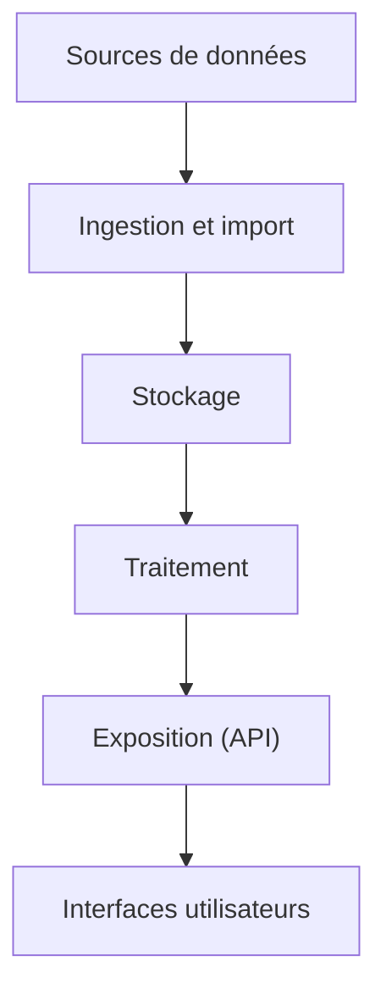
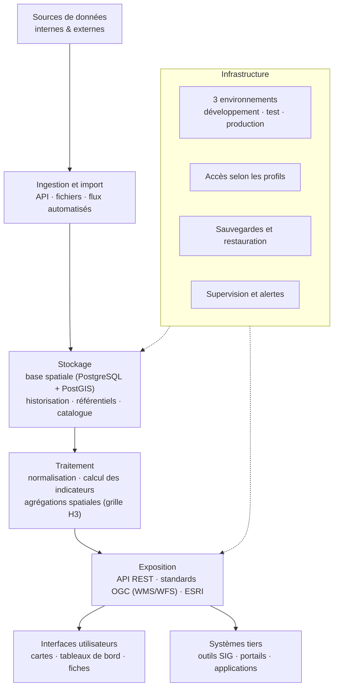
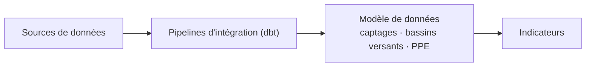
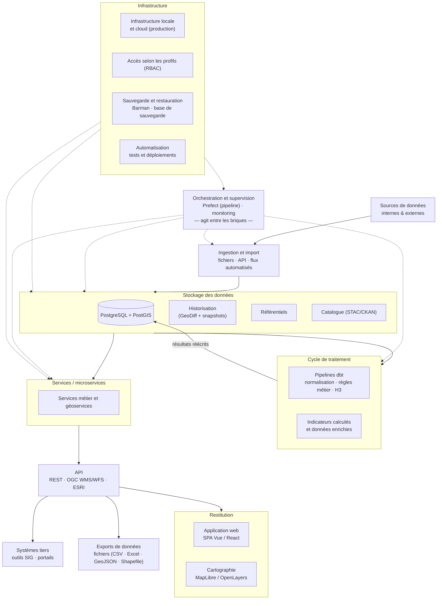

## Architecture cible (niveau macro)

L’architecture cible d’HydroScope vise à structurer de manière cohérente les différents composants du système afin de répondre aux besoins fonctionnels, aux exigences non fonctionnelles et aux contraintes d’interopérabilité. Elle doit permettre de garantir la robustesse, la scalabilité et la maintenabilité de la solution, tout en facilitant les évolutions futures.

Cette architecture repose sur une séparation claire des responsabilités entre les différentes couches du système : acquisition des données, stockage, traitement, exposition et restitution.

### Principes généraux

L’architecture s’appuie sur les principes suivants :

- **Modularité** : séparation des composants pour faciliter la maintenance et les évolutions ;
- **Scalabilité** : capacité à gérer l’augmentation des volumes de données et des usages ;
- **Interopérabilité** : intégration facilitée avec des systèmes externes et respect des standards ;
- **Traçabilité** : capacité à suivre les flux de données et les traitements ;
- **Ouverture** : recours privilégié à des technologies open source lorsque cela est pertinent.

### Schéma fonctionnel

L’architecture s’organise autour de plusieurs briques principales :

- **Sources de données**
  Données internes et externes (services institutionnels, données environnementales, données satellitaires, bases existantes).

- **Couche d’ingestion**
  Mécanismes d’import et de connexion aux sources (API, fichiers, flux automatisés), incluant des processus de validation initiale.

- **Couche de stockage**
  Stockage des données brutes et des données structurées :
  - base de données (relationnelle et/ou spatiale)
  - stockage des historiques
  - gestion des référentiels

- **Couche de traitement**
  Traitements permettant :
  - la transformation et la normalisation des données
  - le calcul des indicateurs
  - l’agrégation spatiale et temporelle
  - l’application des règles métier

- **Couche d’exposition (API)**
  Mise à disposition des données et indicateurs via des interfaces programmatiques, permettant leur consommation par l’application et par des systèmes tiers.

- **Couche de restitution (front-end)**
  Interfaces utilisateurs :
  - cartographie interactive
  - tableaux de bord
  - fiches détaillées
  - outils d’exploration et d’analyse

*Schéma : enchaînement des couches fonctionnelles.*

### Intégration au système d’information existant

HydroScope doit s’intégrer dans l’écosystème existant des partenaires.

Cela implique :
- la connexion à des sources de données existantes sans duplication inutile ;
- la capacité à consommer des services externes (API, flux de données) ;
- la possibilité de diffuser les données produites vers d’autres systèmes ;
- la compatibilité avec les outils SIG et les standards géographiques.

Cette intégration doit être pensée de manière à limiter les redondances et à favoriser la cohérence des données entre systèmes.

*Schéma : intégration dans l'écosystème existant.*

### Choix technologiques

Les choix technologiques ci‑dessous sont proposés pour répondre aux exigences du projet en matière de performance, de sécurité, d'interopérabilité et de maintenabilité. Ils s'appuient sur des technologies open source et des standards en vigueur dans le domaine des données géographiques.

#### Stack applicative

- **Frontend** : application web monopage (SPA) développée en **Vue.js** , **React** , selon les compétences disponibles au sein de l'équipe OEIL. L'interface est conçue pour être responsive, accessible et adaptable aux différents profils d'utilisateurs (experts, partenaires institutionnels, grand public).
- **Cartographie** : utilisation de **MapLibre GL JS** , **OpenLayers** pour la restitution cartographique interactive. Le système supporte le tuilage vectoriel et raster (architecture tuilage) afin d'assurer des performances optimales quel que soit le volume de données affiché.
- **API backend** : exposition des données et des indicateurs via des endpoints RESTful, et conformes aux standards OGC (WMS, WFS) et compatibles avec les systèmes ESRI. L'API sert de couche d'abstraction entre le front-end et la couche de traitement.
- **Géotraitements** : les traitements géographiques spécifiques (validation topologique, contrôle qualité géométrique, agrégation spatiale sur la grille H3) sont réalisés côté serveur via des pipelines dédiés.

#### Données et stockage

- **Base de données** : **PostgreSQL** avec l'extension **PostGIS** pour le stockage des données relationnelles et spatiales. Ce choix garantit la compatibilité avec les standards géographiques et la capacité à gérer des volumes de données importants.
- **Historisation** : mécanisme de versionnement des données via **GeoDiff** (ou équivalent), permettant de conserver un état complet des données à chaque mise à jour et de reconstituer la source exacte d'un indicateur produit à une date donnée.
- **Référentiels** : gestion centralisée des référentiels (objets géographiques, indicateurs, sources de données) avec possibilité d'évolution progressive.
- **Catalogage** : les jeux de données et les indicateurs sont référencés dans un catalogue structuré, exposé via des standards **STAC** (SpatioTemporal Asset Catalog) et **CKAN**, assurant la traçabilité, la découverte des données  interapplicative et la consultation humaine.

#### Intégration et pipelines de données

- **ETL / Transformation** : les pipelines d'intégration et de transformation des données sont construits avec **dbt** (data build tool), assurant la traçabilité des traitements, la reproductibilité des résultats et la cohérence entre les données sources et les indicateurs produits.
- **Modèle de données** : le modèle conceptuel de données (MCD) repose sur les entités principales du projet : **PPE** (Périmètres de Protection de l'Eau), **BV** (Bassins Versants) et **captages/forages**, avec des tables de référence et de fait clairement identifiées.
- **Guidelines d'intégration** : un document de référence (guidelines d'intégration) est produit pour formaliser les modalités de connexion aux sources de données, les formats d'échange attendus et les règles de qualité applicables.

*Schéma : parcours des données jusqu'aux indicateurs.*

#### Infrastructure et déploiement

- **Hébergement** : le système est déployé sur une infrastructure dédiée, conforme aux exigences de sécurité et de souveraineté des données institutionnelles. L'hébergement est à la charge de l'OEIL ou de son prestataire infrastructure.
- **Environnements** : trois environnements distincts sont mis en place — développement, test/recette/qualification, production — afin de sécuriser les mises en production et limiter les risques de régression.
- **CI/CD** : un pipeline d'intégration et de déploiement continus est configuré pour automatiser les tests, la validation et la mise en production des livrables.
- **Sécurité et accès** : mécanismes d'authentification et de gestion des droits (RBAC) sont mis en place. La protection des données utilisateur et sensibles est assurée conformément au RGPD et aux directives institutionnelles.
- **Sauvegarde et restauration** : des mécanismes de sauvegarde régulière (Barman ou équivalent) et de restauration sont configurés avec des délais de récupération évalué en cours de projet (un test de recuperation de la base complète sera effectué avant la mise en production). 
- **Monitoring** : un dispositif de supervision couvre le bon fonctionnement des traitements, la surveillance des connexions aux sources de données, les performances (healthcheck, temps de réponse, disponibilité) et la gestion des alertes en cas d'anomalie.

::: {.callout-caution}

Ces choix devront être validés en cohérence avec les contraintes des partenaires, les compétences disponibles au sein de l'équipe OEIL et les exigences contractuelles du projet.

@todo[] : valider architecture cible avec l'équipe OEIL, en particulier sur les aspects technologiques et d'intégration.

:::

### Schéma de synthèse

Vue d'ensemble reliant le flux de données, la boucle de traitement, l'exposition et les exports, l'orchestration transversale et l'infrastructure.

*Schéma : vue d'ensemble de l'architecture cible.*

