# HydroScope — Spécifications d'interface
## Volet UX & architecture applicative

**Référence :** EPICs (5_perimetre_fonctionnel.qmd), Exigences non fonctionnelles (6_Exigences_non_fonctionnelles.qmd), Vision produit (3_vision_produit_methodologie.qmd), 
**Version :** 1.0


---

## Table des matières

- [HydroScope — Spécifications d'interface](#hydroscope--spécifications-dinterface)
  - [Volet UX \& architecture applicative](#volet-ux--architecture-applicative)
  - [Table des matières](#table-des-matières)
  - [1. Cadre et principes d'alignement](#1-cadre-et-principes-dalignement)
  - [2. Vue d'ensemble de l'interface (zoning)](#2-vue-densemble-de-linterface-zoning)
  - [3. Spécifications UX par zone](#3-spécifications-ux-par-zone)
    - [3.1 Sélecteur d'unités de gestion (captages / forages)](#31-sélecteur-dunités-de-gestion-captages--forages)
      - [Fonctionnalités](#fonctionnalités)
      - [Règles d'affichage](#règles-daffichage)
    - [3.2 Zone cartographique](#32-zone-cartographique)
    - [3.3 Catalogue et sélecteur d'indicateurs](#33-catalogue-et-sélecteur-dindicateurs)
      - [Vignettes organisées](#vignettes-organisées)
      - [Interaction avec une vignette](#interaction-avec-une-vignette)
      - [Tri des captages selon un indicateur](#tri-des-captages-selon-un-indicateur)
    - [3.4 Dataviz — onglets de visualisation](#34-dataviz--onglets-de-visualisation)
    - [3.5 Vues temporelles, changements et choroplèthe H3](#35-vues-temporelles-changements-et-choroplèthe-h3)
    - [3.6 Compte utilisateur et profils](#36-compte-utilisateur-et-profils)
    - [3.7 Analyse multicritère](#37-analyse-multicritère)
    - [3.8 Fil d'actualités](#38-fil-dactualités)
    - [3.9 Export, rapports PDF et partage de session](#39-export-rapports-pdf-et-partage-de-session)
      - [Export de données](#export-de-données)
      - [Rapports PDF (fiches)](#rapports-pdf-fiches)
      - [Partage de session](#partage-de-session)
    - [3.10 Pages À propos et Contact](#310-pages-à-propos-et-contact)
  - [4. Architecture applicative](#4-architecture-applicative)
    - [4.1 Frontend](#41-frontend)
    - [4.2 Couche API / services](#42-couche-api--services)
    - [4.3 Couche données](#43-couche-données)
    - [4.4 Gestion des droits et des sessions](#44-gestion-des-droits-et-des-sessions)
    - [4.5 Schéma d'ensemble](#45-schéma-densemble)
  - [5. Alignement MVP / post-MVP](#5-alignement-mvp--post-mvp)
  - [6. Points de vigilance](#6-points-de-vigilance)

---

## 1. Cadre et principes d'alignement

Les spécifications d'interface sont reformulées pour respecter les principes méthodologiques et fonctionnels du CdC :

| Principe CdC | Référence | Traduction dans l'interface |
|---|---|---|
| **Lisibilité** et interfaces adaptées aux profils | §3.2 Principes méthodologiques ; §6 Accessibilité et ergonomie | Zoning stable, navigation claire, dataviz respectant les règles de l'art, profils experts / partenaires / grand public |
| **Traçabilité et transparence** | §3.2 ; EPIC 1 bis (catalogue) ; EPIC 3 (référentiel indicateurs) | Fiches de métadonnées accessibles depuis chaque vignette d'indicateur ; indication de fraîcheur et de qualité des données (§4 — Monitoring de la qualité des données) |
| **Interopérabilité / standards** | §6 Interopérabilité ; §7 Stack applicative | Carte servie via API OGC/ESRI ; exports aux formats standards (EPIC 8) |
| **Co-construction et profils** | §2 Gouvernance ; EPIC 9 Gestion des utilisateurs | Droits par profil (RBAC), accès gradués aux données, modules et exports |
| **Hors MVP : AMC** | EPIC 5 (vigilance forte, hors périmètre MVP) | Interface AMC présentée comme module post-MVP, bouton dépendant des droits |

La **session de travail** (sélection de captages + indicateurs + filtres) est le concept central : toutes les vues (carte, graphiques, onglets) partagent le même état, conformément à l'exigence de cohérence entre vues de l'**EPIC 6 (Visualisation et exploration)**.

---

## 2. Vue d'ensemble de l'interface (zoning)

```mermaid
flowchart TB
    subgraph HEAD["En-tête global"]
        LOGO[Logo + nom HydroScope]
        NAV[Navigation : Explorer / Analyse / Actualités / À propos]
        USR[Compte utilisateur<br/>bouton silhouette]
        AMC_BTN[Bouton Analyse multicritère<br/>(droit + connexion requis)]
    end

    subgraph WORK["Zone de travail (par défaut : Explorer)"]
        L["Colonne gauche<br/>Sélecteur captages/forages<br/>+ liste de sélection"]
        C["Zone centrale — carte<br/>(fond satellite/carto)<br/>+ couches H3 et captages"]
        R["Colonne droite<br/>Onglets de dataviz<br/>(catalogue → graphiques)"]
    end

    HEAD --> WORK
    NAV -->|basculer| WORK
```

**Légende du zoning (références CdC) :**

| Zone | Rôle | Référence CdC |
|---|---|---|
| **En-tête** | Navigation générale, compte, accès à l'AMC | EPIC 9 (utilisateurs) ; EPIC 5 (AMC) |
| **Colonne gauche** | Sélection et gestion des unités de gestion (captages / forages) | EPIC 6 (sélecteurs et filtres) ; EPIC 3 (référentiels) |
| **Zone centrale** | Carte interactive : objets, couches thématiques, H3 | EPIC 6 (cartographie interactive) ; §1.4 (maille H3) |
| **Colonne droite** | Catalogue d'indicateurs puis visualisations en onglets | EPIC 1 bis (catalogue) ; EPIC 4 (calcul) ; EPIC 6 (graphiques) |

---

## 3. Spécifications UX par zone

### 3.1 Sélecteur d'unités de gestion (captages / forages)

**Références CdC :** EPIC 6 — Sélecteurs et filtres (§5) ; EPIC 3 — Référentiel géographique ; §1.4 — Comparaison de captages/forages et BVAEP.

La colonne de gauche permet de construire et de gérer la **liste des captages/forages** étudiés dans la session.

#### Fonctionnalités

- **Recherche plein texte** — sur le nom du captage/forage, sa commune, son bassin versant (BVAEP) et sa localité.
- **Recherche spatiale** — sélection « par voisinage » d'un point posé sur la carte : l'interface liste les captages proches **avec distance affichée** et les propose à la sélection.
- **Résultats ordonnés par score** de pertinence : affichés en surbrillance sur la carte ; l'utilisateur peut tout sélectionner ou prendre les captages un à un.
- **Affichage des captages sélectionnés** sur la carte selon leur style défini (par type d'ouvrage et statut — cf. catalogue v3.2 : ID 9 Type ouvrage, ID 10 Statut captage).
- **Filtres par groupe** : communes, provinces, BVAEP.
- **Retrait d'un captage** : bouton « croix » sur chaque ligne, ou clic droit sur l'objet dans la carte.
- **Tri de la liste** : ordre alphabétique, regroupement par commune, ou distance à un point de la carte ; tri inversable.
- **Sélection assistée** : proposition automatique des **10 captages les plus exposés** à un indicateur donné (ex. incendies) — appui à l'exploration (hors calcul de criticité, cf. EPIC 7 : pas de scoring interprétatif hors AMC).
- **Import d'une liste** de captages (option à confirmer — cf. EPIC 8 Export/Diffusion pour les formats).

#### Règles d'affichage

- La liste reflète **l'état partagé** de la session : toute modification (ajout / retrait / tri) se répercute sur la carte et les graphiques.
- La surbrillance des résultats de recherche doit se distinguer du style des captages sélectionnés.

---

### 3.2 Zone cartographique

**Références CdC :** EPIC 6 — Cartographie interactive (§5) ; §7 Stack applicative (MapLibre / OpenLayers, tuiles vecteur+raster) ; §1.4 — maille H3 ; §3.3 — risque de surcharge visuelle.

- **Fond de carte** au choix : imagerie satellite ou fond cartographique.
- **Couches d'objets** : BVAEP, captages/forages (avec style type + statut), PPE, limites administratives (communes, provinces) — issue du référentiel géographique (EPIC 3).
- **Couches thématiques d'indicateurs** : rendu choroplèthe sur grille **H3** pour les indicateurs spatialisés (cf. §3.5).
- **Interaction** : zoom, déplacement, sélection, survol (informations contextuelles), superposition de couches.
- **Filtrage serveur / webservice carto** : les données affichées peuvent être servies par des services cartographiques (OGC WMS/WFS ou compatibles ESRI) — §6 Interopérabilité, §7.
- **Cohérence** : la carte ne s'affiche qu'une fois la sélection de captages définie et se synchronise avec les filtres (EPIC 6 — « une modification de filtre doit se répercuter de manière cohérente sur l'ensemble des visualisations »).

> **Risque** (§ EPIC 6 — points de vigilance) : surcharge visuelle → limiter le nombre de couches simultanées et fournir une gestion simple de la visibilité des couches.

---

### 3.3 Catalogue et sélecteur d'indicateurs

**Références CdC :** EPIC 1 bis (catalogue de données) ; EPIC 3 (référentiel des indicateurs) ; EPIC 4 (calcul) ; §1.4 (fiches descriptives des indicateurs) ; catalogue `ressources/liste_indicateurs_v3.2.csv` (source de vérité retenue dans l'analyse `analyse_architecture_donnees_geographique_decisionnelle.md`).

#### Vignettes organisées

- Le catalogue est la porte d'entrée de la colonne droite. Les indicateurs sont organisés **en 2 familles — ENJEUX / MENACES**, puis **thèmes**, puis éventuellement **groupes à objectifs communs** (cf. v3.2 : ex. « Enjeux AEP / Sécurité sanitaire », « Menaces / Infrastructures et usages »).
- **Recherche / filtre** par mot-clé (optionnel : pagination ou « Afficher plus »).
- **Favoris** : marquage d'indicateurs favoris (stockage navigateur/cookies, session ou compte — cf. EPIC 9 — stockage local et RGPD).

#### Interaction avec une vignette

Chaque vignette affiche le **titre de l'indicateur** et propose deux actions :

1. **Ajouter l'indicateur à la session** — action conditionnée aux **droits de l'utilisateur** (RBAC, EPIC 9) ;
2. **Consulter la fiche d'information** (métadonnées, source, méthode, dernière mise à jour, qualité) — **toujours visible, même sans droit d'ajout**.

> **Principe d'inclusivité** : toutes les vignettes sont visibles par tous ; seules les actions sont régulées par les droits. Cela garantit la **transparence** (§3.2) sans compromettre la sécurité (§6 Sécurité, EPIC 9).

#### Tri des captages selon un indicateur

Une icône de tri dans le sélecteur (colonne gauche) ordonne les captages sélectionnés **du plus au moins** selon la valeur de l'indicateur actif — comparaison entre captages (EPIC 6, §1.4).

---

### 3.4 Dataviz — onglets de visualisation

**Références CdC :** EPIC 6 — Tableaux de bord & graphiques ; §6 Accessibilité/ergonomie (dataviz respectant les règles de l'art) ; §1.4 — suivi d'évolution, comparaison.

- **Modèle par onglets** : chaque indicateur ajouté à la session ouvre un onglet nommé à son titre.
- Ajout d'un indicateur via le **bouton « + »** dans la barre d'onglets ; suppression via la **croix** en haut à droite de l'onglet.
- **Page indicateur** : 2 à 3 graphiques par onglet, reprenant les **valeurs de tous les captages sélectionnés** (comparaison inter-captages).
- Chaque graphique doit conserver un lien vers les **métadonnées et la fraîcheur des données** (§4 — Monitoring de la qualité des données ; affichage de la fraîcheur dans les visualisations).
- **Cohérence multi-vues** : les onglets et la carte partagent la même sélection et les mêmes filtres.

---

### 3.5 Vues temporelles, changements et choroplèthe H3

**Références CdC :** EPIC 6 — Graphiques temporels, comparaisons spatiales ; EPIC 4 — agrégations temporelles ; §1.4 — suivi de l'évolution des pressions ; §4 — Monitoring métier et environnemental (tendances et ruptures).

Trois modes complémentaires, activés par icônes sous chaque graphique :

| Mode | Comportement | Détail |
|---|---|---|
| **Vue temporelle** | Icône « dynamiques temporelles » | Série temporelle de l'indicateur pour les captages compatibles (données historisées, EPIC 1/4) |
| **Vue des changements** | Icône « variations » | Variations de l'indicateur entre une date de début et une date de fin ; s'applique à **tous les indicateurs de tous les captages de la sélection** |
| **Carte choroplèthe H3** | Icône « carte stat » | Rend l'indicateur spatialisé en hexagones **H3** sur l'ensemble des BVAEP des captages sélectionnés (EPIC 3 — maillages d'analyse ; §1.4) |
| **Carte thématique** | Icône « carte thématique » | Affiche la **source cartographique** de l'indicateur (couche source, ex. MOS, incendies VIIRS) |

*Chaque mode ne s'affiche que si l'indicateur y est compatible (spatialisation H3, série temporelle disponible).*

---

### 3.6 Compte utilisateur et profils

**Références CdC :** EPIC 9 — Authentification, profils, droits, sessions ; §6 Sécurité ; §11Bis Protection des données (RGPD).

- **Connexion** : bouton discret en haut à droite (icône ronde « buste »).
- **Moyen d'authentification** : compte interne OEIL ou fédération externe (Google, Facebook, LinkedIn…) — **décision à confirmer** (cf. EPIC 9 : SSO, annuaires).
- **Profils** : le compte est associé à un ou plusieurs profils (expert, technicien, décideur, partenaire, grand public — EPIC 9 / EPIC 3 référentiel des rôles).
- **Droits par profil** : accès aux données/indicateurs, aux fonctionnalités (visualisation, export, paramétrage) et aux modules comme **Analyse multicritère**.
- **Sessions et stockage local** : mémorisation des préférences/filtres côté navigateur, limitée aux usages nécessaires et conforme **RGPD** (EPIC 9 — cookies et stockage local).

---

### 3.7 Analyse multicritère

**Références CdC :** EPIC 5 — Analyse multicritère (vigilance forte, **hors MVP**) ; §3.2 Transparence/Traçabilité ; §3.1 (outil d'aide à l'interprétation, non de décision).

- **Accès** : bouton en haut au centre de l'interface, permettant de basculer vers l'interface d'AMC.
- **Disponibilité** : grisé par défaut ; activé selon les **droits de l'utilisateur** et la **connexion**.
- **Pré-sélection** : les indicateurs ajoutés à la session sont proposés par défaut dans l'AMC **lorsque c'est possible** (filtre `Analyse_multicriteres = oui` — v3.2).
  - Les indicateurs incompatibles sont signalés par un message explicite, ex. : *« Les indicateurs "X" et "Y" ne sont pas pris en charge pour le moment dans l'analyse multicritère. »*
- **Onglet « Analyse »** : ajouté à la colonne de dataviz.
- **Composition** : liste des indicateurs pré-sélectionnés, ordonnée **par famille puis thème**.
- **Pondération** : sliders permettant de pondérer les thèmes selon leur importance pour l'utilisateur.
- **Rendu** :
  - carte : résultat en **hexagones H3** + captages en **points colorés par classe** ;
  - **légende** identifiant les valeurs et libellés de chaque classe ;
  - graphique des résultats pour l'ensemble des captages sélectionnés, avec **détail de la composition** (valeur pondérée de chaque composante du score) — à approfondir.
- **Réutilisation** : tri du sélecteur de captages selon les résultats de l'analyse.
- **Principes imposés** : transparence des méthodes, traçabilité des résultats vers les indicateurs sources, réversibilité vers la lecture détaillée (EPIC 5 — principes de mise en œuvre).

---

### 3.8 Fil d'actualités

**Références CdC :** §1.4 — Partage et diffusion ; EPIC 8 — Diffusion ; §4 — Monitoring des usages (pilotage).

- **Page d'articles / fil d'actualités** présentant les nouveautés et les **mises à jour de l'application et des données**.
- **Abonnement** au fil (notification des nouveautés) — niveau d'implémentation à confirmer.
- Ce fil sert de **canal de diffusion** des évolutions (données, indicateurs, fonctionnalités), cohérent avec l'objectif de partage (§1.3 — Objectif Partage).

---

### 3.9 Export, rapports PDF et partage de session

**Références CdC :** EPIC 8 — Export de données, rapports, partage de résultats, API de diffusion ; EPIC 7 — Fiches et rapports automatisés.

#### Export de données

- Export des **données de la session en cours**.
- Export d'**un ou plusieurs (ou tous) indicateurs** pour l'ensemble des objets : **captages/forages, BVAEP, grille H3**.
- Formats standards : tabulaires (CSV, Excel) et géographiques (GeoJSON, Shapefile, GeoPackage) — EPIC 8.
- Résultats d'AMC exportables (option à confirmer).

#### Rapports PDF (fiches)

- Génération d'une **fiche Captage** pour chaque captage de la sélection.
- Contenu : **ensemble des indicateurs disponibles** avec graphiques et **représentation cartographique**.
- Référence EPIC 7 : fiches structurées, sans classement/scoring interprétatif hors AMC ; à maintenir à jour après intégration des mises à jour de données (régénération automatisée).

#### Partage de session

- Génération d'un **lien partagé** restituant le contexte de consultation (territoire sélectionné, indicateurs, filtres, type de vue) — EPIC 8.
- **Droits d'accès** appliqués au destinataire :
  - si le lien contient des données ou une AMC restreinte, le **formulaire de connexion** s'affiche ;
  - si l'authentification échoue (ou absence de droits), seuls les **indicateurs et fonctions publics** sont affichés.
- **Pérennité des liens** : gestion des versions et de l'évolution des données (EPIC 8 — point de vigilance).

---

### 3.10 Pages À propos et Contact

**Références CdC :** §1 Contexte et objectifs ; financeurs (OFB 65 %, fonds PEP 35 %, OEIL) ; §2 Gouvernance.

- **Page À propos** : page statique décrivant le projet HydroScope, ses objectifs (§1.3) et ses **financeurs (PEP, OFB, OEIL)**.
- **Section Contact** : formulaire ou coordonnées de contact.

---

## 4. Architecture applicative

> Les choix ci-dessous reprennent la stack recommandée au **§7 — Architecture cible** (« choix technologiques », marqués comme recommandations AMOE à valider par l'OEIL).

### 4.1 Frontend

| Brique | Choix (recommandation CdC) | Rôle |
|---|---|---|
| Framework | **Solara** ou **Panel** (SPA Python) — alternatives Vue.js/React | Application monopage, responsive, multi-profils |
| Cartographie | **MapLibre GL JS** / **OpenLayers** | Carte interactive, couches, H3 |
| Symbolisation | **BertinJS** | Choroplèthes, classes de légende (AMC, H3) |
| Tuilage | Tuiles **vecteur + raster** | Performance d'affichage (EPIC 6 ; §6 < 3 s) |

**Composants UI attendus** : barre de navigation, sélecteur (colonne gauche), carte (zone centrale), catalogue + onglets de dataviz (colonne droite), en-tête compte/AMC, modales de fiche/métadonnées.

### 4.2 Couche API / services

- **API REST** conforme **OGC (WMS/WFS)** et **compatible ESRI** (§7 Stack applicative) servant : objets du référentiel (captages, BVAEP, PPE, communes/provinces), couches d'indicateurs (H3), fiches de métadonnées.
- **Couche d'abstraction** entre le frontend et les traitements (le front n'accède pas directement à la base).
- **Filtrage selon droits** : l'API applique les habilitations de l'utilisateur (EPIC 9 ; §6 Sécurité) — y compris pour les liens partagés (EPIC 8).
- **API de diffusion** documentée pour la réutilisation par des systèmes tiers (EPIC 8 — API de diffusion).

### 4.3 Couche données

- **Stockage** : PostgreSQL + PostGIS (faits / références) — §7 Données et stockage.
- **Sélection / session** : les états de session (captages, indicateurs, filtres) sont portés par le contexte applicatif ; les préférences persistées côté navigateur restent **limitées et non sensibles** (EPIC 9).
- **Référentiels** (EPIC 3) : géographique (BVAEP, captages/forages, PPE, limites admin, grille H3), indicateurs (fiches, méthodes), utilisateurs/rôles.
- **Catalogue** (EPIC 1 bis) : métadonnées structurées, alimentées par les pipelines (dbt), exposées en partie aux utilisateurs (STAC/CKAN — §7).

### 4.4 Gestion des droits et des sessions

```mermaid
flowchart TB
    U[Utilisateur] -->|connexion| AUTH[Authentification<br/>compte OEIL / SSO externe]
    AUTH --> RBAC[RBAC — profils & droits<br/>(EPIC 9 / EPIC 3 référentiel rôles)]
    RBAC --> FRONT[Frontend : vues et actions<br/>filtrées par droits]
    RBAC --> API[API : données filtrées<br/>par habilitations]
    RBAC --> AMC2[Module AMC<br/>activé si droits + connexion]
    SESS[Session & préférences<br/>cookies / stockage local RGPD] --> FRONT
```

- **Authentification** : identifiants/mot de passe, avec possibilité de SSO/annuaire (décision à confirmer).
- **Droits** : RBAC par profil ; régulent l'accès aux données, indicateurs, modules et exports.
- **Session** : gestion côté navigateur limitée au fonctionnement, conforme RGPD (EPIC 9).

### 4.5 Schéma d'ensemble

```mermaid
flowchart LR
    subgraph FR["Frontend (Solara/Panel)"]
        NAV[Navigation & profils]
        SEL[Sélecteur captages/forages]
        MAP[MapLibre / OpenLayers<br/>+ tuiles vecteur/raster]
        CAT[Catalogue indicateurs<br/>+ onglets dataviz + H3]
        AMC[Module Analyse multicritère]
    end

    subgraph API2["Couche API / services (OGC WMS/WFS, ESRI)"]
        R1[API référentiel & objets]
        R2[API indicateurs & H3]
        R3[API fiches / métadonnées]
        R4[API export / partage]
    end

    subgraph D["Couche données"]
        PG[(PostgreSQL + PostGIS<br/>faits / références)]
        CATD[(Catalogue STAC/CKAN)]
        HIST[(Historisation<br/>GeoDiff + snapshots)]
    end

    FR --> API2
    API2 --> D
    RBAC["RBAC (EPIC 9)"] -.-> API2
    RBAC -.-> FR
```



---

## 5. Alignement MVP / post-MVP

| Fonctionnalité d'interface | Périmètre | Référence |
|---|---|---|
| Sélecteur captages/forages, recherche, tri | **MVP** | EPIC 6 ; §3.4 MVP |
| Carte interactive, couches, H3 de base | **MVP** | EPIC 6 ; §1.4 |
| Catalogue d'indicateurs + fiches métadonnées | **MVP** | EPIC 1 bis ; EPIC 3 |
| Dataviz en onglets, graphiques temporels | **MVP** | EPIC 6 |
| Vues changements / choroplèthe H3 avancées | Post-MVP | EPIC 6 (enrichissement) |
| Compte utilisateur, profils, RBAC | **MVP (socle)** | EPIC 9 ; §7 Sécurité |
| **Analyse multicritère** | **Post-MVP** | EPIC 5 (§ hors MVP) |
| Fiches PDF automatisées | Post-MVP / enrichissement | EPIC 7 |
| Export de données, partage de session | Post-MVP / enrichissement | EPIC 8 |
| Fil d'actualités, abonnement | Post-MVP | EPIC 8 ; §1.4 |
| Pages À propos / Contact | **MVP** | §1 ; §2 |

---

## 6. Points de vigilance

1. **Surcharge visuelle** (EPIC 6) : limiter les couches simultanées et offrir une gestion claire de la visibilité ; adapter les représentations aux profils (experts vs grand public).
2. **Cohérence multi-vues** : toute modification de sélection ou de filtre doit se répercuter sur la carte, les graphiques et les onglets (exigence EPIC 6).
3. **Fraîcheur et qualité des données** : afficher dates de mise à jour et indicateurs de fiabilité directement dans les visualisations (§4 — Monitoring de la qualité des données).
4. **Droits et partage** : les liens partagés et l'API doivent réappliquer les habilitations du destinataire (EPIC 8 / EPIC 9) ; dégradation vers le périmètre public en cas d'échec d'authentification.
5. **AMC** : hors MVP ; toute interface AMC doit respecter les principes de transparence, traçabilité, réversibilité et prudence (EPIC 5), et rester un outil d'aide à l'interprétation (EPIC 5 ; §3.1).
6. **Exports** : cohérence entre les données affichées et les données exportées (EPIC 8) ; formats standards et réutilisation en SIG bureautique.
7. **RGPD / stockage local** (EPIC 9) : cookies et stockage limités aux usages fonctionnels, sans données sensibles, avec transparence et mécanisme de consentement si nécessaire.
8. **Version du catalogue d'indicateurs** : ce document s'appuie sur `ressources/liste_indicateurs_v3.2.csv`, conformément à l'analyse `analyse_architecture_donnees_geographique_decisionnelle.md` (« la v3.2 fait autorité »). Les annexes du CdC contiennent désormais une **v4** (`annexes/liste_indicateurs_v4.xlsx`, `annexes/Fiches_indicateurs_HydroScope-v4.pdf`) — **confirmer la version faisant autorité** avant intégration (évolution des colonnes `objectif_INFO` / `objectif_AMC` / `Analyse_multicriteres`, ajouts d'indicateurs).
