# HydroScope — Analyse d'architecture de données géographique & décisionnelle

---

## 1. Synthèse exécutive & positionnement

HydroScope est un **système d'information** d'observation et de restitution dédié au suivi de la ressource en eau potable sur le territoire néo-calédonien. Il cible les objets géographiques suivants (*§1.3 — Objectifs du projet*) :

- **BVAEP** — Bassins Versants d'Approvisionnement en Eau Potable (~50) ;
- **Captages / forages** (~500) ;
- **Périmètres de Protection des Eaux (PPE)** (~250) ;
- **Unités de Distribution (UD)** associées (sources DASS/CEN).

Le cahier des charges formalise **quatre objectifs structurants** (*§1.3 — Objectifs du projet*) qui fondent directement l'architecture de données :

| Objectif | Ambition | Répercussion architecture |
|---|---|---|
| **Connaissance** | Caractériser le territoire (relief, géologie, pluviométrie) et les enjeux (population desservie) | Structuration d'un **modèle géographique** centralisé et de référentiels |
| **Diagnostic** | Produire des **indicateurs homogènes** (enjeux, pressions, état) et les **historiser** | Couche **décisionnelle** + **versionnement / traçabilité** |
| **Veille** | Détection **automatique** des changements environnementaux significatifs | **Pipelines automatisés** et **monitoring métier** |
| **Partage** | Tableaux de bord **adaptés aux profils** (experts, partenaires, grand public) | Couche **exposition / restitution multi-profils** |

L'outil est un **support d'aide à la décision, non un système décisionnel de substitution** (*§3.1 — Vision cible*) : il croise des sources multiples pour une lecture synthétique et opérationnelle, sans automatiser la décision.

### 1.1 Vue de synthèse (positionnement de l'architecture dans le SI)

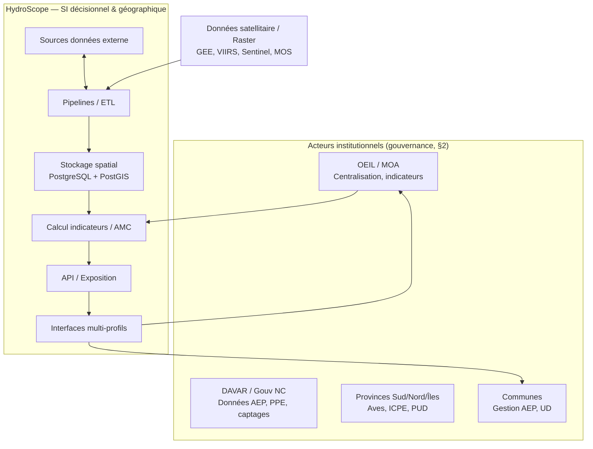

*Cadre de lecture : le SI s'intercale entre les producteurs de données (services institutionnels, provinces, GEE) et les utilisateurs finaux profilés. La MOA (OEIL) pilote la cohérence (« couche socle ») depuis le §2.2.*

---

## 2. Architecture cible (vue macro en 6 couches)

### 2.1 Principes généraux

Le CdC définit explicitement **cinq principes** d'architecture (→ *§7 "Principes généraux"*) :

1. **Modularité** — séparation des composants pour maintenance et évolution ;
2. **Scalabilité** — capacité à absorber la croissance des volumes et usages ;
3. **Interopérabilité** — standards du domaine géographique (OGC), intégration avec le SI externe ;
4. **Traçabilité** — suivi des flux de données et des traitements de bout en bout ;
5. **Ouverture** — préférence aux **technologies open source** (recommandation AMOE, `@todo` à valider par l'OEIL, §7 "Choix technologiques").

> **Note fondamentale.** L'ensemble des choix technologiques proposés dans la suite sont **des recommandations AMOE** ("la stack est une recommandation AMOE, adaptable par l'OEIL"), marquées `@todo` et « à valider » — cf. **§7 — Choix technologiques**.

### C2.2 Schéma fonctionnel en 6 briques (§7 "Schéma fonctionnel")

Le CdC décrit l'architecture en **six couches fonctionnelles** qui séparent clairement les responsabilités. Je les représente ainsi :

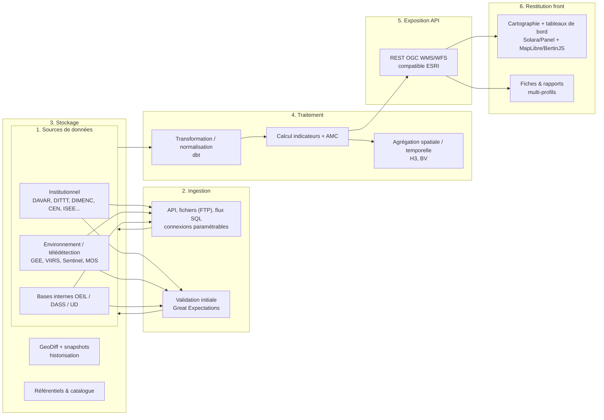

### C2.3 Intégration au SI existant (§7 "Intégration au système d'information existant")

L'architecture doit respecter **quatre exigences d'intégration** :

- Connexion aux sources **sans duplication inutile** ;
- Consommation de **services externes** (API, flux) ;
- Possibilité de **diffuser** les données produites vers d'autres systèmes ;
- **Compatibilité avec les outils SIG et standards géographiques**.

Ceci justifie le choix d'une couche d'ingestion unique (unifie fichiers / bases / API / cloud) et d'une **couche d'exposition API** normalisée (voir §8).

---

## 3. Structure de données géographique (modèle conceptuel)

### C3.1 Entités métier centrales (§7 "Modèle conceptuel MCD" + glossaire)

Le CdC identifie explicitement le **modèle conceptuel de données (MCD)** reposant sur des entités principales : **PPE**, **BV (BVAEP)**, **captages/forages**, complétées par les **tables de référence** et les **tables de fait** clairement identifiées (logique « étoile / fait-référence »). S'y ajoute la **maille géographique H3** comme grille d'agrégation transverse (*§1.4 — Objectifs fonctionnels* : « ...maille géographique vectorielle H3 (système de grille hiérarchique vectorielle standardisée pour agréger les données hétérogènes »).

Le catalogue v3.2 confirme l'existence d'un support spatial **ÉD** (Unité de Distribution) rattaché aux captages, en plus des supports **Captage / BV / grille H3** (cf. §5).

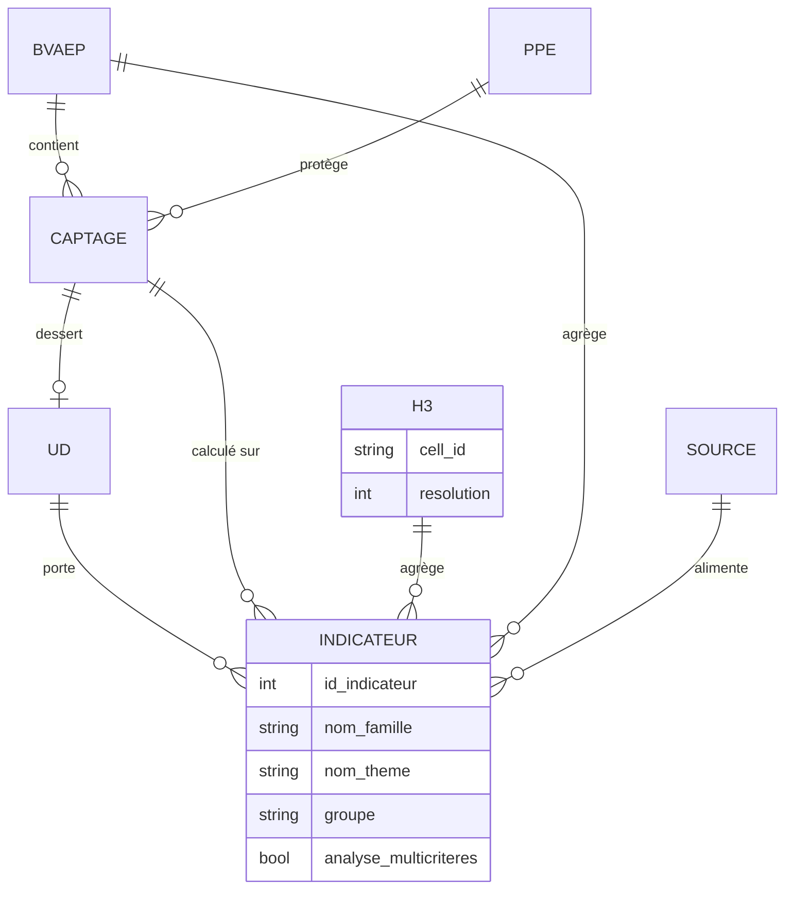

> **Table de fait vs référence.** Les **objets géographiques stables** (BV, PPE, captage, grille H3) constituent le **référentiel** ; les **mesures et métriques calculées** (indicateurs, pressions, taux de couverture) constituent les **faits** — ce qui autorise des croisements temporels et territoriaux sans redondance (cf. §3.3 et §6).

### C3.2 Référentiels & normalisation des identifiants

Le catalogue utilise une **numérotation d'identifiants** qui structure les ensembles d'indicateurs (cf. **dictionnaire** associé au catalogue, §5) :

- `1–99` → Enjeux AEP ;
- `100–199` → Enjeux Environnementaux ;
- `200–299` → Pressions / Menaces Naturelles ;
- `300–399` → Pressions / Menaces Anthropiques ;
- `400–499` → Vulnérabilité / Sensibilité ;
- `500–599` → Pressions Quantitatives (dans le modèle AMC) / Sensibilité (dans v3.2).

La **fig. du catalogue v3.2** reprend ces plages mais avec un regroupement thématique évolué (voir §5.1).

---

## 4. Chaîne de traitement — pipeline de données & ETL

### C4.1 Vue du pipeline (§7 "Intégration et pipelines de données" ; §3bis "Implémentation technique" ; EPIC1/1bis)

Le CdC propose une **stack ETL / orchestration / qualité** cohérente et open source :

| Brique | Outil | Rôle | Références CdC |
|---|---|---|---|
| **Ingestion** | **Intake** | Accès unifié fichiers/bases/API/stockage cloud ; chargement paresseux + cache | §7 "Intégration et pipelines de données" |
| **Qualité** | **Great Expectations** | Validation conformité (schéma, complétude, cohérence) avant transformation | §7 "Intégration", EPIC2 (§5) |
| **Transformation** | **dbt** (data build tool) | ETL/traçabilité des lignages entre sources et indicateurs | §7 + §3bis "Implémentation technique" |
| **Catallogue** | **STAC / CKAN** | Découverte et traçabilité des jeux de données | §3bis + EPIC1bis |
| **Orchestration** | **Prefect** | Pilotage du pipeline, snapshots, horisation | §7 "Données et stockage" + §4.6 |

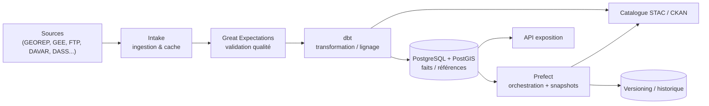

### C4.2 Nature des importations (EPIC1)

- Dépôts **FTP** de fichiers (CSV/SIG) ;
- connexions **API** aux services externes (GEOREP/ArcGIS REST, GEE, provinces) ;
- connexions **bases de données** internes (sans duplication inutile — §7 Intégration) ;
- imports **paramétrables et reproductibles** (automatisation).

### C4.3 Traçabilité & gouvernance des lignes (§3.2 "Traçabilité/Transparence" + §3bis)

Les principes méthodologiques *Traçabilité* et *Transparence des calculs* (**§3.2 — Principes méthodologiques**) imposent que **chaque** donnée soit reliée à **sa source, sa date de production et ses transformations**. dbt (data lineage) et le versioning (§7) fournissent ce « fil d'Ariane » : chaque indicateur produit est rattaché à la version exacte des données ayant servi à son calcul — cf. §6 et §7.

---

## 5. Catalogue d'indicateurs (couche métier & décisionnelle)

> **Source de référence :** `ressources/liste_indicateurs_v3.2.csv` (39 lignes). Ce fichier est **autoritatif** pour la description, les objectifs **INFO/AMC** et l'éligibilité à l'analyse multicritère ; il **complète et affine** dans certains points le CdC (qui ne détaille pas les familles de façon exhaustive). Le CdC (§1.4 — Objectifs fonctionnels, §5Ter) définit le cadre : grille H3, fiche par profils, comparabilité.

### 5.1 Hiérarchie Famille → Thème → Groupe → Indicateur

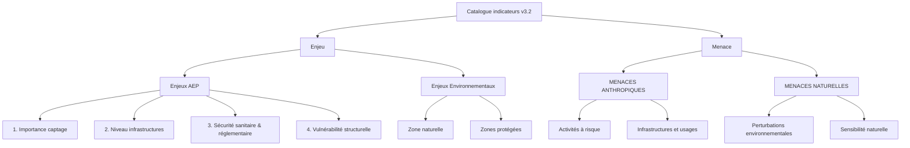

### 5.2 Tableau détaillé des indicateurs v3.2

Légende colonnes : **ID** = atténuant ; **AMC** = *oui* si l'indicateur participe à l'analyse multicritère (sinon il reste **informatif** contextuel) ; **Sources** = ressources mobilisées.

| ID | Famille | Thème / Groupe | Indicateur | AMC | Sources mobilisées (description v3.2) |
|---|--------|----------------|-----------|-----|---------------------------------------|
| 1 | Enjeu | Enjeux AEP / Importance captage | Capacité de production | oui | Hydrométrie DAVAR (limnimètres) — règle 50 % étiage |
| 6 | Enjeu | Enjeux AEP / Importance captage | Population desservie | oui | Fichiers DASS (UD) |
| 10 | Enjeu | Enjeux AEP / Importance captage | Statut captage | oui | Captages d'eau DAVAR |
| 12 | Enjeu | Enjeux AEP / Importance captage | Établissements publics sensibles | oui | Inventaires services publics († à définir) |
| 2 | Enjeu | Enjeux AEP / Niveau infrastructures | Longueur réseau | oui | Registres UD (DASS) |
| 3 | Enjeu | Enjeux AEP / Niveau infrastructures | Capacité réservoir | oui | Registres DASS (UD) |
| 4 | Enjeu | Enjeux AEP / Sécurité sanitaire | Traitement | oui | Fichiers UD (DASS) |
| 7 | Enjeu | Enjeux AEP / Sécurité sanitaire | Statut AODPE | oui | Base AODPE (DAVAR) |
| 8 | Enjeu | Enjeux AEP / Sécurité sanitaire | Statut PPE | oui | PPE (DAVAR) |
| 11 | Enjeu | Enjeux AEP / Sécurité sanitaire | Statut du foncier | oui | Parcelle cadastrale (DITTT) |
| 5 | Enjeu | Enjeux AEP / Vulnérabilité structurelle | Interconnexion | oui | UD (DASS) |
| 9 | Enjeu | Enjeux AEP / Vulnérabilité structurelle | Type ouvrage | oui | Captages d'eau (DAVAR) |
| 105 | Enjeu | Enj.Env. / Zone naturelle | Occupation sol (couvert végétal) | oui | MOS 2014 + Dynamic World (GEE) |
| 106 | Enjeu | Enj.Env. / Zone naturelle | Occupation sol (couvert forestier) | oui | TMF (JRC) |
| 100 | Enjeu | Enj.Env. / Zones protégées | Zones UNESCO | oui | CEN (zones UNESCO) |
| 101 | Enjeu | Enj.Env. / Zones protégées | Zones protégées provinciales | oui | 3 provinces |
| 102 | Enjeu | Enj.Env. / Zones protégées | KBA / ZICO | oui | CEN (UICN) |
| 104 | Enjeu | Enj.Env. / Zones protégées | Espèces rares & forêt sèche | oui | Endemia + CEN (forêt sèche) |
| 107 | Menace | Anthropiques / Activités à risque | Occupation sol (surfaces agricoles) | oui | MOS 2014 |
| 300 | Menace | Anthropiques / Activités à risque | ICPE | oui | DIMENC + 3 provinces |
| 301 | Menace | Anthropiques / Activités à risque | Zone d'exploitation minière | oui | Exploitation minière DIMENC |
| 308 | Menace | Anthropiques / Activités à risque | Autres IOTA | oui | Inventaires terrain |
| 302 | Menace | Anthropiques / Infrastructures | Urbanisation | oui | Localités zones bâties (DITTT) |
| 304 | Menace | Anthropiques / Infrastructures | Habitations | oui | Typologie habitat ISEE + BDTOPO |
| 305 | Menace | Anthropiques / Infrastructures | Franchissements | oui | Réseau routier DITTT + DAVAR |
| 306 | Menace | Anthropiques / Infrastructures | Linéaire routes | oui | BDROUTE-NC (DITTT) |
| 307 | Menace | Anthropiques / Infrastructures | Plan d'Urbanisme Directeur | **non** | PUD communes (provinces) |
| 503 | Menace | Anthropiques / Infrastructures | Nombre de prélèvements AODPE | **non** | AODPE (DAVAR) |
| 504 | Menace | Anthropiques / Infrastructures | Volume prélèvements AODPE | oui | AODPE (DAVAR) |
| 200 | Menace | Nat. / Perturbations env. | Incendies cumulés | oui | VIIRS (OEIL) depuis 2012 |
| 201 | Menace | Nat. / Perturbations env. | Surface érosion | **non** | Carto formes érosives OEIL |
| 202 | Menace | Nat. / Perturbations env. | Terrain nu | oui | MOS 2014 / Dynamic World |
| 204 | Menace | Nat. / Perturbations env. | Espèces exotiques envahissantes (EEE) | oui | ANCB |
| 203 | Menace | Nat. / Sensibilité naturelle | Glissement terrain | oui | Aléas mouvement DIMENC |
| 401 | Menace | Nat. / Sensibilité naturelle | Géologie | **non** | Géologie 1/200 000 (DIMENC/BRGM) |
| 402 | Menace | Nat. / Sensibilité naturelle | Vulnérabilité intrinsèque eaux souv. | oui | BDLISA-NC (DIMENC) |
| 500 | Menace | Nat. / Sensibilité naturelle | Bilan Besoin Ressource (BBR) | oui | BBR (DAVAR) — DCE2 |
| 501 | Menace | Nat. / Sensibilité naturelle | Pluviométrie | **non** | Météo France NC |

**Lecture :** la colonne `Analyse_multicriteres` (*oui/non*) distingue les indicateurs **calculés pour l'AMC** des indicateurs **strictement informatifs/contextuels** (307 PUD, 503 nb prélev., 201 érosion, 401 géologie, 501 pluviométrie). Le `objectif_INFO` et `objectif_AMC` du CSV séparent explicitement les deux vocations par indicateur.

### 5.3 Régime de la source ↔ support spatial ↔ agrégation (H3)

Conformément au CdC (*§1.4 Objectifs fonctionnels — maille H3 ; §5Ter — EPIC 3 Référentiels & maillages*), chaque indicateur est décliné selon un **support spatial** puis agrégé vers le bassin versant pour la restitution :

| Support spatial | Nature | Exemples d'indicateurs (v3.2) |
|---|---|---|
| **Captage / forage** | ponctuel | Capacité de production (1), Statut AODPE (7), Type ouvrage (9), Volume prélèvements (504) |
| **Unité de Distribution (UD)** | agrégation liée au captage | Population desservie (6), Longueur réseau (2), Capacité réservoir (3), Traitement (4) |
| **Bassin versant (BV)** | agrégation native | BBR (500), EEE (204) |
| **Maille H3** | grille hiérarchique vectorielle | Occupation sol (105/106/107), Incendies (200), Terrain nu (202), ICPE (300), Urbanisation (302) |

La **maille H3** joue un rôle central : c'est le **support d'agrégation transverse** qui permet de croiser des données hétérogènes (incendies, érosion, occupation du sol) à résolution spatiale comparable avant de les agréger vers le BV (*§1.4*). Les données **raster** (Dynamic World, TMF, VIIRS, formes érosives) y sont échantillonnées ; les données **vectorielles** y sont intersectées puis sommées.

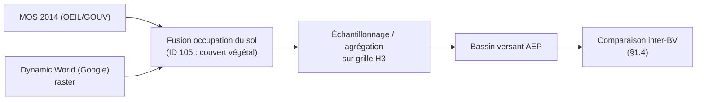

*Exemple issu de la description v3.2 de l'indicateur 105 (« croiser le MOS 2014 (OEIL/GOUV) et Dynamic World (Google) ») : deux sources de nature différente (vecteur / raster) sont réconciliées sur la grille H3 avant agrégation au BV.*

#### Propagation captage → UD → BV

La logique de propagation des indicateurs ponctuels est explicitée dans la v3.2 (ex. Population desservie rattachée à l'**UD**) et reprise par la chaîne de calcul (§6) :

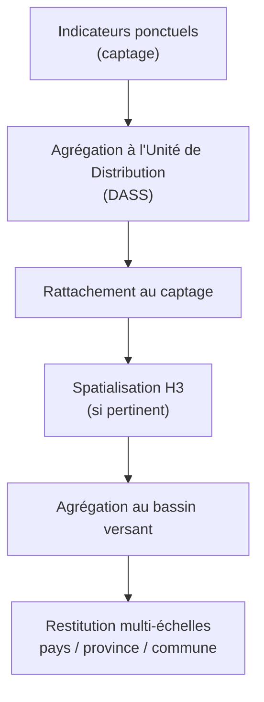

---

## 6. Couche décisionnelle — analyse multicritère & versionnement

### 6.1 Principes et moteur AMC (§5 EPIC 5 ; §3.2 Principes méthodologiques)

L'analyse multicritère (**hors périmètre du MVP**, soumise à vigilance forte, cf. **§5 — EPIC 5** et §3.4) combine les indicateurs marqués `Analyse_multicriteres = oui` (v3.2) en représentations synthétiques :

- **Normalisation** des métriques hétérogènes — 4 méthodes identifiées dans le catalogue : classes 3 niveaux, catégoriel mappé 1-3, binaire mappé, valeurs déjà normalisées (IDPR 0-4, BBR 1-5) ;
- **Pondération par famille** : *Enjeux* → contribution positive, *Menaces* → contribution négative, *Vulnérabilité / Sensibilité* → facteur amplifiant ;
- **Criticité combinée** : définition du sens par indicateur (ex. faible capacité = criticité forte ; absence de PPE = criticité forte).

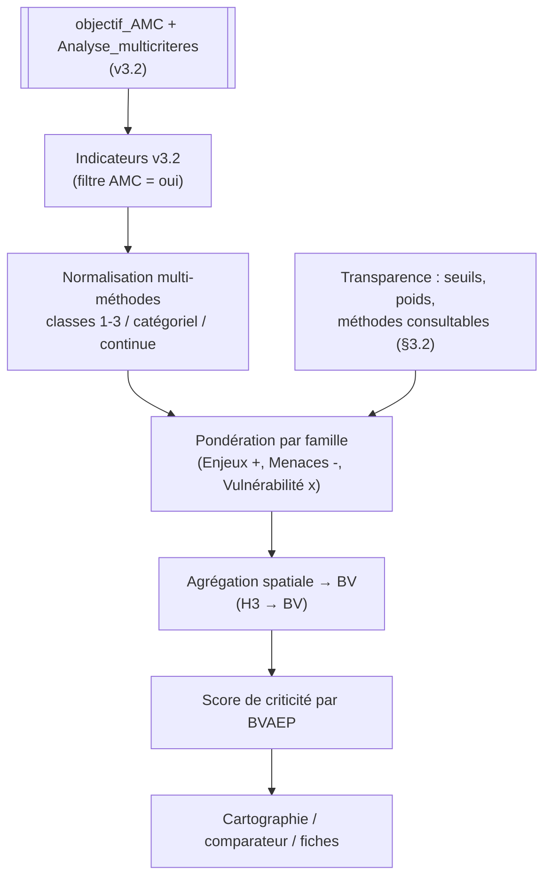

### 6.2 Versionnement des méthodes (§5 EPIC 4 ; §4.6 Historisation)

- **Versionnement des indicateurs** — distinct de l'historisation des données : conservation des **versions successives des méthodes de calcul**, reproductibilité par version, traçabilité des changements (formule, source, paramètres) ;
- **Lien indicateur ↔ version exacte des données** via l'orchestration **Prefect** (cf. §7.2) → reproductibilité des résultats passés et comparabilité temporelle.

---

## 7. Monitoring, veille & historisation

### 7.1 Quatre volets de supervision (§4 Monitoring, supervision et pilotage)

| Volet | Cible | Contenu |
|---|---|---|
| **Monitoring technique** (§4.1) | équipes techniques | imports (succès/échec, volumétrie, durée), connexions aux sources, healthcheck, alertes |
| **Monitoring qualité des données** (§4.2) | utilisateurs | dates de mise à jour, complétude, détection d'anomalies, fiabilité |
| **Monitoring métier & environnemental** (§4.3) | MOA / AMOA | suivi temporel des pressions, alertes, **détection différentielle** brute à chaque mise à jour de source |
| **Monitoring des usages** (§4.4) | pilotage | fréquentation, actions les plus utilisées, usage par profil, territoires consultés |

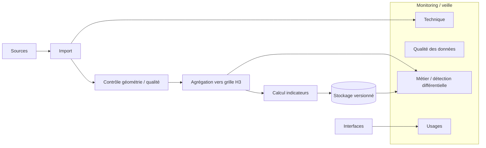

### 7.2 Historisation & traçabilité (§4.6 ; §7 Données et stockage)

Mécanisme **dual** selon le type de données (pas d'historisation uniforme — adaptation aux types) :

- **Cartographie vectorielle** → **GeoDiff** (enregistrement détaillé : ajouts, suppressions, modifications) ;
- **Autres types** (raster : imagerie Sentinel/VIIRS ; séries temporelles) → **snapshots complets** à chaque mise à jour, orchestrés par **Prefect**.

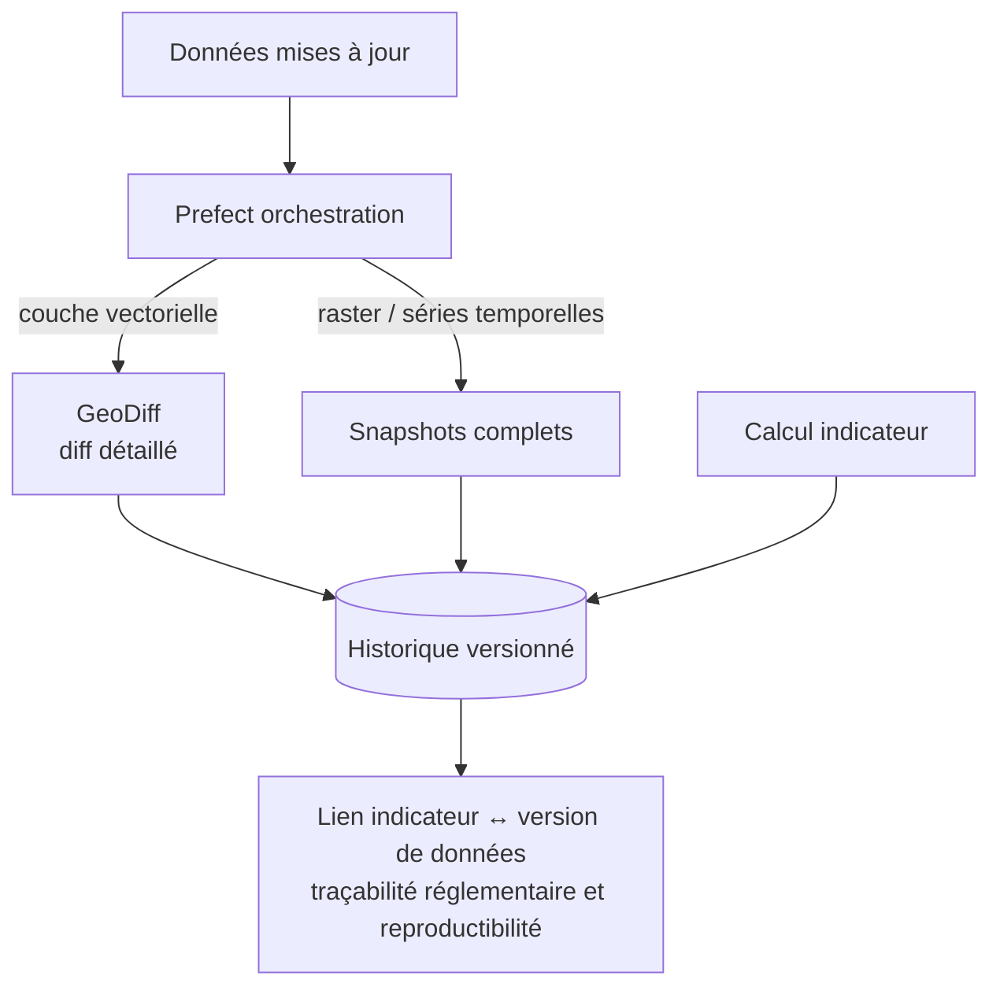

*Chaque indicateur est relié à la **version exacte** des données ayant servi à son calcul (traçabilité — §3.2).*

---

## 8. Exposition & restitution (API & interfaces)

### 8.1 Stack applicative (§7 Stack applicative)

| Brique | Préconisation CdC |
|---|---|
| Frontend | **Solara** ou **Panel** (SPA Python) — alternatives : Vue.js / React |
| Cartographie | **MapLibre GL JS** / **OpenLayers** |
| Symbolisation | **BertinJS** |
| Tuilage | vecteur + raster |
| API backend | **RESTful** conformes **OGC (WMS/WFS)**, compatibles **ESRI** |
| Géotraitements | pipelines serveur : validation topologique, agrégation **H3** |

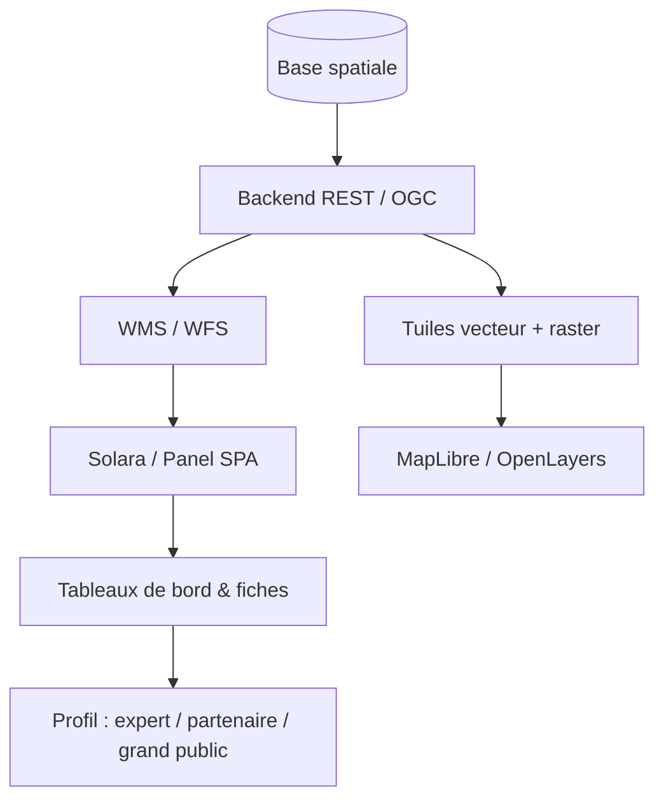

### 8.2 Interfaces par profil (§1.4 ; §3.1 ; §5 EPIC 6 & 7)

Restitution **multi-profils** : tableaux de bord experts, interfaces partenaires institutionnelles, fiches pédagogiques — socle de données partagé, niveaux d'information différenciés (*§1.4 Objectifs fonctionnels — Partage*).

---

## 9. Sécurité, exigences non fonctionnelles & gouvernance

### 9.1 Sécurité & accès (§7 Sécurité et accès ; §6 Sécurité ; §11Bis Protection des données)

- **Authentification** + **RBAC** (rôles par profil) ;
- conformité **RGPD** et directives institutionnelles ;
- protection des données sensibles (cadastre, minier), **sécurisation des échanges**, **traçabilité des accès** ;
- sauvegarde / restauration via **Barman** (ou équivalent).

### 9.2 Performances & volumétrie (§6)

| Exigence | Valeur |
|---|---|
| Affichage cartes / tableaux de bord | < 3 s |
| Volumes | ~50 BVAEP ; ~500 captages/forages ; ~250 PPE ; ~40 indicateurs ; **10–50 utilisateurs simultanés** |
| Croissance | ≈ +15 % / an |
| Traitements lourds | différés (pipeline arrière-plan) |
| Disponibilité | ≥ 98 % |

### 9.3 Disponibilité & SLA (§11Bis ; §6 Disponibilité)

- Disponibilité cible : **≥ 98 %** (hors maintenance planifiée) ;
- SLA contractuels : **Bloquant** 4h prise en charge / 24h résolution ; **Majeur** 5j / 10j ; **Mineur** 10j / 30j.

### 9.4 Gouvernance (§2.3) & déploiement (§7 ; §9)

- **COPIL / COTECH / ateliers utilisateurs** ; validations itératives ;
- **3 environnements** : dev / recette-qualification / production (conteneurs + CI/CD — §9) ;
- infrastructure **souveraine**, à la charge de l'OEIL (orientation open source — §7).

---

## 10. Recommandations & points de vigilance

### 10.1 Constats issus du catalogue v3.2 (architecture)

- **Indicateurs strictement informatifs** (AMC = non) à gérer séparément dans l'exposition : PUD (307), nombre de prélèvements (503), érosion (201), géologie (401), pluviométrie (501) — ne pas les intégrer au score de criticité sans arbitrage métier (§3.2) ;
- **Ambiguïtés de classification** entre familles (ex. BBR 500, géologie 401, vulnérabilité souterraine 402, pluviométrie 501 rangés sous « MENACES NATURELLES / Sensibilité naturelle » dans la v3.2, alors que le CdC les rapproche de la vulnérabilité / des pressions quantitatives) → **repasser le graphe de dépendances** avant de figer l'AMC ;
- **Sources multiples à fusionner** (MOS + Dynamic World pour le couvert végétal ; Endemia + CEN pour la forêt sèche ; DIMENC + 3 provinces pour l'ICPE ; BDROUTE + DAVAR pour les franchissements) → pipelines de **réconciliation / dédoublonnage** dédiés (§7) ;
- **Nouveaux indicateurs v3.2** (12 Établissements sensibles, 308 Autres IOTA) : sources à consolider (« à définir »).

### 10.2 Lacunes / points d'architecture à arbitrer

- **Tests automatisés** : pas d'exigence explicite (unitaires / intégration / e2e) ni de stratégie détaillée dans §8Bis → à formaliser ;
- **Stockage raster / volumétrie** : pas de lac de données explicite ni de stratégie objet pour Sentinel / VIIRS / Dynamic World → prévoir un **stockage objet** et un tuilage (§8) ;
- **Haute disponibilité** : 98 % sans architecture HA explicite (réplication) → prévoir réplication / load-balancing ;
- **CI/CD et outillage** non nommés (Azure DevOps pressenti pour la gestion agile, §8Bis / §8) ;
- **Technologie backend API** (FastAPI / pygeoapi / pg_featureserv) et **authentification** (SSO, OIDC, LDAP) à fixer ;
- **Historisation** : proposer une **stratégie de rétention** et des politiques de stockage (à valider avec l'OEIL, §7).

### 10.3 Recommandations transverses

1. **Démarrer par le MVP** : données structurées + indicateurs simples + cartographie/temporelle + fiches (§3.4 ; §9), puis enrichir — compatible avec l'architecture en couches (AMC et automatisation avancée en phase 2) ;
2. **Registre de preuve** : s'appuyer systématiquement sur **dbt + catalogue (STAC/CKAN)** pour la conformité à §3.2 (Traçabilité / Transparence) ;
3. **Exposition interopérable** : OGC, GeoJSON, formats standards — pour §7 (Intégration) et §11Bis (réversibilité) ;
4. **Conventions avec les producteurs** de données sensibles ou à accès limité (BDTOPO, ISEE, AODPE) — cf. §1.6 et §6.

---

## Annexe — Tableau synthétique des indicateurs v3.2

Voir le tableau complet à la **§5.2** (38 indicateurs : familles Enjeu / Menace ; groupes ; objectifs INFO / AMC ; sources mobilisées). Source de vérité : `ressources/liste_indicateurs_v3.2.csv`.

> **Évolution v3.1 → v3.2 :** ajout des colonnes `objectif_INFO` / `objectif_AMC` / `Analyse_multicriteres`, descriptions enrichies (sources, hypothèses de calcul, unités de distribution), ajout de *Établissements publics sensibles (ID 12)* et *Autres IOTA (ID 308)*, redéfinition de la vocation AMC de plusieurs indicateurs (Géologie, Pluviométrie, PUD...). **La v3.2 fait autorité** pour toute référence d'intégration.
