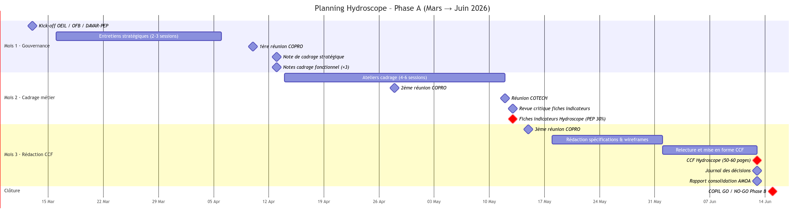

# Gouvernance, pilotage et sécurisation du projet

## Gouvernance du projet

L'**OEIL** assure la maitrise d'ouvrage du projet. La mission d'**AMOA** est confiée au consultant indépendant Hugo Roussaffa de la société **Yapuka**, garant de la cohérence fonctionnelle et de l'alignement sur les objectifs stratégiques. Le pilotage opérationnel est structuré autour de deux instances : le comité de pilotage **COPIL** et le comité de projet **COPRO** . Une équipe projet dédiée, pilotée par Marjolaine David (CP OEIL) avec l'appui de l'AMOA, est chargée de la coordination quotidienne, la réalisation d'action de gestion de projet, la mise en oeuvre de la récolte des besoins et de la production des livrables.

- COPIL (Stratégique) : Composé de l'OEIL, de l'OFB et du Chef de service de l’eau de la DAVAR (ou son représentant). Son rôle est l'arbitrage des besoins synthétisés.
- COPRO (Opérationnel) : Intègre les chefs de projet techniques de l'OEIL et le comité OS1 (DAVAR, DASS, DIMENC, 3 provinces, communes). Il garantit l'alignement des besoins recensés avec le périmètre du projet.
- Équipe projet : Pilotée par Marjolaine David (CP OEIL) avec l'appui de l'AMOA (Yapuka).

### Validation des livrables : Processus distinct entre notes stratégiques (OEIL) et fonctionnelles (COPRO).

## Analyse des risques majeurs

### Risques organisationnels

Risque de frustration des partenaires : L'impossibilité d'intégrer tous les besoins exprimés lors des ateliers peut générer une déception. Une communication claire sur le périmètre stratégique sera faite en amont de chaque atelier.

### Risques techniques

L'enjeu technique majeur concerne l'hétérogénéité des référentiels sources et la **complexité de l'architecture** (historisation, indexation H3 et calcul d'indicateurs multicritères pondérés).

La stabilisation du **modèle de données métier** et le choix définitif de l'unité principale de gestion, le consensus actuel penchant pour le **Bassin AEP** plutôt que le seul PPE. ces données doivent être solides car le modèle de données métier est un socle structurant pour la réalisation technique et les choix d'architecture.

### Risques financiers

Il existe un risque lié à la difficulté de mobiliser des financements complémentaires ou d'amender les conventions actuelles en cas de dépassement budgétaire imprévu, il faut donc être extremement prudent dans la définition du périmètre fonctionnel.

## Indicateurs de pilotage

Le suivi de la valeur métier du projet s'appuiera sur le **nombre d'indicateurs priorisés** par les experts. La traçabilité des arbitrages sera assurée par un **journal des décisions** tenu à jour par l'AMOA tout au long de la phase de cadrage.

## Planning macro

Le calendrier est soumis à deux échéances contractuelles majeures :

- 30 Décembre 2026 : fin de la convention OEIL/PEP, un avenant doit être réalisé pour étendre la periode d'un an.
- Décembre 2027 : Date limite cible pour la livraison des outils.
- 31 Mars 2028 : Clôture définitive de la convention avec l'OFB

Le projet est découpé en deux étapes majeures : une première phase de **cadrage fonctionnel** (Phase A) d'une durée de 3 mois, suivie d'une phase de **réalisation technique** (Phase B) . Les points de validation clés incluent la livraison des fiches indicateurs et du **Cahier des Charges Fonctionnel (CCF)**.

### Mois 1 : Gouvernance et cadrage stratégique (mi-Mars à mi-Avril 2026)

Ce mois est dédié à la mise en place du cadre de travail et à la définition des principes fondamentaux du projet.

13 Mars 2026 : Réunion de lancement (Kick-off) avec l'OEIL et les financeurs (OFB et DAVAR/PEP).

Semaines 1 à 3 : Entretiens stratégiques et fonctionnel (2 à 3 sessions) avec l'équipe de l'OEIL pour stabiliser la vision.

Semaine 4 : Première réunion du COPRO (suivi opérationnel et planning).

Jalons de livrables :

  - Note de cadrage stratégique;
  - Notes de cadrage fonctionnel pour les trois domaines : gestionnaires, grand public et besoins internes OEIL.

### Mois 2 : Cadrage métier et ateliers (mi-Avril à mi-Mai 2026)

Période pour transformer les besoins en spécifications fonctionnelles précises.

Semaines 1 à 4 : Réalisation des ateliers de cadrage (6 à 8 sessions) avec les gestionnaires  pour définir les indicateurs et fonctionnalités.

Fin-Avril : Deuxième réunion du COPRO.

Jalons de livrables (mi-projet) :

- Revue critique des fiches indicateurs et du modèle PressionPPE (usages et limites);
- Fiches indicateurs Hydroscope

### Mois 3 : Rédaction du cahier des charges fonctionnel et validation (mi-Mai à mi-Juin 2026)

Finalisation de la documentation pour préparer la phase de réalisation technique (Phase B).

Semaines 1 et 2 : Rédaction détaillée des spécifications fonctionnelles, schémas, processus et maquettes fonctionnelles (wireframes).

fin-Mai : Troisième réunion du COPRO.
Début Juin : Relecture et mise en forme finale du cahier des charges fonctionnel.

Jalons de livrables (fin de projet) :

- Cahier des charges fonctionnel Hydroscope (50-60 pages);
- Journal des décisions et arbitrages finalisé;
- Rapport de consolidation finale de la mission AMOA;

Mi-Juin : COPIL de clôture de la Phase A : Présentation finale des livrables et arbitrage pour lancer la réalisation technique (Phase B ).

::: {.landscape}

:::